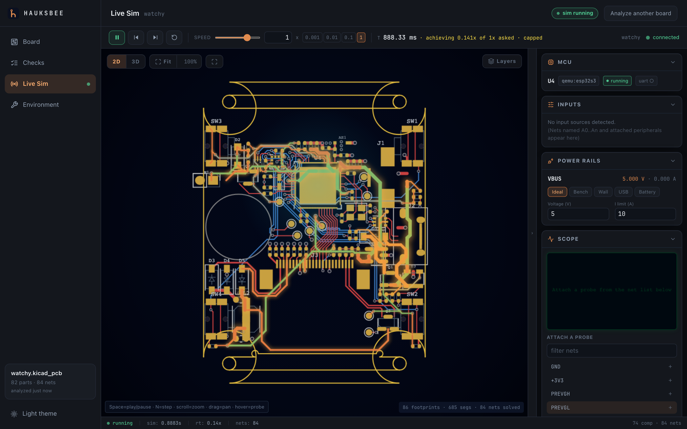
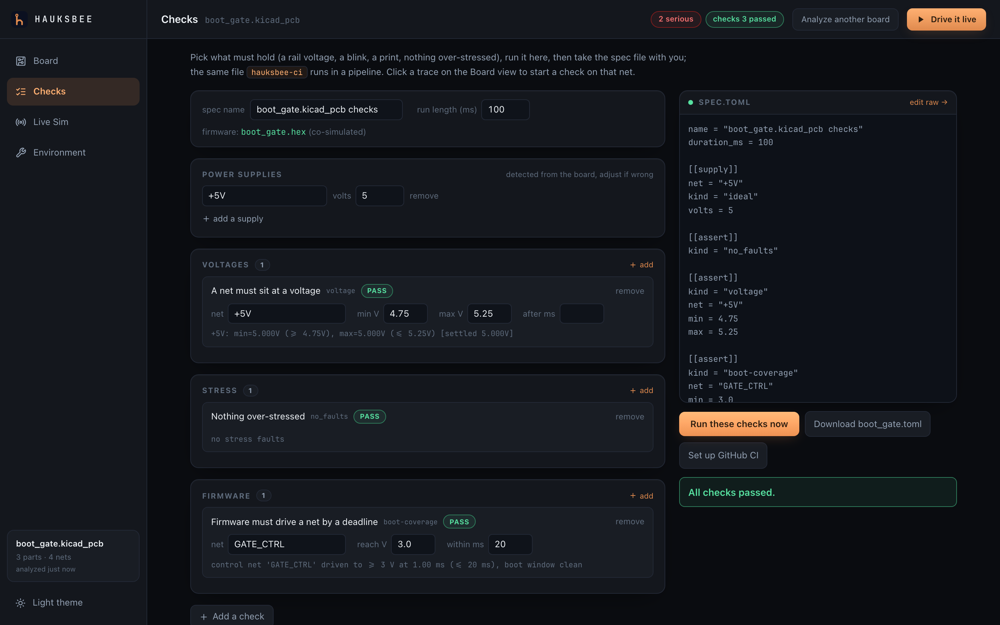
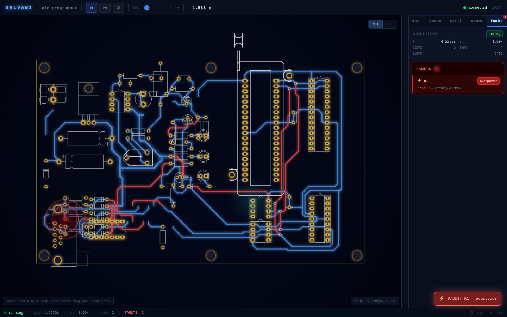
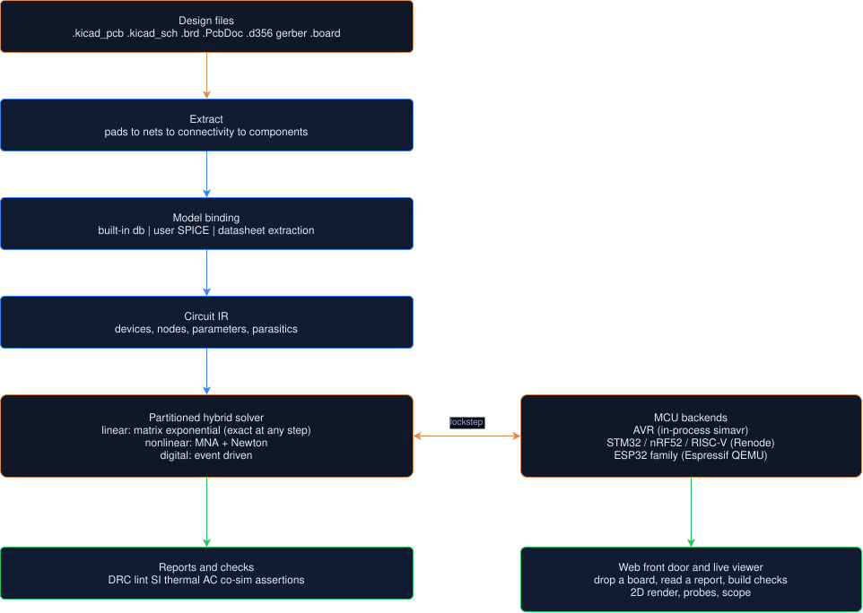

# Hauksbee

**CI for hardware. Hand it a PCB, and it tells you what blows up before you order boards.**

Software runs its tests on every commit. Hardware never got that loop. You change the layout, send it to fab, wait three weeks, populate the board, and only then find the bug with a scope. Hauksbee closes the loop. It takes a real PCB design file, works out the circuit it actually implements, and runs the board headless on every commit. The bugs that used to cost a fab spin and a fortnight at the bench now fail a test instead.

No other tool does this from the layout. Schematic simulators never see the board, MCU simulators use breadboards, and Proteus VSM co-simulates only from its own schematic. Hauksbee starts from the copper. See [`docs/about/COMPARISON.md`](docs/about/COMPARISON.md) for the full matrix.

**New here? Start with [`docs/START_HERE.md`](docs/START_HERE.md):** the user path, install, and your next four reads. [`docs/about/CAPABILITIES.md`](docs/about/CAPABILITIES.md) is the authoritative scope document. It states what every layer does, which checks are commodity versus differentiated, and which MCU architectures the firmware co-sim covers: AVR via libsimavr, STM32/nRF52/RISC-V/RP2040 via Renode, ESP32 family via Espressif QEMU.



---

## What it does

The fastest way in needs no terminal at all:

1. Run `hauksbee serve` and open the page it prints.
2. Drop a board (optionally with firmware, or a zip of the whole PlatformIO project), or click a bundled sample. The first report needs no file at all.
3. Read the report. It renders the board's real copper (zoom in and part labels appear).
4. Compose the rules that must hold (rail voltages, blink, UART output, nothing over-stressed) in plain language, and run them on the spot through the real `hauksbee-ci`.
5. Download the resulting `.toml` plus the GitHub workflow that enforces it on every push.

The browser is the quick look and the on-ramp. The checked-in spec is the repeatable check a pipeline gates on. Everything runs on the same engine, from the command line.



Point it at any PCB design and it will:

- **Ingest** it: KiCad, Eagle `.brd` ([`docs/ingest/EAGLE.md`](docs/ingest/EAGLE.md)), Altium `.PcbDoc` ([`docs/ingest/ALTIUM.md`](docs/ingest/ALTIUM.md)), IPC-D-356, and gerber-only boards that ship no CAD at all. Hauksbee reverse-extracts these from copper geometry alone ([`docs/ingest/GERBER.md`](docs/ingest/GERBER.md), [`docs/about/ARCHITECTURE.md`](docs/about/ARCHITECTURE.md)). Every EDA tool can produce fab output, so the gerber path is the on-ramp that works whatever you drew the board in.
- **Simulate** the analogue circuit with real device physics, co-simulating the firmware in lockstep on an emulated MCU. AVR, STM32, ESP32, ESP32-C3, and RP2040 are proven end-to-end; nRF52840 and SiFive RISC-V are proven to UART boot; ESP32-S3 wiring is proven, with the full app proof pending a flash image. GPIO and UART co-sim run on every backend. I2C/SPI peripheral-slave models run on AVR (exact), on Renode platforms whose descriptors name the controllers, and on ESP32 QEMU through a firmware mailbox. ADC injection is exact on AVR, real on RP2040 inputs 0..3, and dropped loudly on the stock Renode platforms, which model no converter to inject into. [`docs/cosim/MCU.md`](docs/cosim/MCU.md) states the per-backend coverage matrix and the reason plainly.
- **Check** it: copper shorts, USB-C CC compliance, boot strap-pins, MCU resource conflicts, trace ampacity, behavioural power-IC models, and transient brownouts. Signal integrity checks now include a controlled-impedance estimate for USB and Ethernet from trace geometry and stackup (quasi-static closed-form, not a field solve). Each check is tuned against a known-good corpus, so it does not cry wolf ([`docs/checks/SHORTS.md`](docs/checks/SHORTS.md), [`docs/checks/RESOURCE_CONFLICTS.md`](docs/checks/RESOURCE_CONFLICTS.md), [`docs/checks/SI_CHECKS.md`](docs/checks/SI_CHECKS.md), [`docs/checks/TRANSIENTS.md`](docs/checks/TRANSIENTS.md)).
- **Analyse** it past the static checks: a small-signal AC sweep for Bode plots, phase margin, and gain crossover. This is averaged about the DC operating point, not cycle-by-cycle switching ([`docs/analysis/AC_ANALYSIS.md`](docs/analysis/AC_ANALYSIS.md)). Also a steady-state thermal pass. It turns each part's dissipation into a junction temperature and flags the ones that run too hot (per-device `Tj = Tambient + P * theta_JA`, not a board thermal field solve) ([`docs/checks/THERMAL.md`](docs/checks/THERMAL.md)).
- **Catch** the bug before you fab, in a headless pipeline with a GitHub Action, a KiCad plugin, and a pre-commit hook. Assertions cover rails, faults, temperature, and loop stability ([`docs/ci/CI.md`](docs/ci/CI.md)). Runnable examples are in [`docs/ci/EXAMPLES.md`](docs/ci/EXAMPLES.md).



---

## The evidence

**Validated against documented faults.** Four famous boards (ZSWatch DevKit, Watchy, Olimex ESP32-EVB, MNT Reform) fixed eight in-scope faults between two public design revisions. Hauksbee runs on the faulty and the fixed file for each pair where both files are obtainable; two are not, because `corpus.toml` does not pin the ZSWatch DevKit 1.1.0 revision and Olimex published no rev E file. The revision history is the ground truth. Static checks caught six, firmware co-sim executed one two-sided, and one is an honest miss whose firmware-decidable path is named. We did not force any check to inflate the count. Full matrix and the rejected-check evidence: [`docs/evidence/KNOWN_FAULTS_VALIDATION.md`](docs/evidence/KNOWN_FAULTS_VALIDATION.md).

**The most famous USB-C fault ever shipped, re-derived cold.** Feed hauksbee's generic USB-C classifier a reconstruction of the Raspberry Pi 4's USB-C power-in: CC1 and CC2 tied to one shared 5.1 kΩ pulldown, the design that shipped on tens of millions of units. It derives the failure from spec thresholds alone. Both CC pins land at 0.1338 V, below the 0.20 V vRa threshold, so a compliant source declares an Audio Adapter Accessory and withholds VBUS. A hand recomputation from the USB Type-C spec matched every solved voltage to better than 0.01%. Full derivation: [`docs/evidence/BUG_HUNT.md`](docs/evidence/BUG_HUNT.md).

---

## Quickstart

**Download the app (macOS): double-click, drop a board.** Grab `Hauksbee.app` (the `hauksbee-<version>-darwin-<arch>-app.zip` asset) from the [releases page](https://github.com/hauksbee-dev/hauksbee/releases), unzip, and double-click it. It opens your browser on the drop-zone. Drop a board file and read the report. No terminal at any point. No board of your own yet? The same page carries three one-click samples under "No board handy? Try a sample", so the app's first run needs no file either. Released apps are signed and notarised, so Gatekeeper accepts a plain double-click. The full signing story is under the installer below.

This is macOS-only today. We are evaluating Windows but do not promise it yet. The GPL-free build cross-compiles clean, and a full run of the CLI and web surface passes under Wine, but no native Windows runner keeps it green. Status and what remains: [`docs/about/release-and-licensing.md`](docs/about/release-and-licensing.md) section 5. Linux users, take the installer line below.

**One-line installer (terminal, macOS/Linux):**

```bash
curl -fsSL https://raw.githubusercontent.com/hauksbee-dev/hauksbee/main/scripts/get-hauksbee.sh | bash
```

This fetches the latest release for your OS/arch, verifies the sha256 checksum, and installs `hauksbee`, `hauksbee-ci`, and `hauksbee-mcp` to `~/.local/bin`. If that directory is not on your `PATH`, the installer prints the exact line to add. The installer itself needs only `curl` and CA certificates (on minimal Debian/Ubuntu: `apt-get install -y curl ca-certificates`).

**macOS signing, stated plainly.** Every macOS release binary is signed with a Developer ID identity. `Hauksbee.app` is signed and notarised with the ticket stapled, and the release workflow refuses to publish an app zip that is not, so the app opens on a double-click with no Gatekeeper warning. The tarball binaries are signed too, and notarised from launch onward; a bare command-line binary cannot carry a stapled ticket, so Gatekeeper confirms the notarisation online on first run, and a tarball fetched through a browser opens cleanly. Only a pre-release or locally built unsigned bundle still needs the one-time fallback `xattr -d com.apple.quarantine ~/.local/bin/hauksbee ~/.local/bin/hauksbee-ci ~/.local/bin/hauksbee-mcp`, while a copy installed by the curl line above never carries the quarantine flag at all.

Two downloads exist, and each says so on the tin. The default one includes the AVR/ATmega backend, which statically links libsimavr, so that **binary** is GPL-3.0 while hauksbee's source stays Apache-2.0. If you redistribute or embed hauksbee, add `--permissive` (`curl ... | bash -s -- --permissive`) for the Apache-2.0 build, which drops AVR co-sim and links no GPL code at all.

**Build from source:**

```bash
scripts/install.sh                                   # build hauksbee + hauksbee-ci + hauksbee-mcp, put them on PATH
```

Building needs Rust via rustup (the pinned toolchain builds automatically), plus `scripts/install-sims.sh --avr` for the default AVR feature, or `--no-default-features --features renode,qemu` to skip it. Details: [`CONTRIBUTING.md`](CONTRIBUTING.md).

**Or run it in Docker** (no local toolchain needed: the slim image carries `hauksbee` + `hauksbee-ci`, the model db and AVR co-sim):

```bash
docker run --rm -v "$PWD:/work" ghcr.io/hauksbee-dev/hauksbee:slim \
  hauksbee run path/to/board.kicad_pcb --report
```

The slim and full images and more `docker run` examples are in [`docs/ci/DOCKER.md`](docs/ci/DOCKER.md).

**Then use it, first run.** If you took the installer or the app, you have
binaries and nothing else on disk: the installer extracts the release tarball to
a temp directory and deletes it, keeping only the binaries. So your first run
needs no file at all. The `blinky` board below is compiled into both binaries and
unpacked to a temp directory, so there is no path to get wrong, and each command
prints a verdict rather than a data dump:

```bash
hauksbee run --example blinky --check --plain   # every static check on a bundled board, plain-language verdict
hauksbee-ci run --example blinky                # the same board as a CI spec: 4 assertions, GREEN or RED
```

Ask either binary for an example it does not carry and it names the ones it does.
`hauksbee serve` is the third route: its landing page offers three one-click
samples (the Watchy below, a board-plus-firmware pair that runs a live co-sim,
and this same minimal board).

**From a checkout**, first run against a real, shipped board instead. That board
is the [SQFMI Watchy](https://github.com/sqfmi/watchy-hardware), an ESP32-S3
e-paper smartwatch, vendored unmodified under its MIT licence: 86 footprints
making 82 distinct parts, 685 copper segments, a charger and a boost converter.
Every command below finishes in about a second.

```bash
hauksbee run crates/hauksbee-ci/examples/boards/watchy.kicad_pcb --report --plain  # which parts were modelled, plain bottom line
hauksbee run crates/hauksbee-ci/examples/boards/watchy.kicad_pcb --drc --plain     # clearance + shorts report, in plain language
hauksbee-ci run crates/hauksbee-ci/examples/watchy.toml                            # run a CI spec the way a pipeline would
```

The DRC report on this board is clean: `Looks healthy: no copper spacing (drc)
problems found.` It reads the 0.150 mm clearance rule out of the board's own
project file and finds nothing under it, which is the verdict a shipped,
working design should get. A tool that manufactured warnings here would be
teaching you to ignore it.

To see the other outcomes: the `boot_gate` example in
[`docs/ci/EXAMPLES.md`](docs/ci/EXAMPLES.md) carries a deliberate copper short and
names both layers and coordinates. For a real sub-rule *clearance* finding, the
Adafruit Circuit Playground Express in the board corpus has one, a 0.113 mm gap
between `3.3V` and `N$3` against the board's own 0.178 mm rule; every corpus
board's result is tabulated in
[`docs/evidence/FAMOUS_SWEEP.md`](docs/evidence/FAMOUS_SWEEP.md).

**Then swap in your own board** (`my_board.kicad_pcb` is a placeholder for your file):

```bash
hauksbee run my_board.kicad_pcb                      # no flags on a terminal: a full-screen dashboard (TUI)
hauksbee run my_board.kicad_pcb --si --plain         # signal integrity (USB/Ethernet impedance, rise times)
hauksbee run my_board.kicad_pcb --list-nets          # list net names (for --ac-node / --ac-loop)
hauksbee run my_board.kicad_pcb --lint --strict      # exit non-zero on a real defect, to gate a pipeline
hauksbee run my_board.kicad_pcb --check --emit-manifest run.manifest.json # immutable, replayable run identity
hauksbee-ci init my_board.kicad_pcb                  # scaffold a CI spec into the current directory (prints the path; edit, then run)
hauksbee serve                                       # web front door (long-running): open the page, drop a board, read the report
```


Reports exit 0 by default even when they find something. `--strict` (alias `--fail-on-findings`) makes them fail a build. `--plain` (alias `--explain`) rewrites any finding as what it is. It states why the finding matters and what to do.

`--emit-manifest <file>` is available on both run binaries. It hashes every
resolved input and model source, pins tool/component/plugin revisions and parsed
settings, and writes without clobbering. Re-run it with
`hauksbee reproduce <file>`. The full stable-JSON and privacy contract is in
[`docs/analysis/RUN_MANIFESTS.md`](docs/analysis/RUN_MANIFESTS.md).

The exact exit-code contract for `hauksbee run`:
- **0**: clean, or a report-only run (no `--strict`, whatever it found). A gate-grade finding without `--strict` prints a stderr note saying so.
- **1**: the board was never analysed (unreadable or unrecognized file, a Git LFS pointer, a bad path). Your input, not your board.
- **2**: gate-grade findings under `--strict` (or `--strict-boot`), or a usage error.
- **3**: a well-formed analysis request could not produce a trustworthy answer
  (for example, an aborted analog solve). Every exit-3 surface carries the same
  refusal contract: the claim declined, its specific missing prerequisite, the
  partial conclusions that remain valid, and the cheapest concrete next action.
  Missing/unreadable input is still 1; bad options and gate findings are still 2.

For `hauksbee-ci run`:
- **0**: all assertions held.
- **1**: an assertion failed.
- **2**: spec/board error.
- **3**: analog result not trustworthy, with the same four-field refusal in
  terminal, JSON, JUnit, GitHub annotations, and the web checks panel.

**Native for agents, not just humans.** Both run binaries, the localhost HTTP front door and the bundled MCP server are machine-readable by design; the interactive TUI is the one human-only surface. `hauksbee run --json` and `hauksbee-ci run --json` emit one structured verdict object. Exit codes distinguish green / failed / bad-input / not-trustworthy (an aborted analog solve exits 3 rather than pretending). Honesty qualifiers (substitute MCU cores, coverage holes) come as data fields rather than prose, and the whole analyze/check flow is reachable over localhost HTTP. An AI agent can scaffold a spec with `hauksbee-ci init` and iterate it to green. It can wire the result into CI without ever opening the browser. For MCP-speaking agents, the bundled `hauksbee-mcp` binary is a stdio MCP server that exposes the same flow as structured tools: analyse a board, run a spec, list capabilities, decompile to Board-as-Code, and drive a scripted session. Registering it with Claude Code is one line:

```bash
claude mcp add --transport stdio hauksbee -- hauksbee-mcp
```

[`crates/hauksbee-mcp/README.md`](crates/hauksbee-mcp/README.md) covers the five tools, the generic `mcpServers` JSON, and where the binary comes from; [`agents/AGENTS.md`](agents/AGENTS.md) is the agent-facing contract, including the MCP tool schemas. Runnable specs, board-as-code examples and captured sessions are in [`docs/ci/EXAMPLES.md`](docs/ci/EXAMPLES.md).

---

## Firmware co-sim and CI specs

Firmware co-sim boots your compiled image on an emulated MCU and runs it in
lockstep with the analog solve of the as-built board, so a GPIO the firmware
drives actually moves the copper it is wired to, and you assert on the result.
There are two ways in.

**One-off, from the command line**: point `run` at a board and a firmware image:

```bash
hauksbee run my_board.kicad_pcb --firmware build/app.elf            # TUI dashboard, live
hauksbee run my_board.kicad_pcb --firmware build/app.hex --report --plain   # one-shot verdict
```

hauksbee detects the MCU from the board (an ESP32-S3 boots Espressif QEMU, an
ATmega328P libsimavr, an STM32/nRF52 Renode). `--firmware` takes a compiled
`.elf`/`.hex`, a PlatformIO project directory (built with your own `pio run`),
or a zip of either. hauksbee finds the built image inside automatically, so you
never have to know it lives at `.pio/build/<env>/firmware.elf`. The web drop
zone accepts the same. If a needed emulator is not installed, hauksbee tells
you the one command to get it (`hauksbee install esp-qemu`, or
`scripts/install-sims.sh`).

**As a repeatable check**: a `.toml` spec captures the board, the firmware, how
the board is powered, and the assertions that must hold, so a pipeline can gate
on it. Compose it visually in the web checks panel (`hauksbee serve`, which also
hands you the GitHub workflow), or scaffold one from a board with
`hauksbee-ci init my_board.kicad_pcb`, then run it:

```bash
hauksbee-ci run ci/boot.toml                    # exit 0 = all assertions held
hauksbee-ci run ci/boot.toml --junit out.xml    # emit JUnit XML for CI
```

A spec reads as board-as-code. This one boots real firmware and asserts that a
MOSFET gate is actively driven within 20 ms of reset. It is quoted verbatim from
[`crates/hauksbee-ci/examples/boot_gate_pass.toml`](crates/hauksbee-ci/examples/boot_gate_pass.toml),
the runnable file, with only its header comment trimmed and the field comments
added here:

```toml
name = "boot_coverage: MOSFET gate driven promptly (PASS)"
board = "boards/boot_gate.kicad_pcb"      # .kicad_pcb / .kicad_sch / .brd / .d356
firmware = "../../../testdata/firmware/boot_gate_a/boot_gate.hex"  # optional; ELF or hex, relative to the spec
mcu = "atmega328p"                        # usually auto-detected from the board
duration_ms = 50

[[supply]]                                # how the board is powered
net = "+5V"
kind = "ideal"
volts = 5.0

[[assert]]                               # 1+ assertions; all must hold
kind = "boot_coverage"                    # the gate net must reach a logic high...
net = "GATE_CTRL"
min = 3.0
deadline_ms = 20.0                        # ...within 20 ms of reset

[[assert]]
kind = "no_faults"                        # and nothing is over-stressed meanwhile
```

Assertions cover rails and forced net drives, timed peripheral events (button
presses, sensor inputs), `voltage` / `toggle` / `boot_coverage` / `no_faults`,
thermal limits, and tolerance/AC sweeps. More runnable specs and board-as-code
examples are in [`docs/ci/EXAMPLES.md`](docs/ci/EXAMPLES.md). The top of
[`crates/hauksbee-ci/src/spec.rs`](crates/hauksbee-ci/src/spec.rs) documents the full spec schema.

---

## Simulators / firmware co-sim

AVR (ATmega328P) co-simulation links libsimavr directly into the engine, so
there is no separate simulator process to launch. simavr is GPL-3.0, and this
Apache-2.0 repo does not vendor it, so a source build links it from the
system. One command installs it:

```bash
scripts/install-sims.sh --avr    # build + install libsimavr (AVR co-sim)
```

Prefer to skip AVR? Build the GPL-free subset instead:

```bash
cargo build -p hauksbee-engine --no-default-features --features renode,qemu
```

For STM32, nRF52, SiFive RISC-V, ESP32, and ESP32-C3 you need the external
simulator backends:

```bash
scripts/install-sims.sh          # install Renode + Espressif QEMU
scripts/install-sims.sh --check  # verify hauksbee will find them
```

Renode covers STM32 / nRF52 / RISC-V / RP2040, the last on a platform hauksbee
supplies itself because Renode ships none. The Espressif QEMU fork covers the full
ESP32 family. hauksbee detects both from an external install (GPL/size, not
bundled), using the same detect-do-not-bundle pattern as the KiCad and ngspice
oracles. [`docs/cosim/SIMULATORS.md`](docs/cosim/SIMULATORS.md) has the full
details: discovery order, env-var overrides, manual install steps, and the
Gatekeeper note for macOS.

---

## The honest verdict on the hunt

**The famous-board sweep: no unreported defect, and the lint almost silent.** Pointed at two dozen famous open-hardware boards, hauksbee found no unreported defect. These are shipped, reviewed, working boards, so a clean electrical verdict is the correct one. The real yield was about ten bugs in hauksbee itself: surprises that turned out to be tool defects rather than board defects, each chased to ground and fixed.

Stated at the precision it deserves, because "zero false positives" is a strong claim and the useful version is narrower. Running the lint over every board file in the fetched corpus, medium-and-high findings appear on six board families, and **every one that can be adjudicated is a true positive**:

- **Olimex ESP32-EVB, revisions B to L**: a free-running 50 MHz oscillator on the ESP32's GPIO0 boot-strap net, where a clock edge at the reset latch can drop the part into download mode.
- **Olimex RP2040-PICO-PC, revisions B, C and D**: RP2040 PWM slice 6A double-booked between the PicoDVI pixel clock and the PWM audio. Upstream issue #1. Rev B is the instructive one: its layout fires and its netlist does not, because that netlist is a stale rev-A export Olimex shipped in the rev-B folder. The layout matches the fabricated board and the Gerbers, so both readings are right about the file they were given.
- **ZSWatch DevKit 1.2.0**: missing pull-ups on the RTC-side I2C bus. This is the calibration's gold row, and 1.2.0 is the *faulty* revision; 1.2.1 is clean.
- **Lily58 and Lily58 Pro**: `R1`/`R2`, the I2C pull-ups, carry the literal value `R`. The upstream design genuinely never specified them.
- **MNT Reform historic rev-1 motherboard**: `L4`/`L5` are inductor designators on a resistor footprint.
- **MNT Reform motherboard 2.0 and 2.5**: no pull-up on the on-board DAC I2C bus. **Not adjudicated**, and one of two honest open questions in the set.
- **MNT Reform hierarchical sub-sheets**: 6 highs claiming `USB_PWR_EN`, `AUX_PWR_EN` and `PCIE1_PWR_EN` are floating enable inputs. **A false positive.** Those nets are driven from a sibling schematic sheet the lint never sees when handed one sub-sheet, and linting the top-level sheet correctly finds nothing. Run connectivity checks on a top-level sheet, a layout or a netlist, never on a sub-sheet.

So the claim we will defend is narrower than either "zero false positives" or "the lint does not invent findings on shipped hardware", because handed a partial view of a shipped board it does. What holds is: **on a complete design file, every medium-or-high finding in this corpus that has been chased is real.** Silence above Low is the common case rather than the universal one, and the Lows throughout are the I2C-breaks-out-to-a-header convention.

Part of that is enforced by corpus silence gates that go red if a check fires on a known-good board, and it is worth being exact about how much. All four run against a corpus fetched by `scripts/fetch-corpus.sh`, and each prints what it covered: the placeholder-value gate sweeps 470 board files across four extraction paths, the geometric-shorts sweep 116 layouts, the output-contention calibration 14 schematics, and the MNT Reform sub-sheet hierarchy guard 33. A gate that opens no board fails outright rather than passing, and the per-gate counts go into the nightly run summary, so "the gate is green" and "the gate looked at something" are separate claims you can check separately.

Being exact also means saying what the gates decline to grade themselves on. Four corpus entries are fetched and parsed but excluded from the silence gates, each with its reason recorded in `corpus.toml`: KiCad's own demo projects and the CATs Eurosynth modules were never manufactured products, and the Olimex ESP32-PoE and Duet 2 boards did ship but the shorts check fires on them and the finding is not yet adjudicated. Those exclusions are announced per board rather than absorbed. Full detail, per board and per check: [`docs/evidence/FAMOUS_SWEEP.md`](docs/evidence/FAMOUS_SWEEP.md).

**The thin-review hunts: three findings.** Then we pointed it where unknown bugs actually survive: **thin-review, single-maintainer, freshly-shipped boards with no issue history**, the opposite of the famous survivors. Across five such boards came three genuine, previously-unreported findings: two straight from the tool, and one tool-assisted by hand analysis. Each was chased to the design file, hand-verified, and prior-art-checked:

- **FPV-Drone-STM32F411 ESC board**: a **+3.3 V-to-GND copper short** on the bottom copper (GND pour overlaps the 3.3 V trace, actual clearance 0.0000 mm). KiCad's own DRC confirms it independently, and it is present byte-for-byte in the exported gerber. Built as drawn, the ESC is dead on arrival. This is a DRC-class defect: KiCad's built-in DRC catches it too. The board was simply never run through DRC before shipping.
- **LibreSolar mppt-1210-hus**: the input bulk electrolytic runs at **~1.66x its ripple-current rating** (~5.0 A rms vs 3.0 A) at the board's rated 10 A charge. This is a lifetime/derating overstress, not a power-up failure. This is a hauksbee-assisted hand finding: hauksbee extracted the topology and part values, and the analyst worked out the ripple physics.
- **INGBZGMBH PD-Sink-Trigger-Board**: the rotary voltage selector **mis-codes its top two detents** against the CYPD3177 EZ-PD BCR decode table. "15 V" requests 12 V, and "20 V" never reaches 20 V, so the advertised 20 V / 100 W is unreachable. Functional defect, no safety hazard.

Two tool findings plus one tool-assisted, on boards nobody had reviewed. The targeting thesis (bugs survive on unproven boards, not on shipped survivors) held. [`docs/evidence/FAMOUS_SWEEP.md`](docs/evidence/FAMOUS_SWEEP.md) records the sweep and summarises these companion findings.

A later **firmware co-sim** hunt added a fourth finding of a different character: a **cross-layer power-up ignition fault** that only the co-sim differentiator can see. The board is `explosion33/RocketryIgniter` (ATmega328P dual-igniter e-match board). Its firmware's `SoftwareSerial` constructor enables the AVR internal pull-up on its RX pin during C++ static init, before `setup()` runs. That RX pin is wired straight to one of the two MOSFET igniter gates, which has no pull-down. The gate charges to ~VCC through the ~30 kΩ pull-up, the FET turns on, and an e-match fires at power-up. The firmware's intended fire path is an unimplemented `//To Do`. hauksbee co-sim settles the gate at 5.000 V. `hauksbee run --firmware --headless --plain` names the chain: copper (no pull-down), silicon (AVR pull-up), firmware (a serial port mapped onto a pyrotechnic gate), consequence (ignition). The mechanism that surfaces it is the held-high boot-safety advisory, and the gateable form is the `boot-coverage` assertion; both are documented in [`docs/about/CAPABILITIES.md`](docs/about/CAPABILITIES.md). Catching it at all first required fixing a co-sim solver bug that had been failing silently, a crystal mis-bound as a 16-gigafarad capacitor.

## A note on speed

Hauksbee's matrix-exponential fast path wins in the PCB regime: many small RC islands hang off shared rails, and exact large steps replace thousands of small ones there. Benchmarks put it in the range of 19x to 37x ngspice wall-clock on a half-wave rectifier and around 14x to 15x on a 90-block synapse array (`#[ignore]` benches; the spread is what repeated runs on different machines actually produce, and both figures include ngspice's process startup, which is a large share of the total at these durations). What the tests *do* assert is the accuracy: agreement with ngspice and analytic theory to fractions of a percent typically, and within a few percent at worst (the per-deck bounds are in the comparison table). The accuracy assertions live in the always-on suites; the speed benches themselves assert nothing and only print, which [`docs/about/COMPARISON.md`](docs/about/COMPARISON.md) states plainly. The method and the full table are in [`docs/about/COMPARISON.md`](docs/about/COMPARISON.md).

---

## Architecture



Partition the circuit at device boundaries, and give every island the cheapest solver that is exactly right for it. Linear islands get matrix exponentials (exact at any step size), nonlinear islands get MNA + Newton, and digital is event-driven. Full write-up in [`docs/about/ARCHITECTURE.md`](docs/about/ARCHITECTURE.md).

| crate | what |
|---|---|
| `hauksbee-extract` | design files → components + nets + connectivity, with lint |
| `hauksbee-models` | component → device model: built-in library, user SPICE, datasheet extraction |
| `hauksbee-ir` | circuit intermediate representation |
| `hauksbee-solve` | the solver: exact where possible, MNA+Newton where needed, every effect toggleable |
| `hauksbee-mcu` | MCU emulation and pin/ADC/UART/I2C/SPI coupling |
| `hauksbee-engine` | the whole pipeline wired together: bind → build → co-sim, plus examples and benchmarks |
| `hauksbee-ci` | the headless CI runner |
| `hauksbee-server` | websocket server streaming live simulation frames |
| `hauksbee-mcp` | stdio MCP server: the analyse/check/decompile flow as structured tools for AI agents |
| `hauksbee-testkit` | shared test plumbing: locates test assets and fixtures for the suites |
| `frontend/` | the board, alive: 2D/3D render, signal flow, probes, scope |

The KiCad file layer, `kicad-forge`, is a vendored component rather than an external dependency: lossless parse and produce (byte-exact round-trip), the typed board model hauksbee extracts from, and board-to-code decompilation. Its `forge-sexpr`, `forge-model` and `forge-codegen` crates live under [`vendor/kicad-forge`](vendor/kicad-forge), so a fresh clone builds with no sibling checkout and no network. It has no separate public repository, and hauksbee is where it is used. Provenance and the update procedure: [`vendor/kicad-forge/VENDORED.md`](vendor/kicad-forge/VENDORED.md).

---

## Where it came from

We built hauksbee for one board no simulation tool could honestly check: Tarski, a 3,442-component analogue neuromorphic accelerator (Project Tarski, University of Galway). That board got a bespoke emulator, fast because it integrated the *intended* circuit in closed form. That speed was exactly its blind spot: it could never see a base wired where a collector should be. Hauksbee simulates the board you actually drew, device by device, and finds the bugs the bespoke one was structurally incapable of finding.

That board is not ours to publish. It is not in this repository, and neither are the 60 tests that run against it. [`docs/about/PRIVATE_SUITE.md`](docs/about/PRIVATE_SUITE.md) lists them suite by suite, with counts, and says what each suite covered. A suite that quietly shrinks reads as a suite that was always this size.

The name is for [Francis Hauksbee](https://en.wikipedia.org/wiki/Francis_Hauksbee), who built the first machine to make the electrostatic spark on demand. Bringing a dead board to life is roughly the same trick.

See the website at [hauksbee.dev](https://hauksbee.dev). [`docs/about/LIMITATIONS.md`](docs/about/LIMITATIONS.md) catalogues honest limitations. The [SPICE compatibility statement](docs/spice-compat/compatibility.md) states exactly which SPICE cards `hauksbee sim` accepts or refuses. CI enforces it against the loader, so it cannot drift.

---

## Acknowledgements

Hauksbee stands on a lot of open-source work. The substantial ones:

**MCU co-simulation backends**
- [simavr](https://github.com/buserror/simavr) (GPL-3.0), cycle-accurate AVR / ATmega328P emulation, linked in-process via FFI, behind the `avr` backend.
- [Renode](https://renode.io) by Antmicro (MIT), STM32, nRF52, SiFive RISC-V and RP2040 emulation, driven headless over its Monitor protocol.
- [Renode_RP2040](https://github.com/matgla/Renode_RP2040) by Mateusz Stadnik (MIT), the RP2040 peripheral models Renode itself does not ship, vendored and compiled at run time; plus the [pico-sdk](https://github.com/raspberrypi/pico-sdk) RP2040 SVD and the [RP2040 boot ROM](https://github.com/raspberrypi/pico-bootrom-rp2040) (both BSD-3-Clause, Raspberry Pi).
- [QEMU](https://www.qemu.org) and [Espressif's QEMU fork](https://github.com/espressif/qemu) (GPL-2.0), ESP32 / ESP32-S3 / ESP32-C3 emulation with the SoC peripherals modelled.

**PCB tooling**
- [KiCad](https://www.kicad.org) (GPL-3.0). hauksbee ports the Altium `.PcbDoc` binary record parsers field-by-field from KiCad's open-source Altium importer ([`docs/ingest/ALTIUM.md`](docs/ingest/ALTIUM.md)). It uses `kicad-cli` for DRC cross-checks.
- [freerouting](https://github.com/freerouting/freerouting), the open-source autorouter hauksbee hands recompiled board-as-code off to for production routing (separate process, invoked headless).
- [ngspice](https://ngspice.sourceforge.io), the reference SPICE engine the solver is cross-validated against for accuracy and benchmarked beside.

**Rust ecosystem**
- [num-complex](https://crates.io/crates/num-complex): complex MNA for the AC solver.
- [cfb](https://crates.io/crates/cfb): OLE2 parsing for Altium files.
- [evalexpr](https://crates.io/crates/evalexpr): behavioural device-model expressions.
- [clap](https://crates.io/crates/clap): CLI.
- [axum](https://crates.io/crates/axum) + [tower-http](https://crates.io/crates/tower-http) + [tokio](https://crates.io/crates/tokio): the web front door.
- [serde](https://crates.io/crates/serde): serialisation.
- [bindgen](https://crates.io/crates/bindgen): the simavr FFI bindings.
- And the wider Rust crate ecosystem.

## Contributing

[`CONTRIBUTING.md`](CONTRIBUTING.md) covers getting a build and running the tests, including reproducing the board corpus that the zero-false-positive gate measures against. It also covers what a change has to clear before it lands. Security reports go through [`SECURITY.md`](SECURITY.md). [`CODE_OF_CONDUCT.md`](CODE_OF_CONDUCT.md) covers conduct, and notable changes land in [`CHANGELOG.md`](CHANGELOG.md).

## License

Hauksbee's own source is **Apache-2.0** (see [`LICENSE`](LICENSE)). Redistributions must retain the [`NOTICE`](NOTICE) file, which is how attribution travels with the code. One caveat, stated plainly: the optional `avr` backend links **libsimavr, which is GPL-3.0**. A binary built with the default features (which include `avr`) is a combined work covered by GPL-3.0. Build with `--no-default-features --features renode,qemu` for a GPL-free binary. Renode and the Espressif QEMU fork run as separate processes reached over TCP, so they impose no link-time licence obligation.

Releases ship both, labelled rather than implied. `hauksbee-<version>-<target>.tar.gz` is the default download, and is a **GPL-3.0** binary (AVR included). This constrains redistributing it, not running it. `hauksbee-<version>-<target>-permissive.tar.gz` is the **Apache-2.0** build with no GPL code linked, for anyone redistributing or embedding hauksbee. Every tarball carries a `LICENSE-BINARY.txt` that states which it is. The release workflow refuses to publish a build whose `hauksbee doctor` output contradicts its label.

[`COMPLIANCE.md`](COMPLIANCE.md) is the one-page answer per artifact: source tree, both tarballs, the macOS app, the Docker images, and what each one obliges you to do if you redistribute it. [`docs/about/release-and-licensing.md`](docs/about/release-and-licensing.md) has the full reasoning and the guard that keeps the labels honest.
