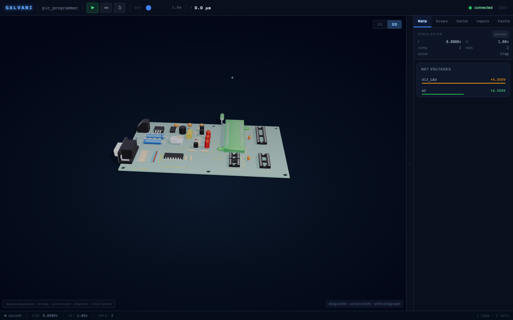
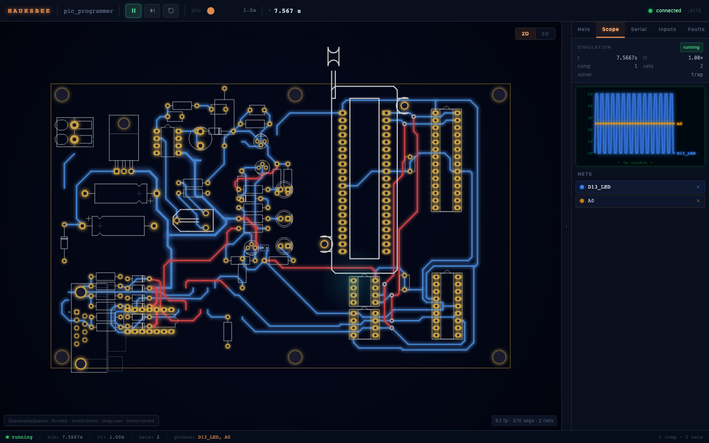

# Galvani

**CI for hardware. Hand it a PCB; it tells you what blows up before you order boards.**

Software got transformed by one boring idea: run the tests on every commit. Hardware never got that. You change the layout, send it to fab, wait three weeks, populate the board, and *then* find the bug with a scope and a multimeter. The feedback loop is measured in weeks and money.

Galvani closes it. It takes a real PCB design file, works out the circuit it actually implements, and runs the board headless: boot the firmware, assert the rail comes up, assert the UART says hello, assert no part is being asked to dissipate three times its rating. On every commit, before any copper exists. The bugs that used to cost you a fab spin and a fortnight at the bench fail a test instead.

No other tool does this from the layout. Schematic simulators (LTspice, ngspice, Falstad) never see the board. MCU simulators (Wokwi, SimulIDE) use behavioural circuits and breadboards. Proteus VSM co-simulates firmware with SPICE, but only from its own schematic. Galvani starts from the copper.

[**Watch the showcase video**](frontend/capture/out/galvani_showcase.mp4) (a dozen boards running headless, ~2.5 min).


---

## What it catches

Pointed at a raw 3,443-component layout it had never seen, with no board-specific code, galvani independently derived two bugs that historically cost weeks of bench time. It read them straight off the design files. The full account, every candidate chased to the s-expression level and killed or confirmed, is in [`docs/BUG_HUNT.md`](docs/BUG_HUNT.md).

**A catastrophic transistor miswire.** A weight switch's common terminal wired to a transistor's *base* instead of its *collector*, repeated across all 90 cells. Enable the weight and galvani derives **689 mA** forced through a switch channel rated 50 mA and a junction rated 100 mA, 596 mW in a 250 mW package, with the stress monitor raising overcurrent and overpower the instant it solves. Repair the wiring (swap base and collector) and the same cell solves to a textbook current sink at **0.424 µA**, zero faults. The defect lives at the electrode level, where schematic review and a behavioural model both look right past it.

**A compound power-up brownout.** Three smaller defects that are each survivable alone, until they interact. Floating shift-register control lines leave weight bits undefined at boot; one undefined bit drives the miswired base path above; and through a 1 kΩ part sitting where a milliohm current-sense shunt should be, that single cell's fault current collapses the whole analogue rail **from 4.96 V to 0.76 V**. One stray bit at power-on takes the entire board down. No tool looking at one defect at a time predicts that.

The honest part, stated as plainly in the doc: in the value-and-topology space galvani found no *new* bug beyond the two already known. A clean negative, scoped precisely, not a claim the whole board is correct. A confidently-presented false positive would have been worse than an honestly-scoped "no".

**The most famous USB-C fault ever shipped, re-derived cold.** Fed a five-component reconstruction of the Raspberry Pi 4's USB-C power-in (CC1 and CC2 tied to one shared net through a single 5.1 kΩ pulldown, the design that shipped on tens of millions of units and was fixed in rev 1.2), galvani's generic USB-C classifier, which carries no Pi-specific logic, derives the failure from spec thresholds alone. Its MNA solver lands both CC pins at **0.1338 V** with an electronically-marked cable, below the 0.20 V vRa detection threshold, so a compliant source reads Ra on both lines, declares an Audio Adapter Accessory, and withholds VBUS. The board looks dead. The repaired netlist (independent Rd per pin) powers with both cable types. Every solved voltage was recomputed by hand from the USB Type-C spec resistor values and matched the solver to better than 0.01% (skeptic-gated). Full derivation, with the 2×2 cable matrix and spec citations, is [`docs/BUG_HUNT.md`](docs/BUG_HUNT.md) Finding 19.


---

## Validated against documented faults

The strongest evidence galvani has is not a bug it found, it is the bugs it catches on boards whose faults are written down in the boards' own revision history. We took eight in-scope, real-world faults that were fixed between two public design revisions, across four famous boards (ZSWatch Watch-DevKit, Watchy, Olimex ESP32-EVB, MNT Reform), and ran galvani on both the faulty and the fixed file. The revision history is the ground truth: a real catch flags the faulty revision for exactly the thing the next revision fixed, and goes clean once it is fixed.

| Board | Fault (faulty → fixed rev) | galvani | Outcome |
|---|---|---|---|
| ZSWatch DevKit | missing RTC-side I2C pull-ups (1.2.0 → 1.2.1) | `missing_i2c_pullup` | flagged faulty, clean on fix |
| MNT Reform | LTC4020 ILIMIT charge overdraw, 88 W against a 60 W brick budget (mb2.5 → 3.0) | LTC4020 converter model | flagged faulty, clean on fix |
| MNT Reform | LTC4020 RNG/SS destabilises the DC/DC (mb2.0 → 2.5) | LTC4020 FSM | flagged faulty, clean on fix |
| MNT Reform | LTC6803-4 leak through an absent cell, 0.28 A (mb2.0 → 2.5) | LTC6803-4 leak law | flagged faulty, clean on fix |
| ZSWatch DevKit | nPM1300 SHPHLD feeds an MCU GPIO from VSYS in sleep (1.2.0 → 1.2.1) | nPM1300 internal-pull model | flagged faulty, clean on fix |
| Olimex ESP32-EVB | 50 MHz PHY clock on the GPIO0 strapping pin (rev D → E) | `strap_pin` lint | flagged (fix is not netlist-visible) |
| Watchy | e-paper RES# on a Hi-Z GPIO, no pull (v1.5 → v2.0) | `boot-coverage` firmware co-sim | executed two-sided on the real board |
| ZSWatch DevKit | DISPLAY-EN on a Hi-Z GPIO, no pull (1.1.0 → 1.2.0) | (control-pin class) | honest static miss, decidable by firmware |

**Eight in-scope faults: six caught statically, one executed via firmware co-sim, one honest miss** whose firmware-decidable path is named. Every catch is two-sided, and no check was forced to inflate the count: the proposed "control input on a Hi-Z GPIO" lint was specified, measured against the clean corpus, shown to manufacture six false positives on five shipped boards, and rejected. The Watchy row runs the firmware on the real v1.5 board under the Espressif QEMU ESP32 backend: it goes GREEN when the firmware drives the reset line and RED when it does not, so it is a measurement, not a vacuous pass. Full matrix, citations, and the rejected-check evidence are in [`docs/KNOWN_FAULTS_VALIDATION.md`](docs/KNOWN_FAULTS_VALIDATION.md).

---

## What galvani is

Take any supported PCB file, and galvani will:

1. **Extract** the circuit: pads to nets to a connectivity graph to component instances, with lint.
2. **Bind** each component to a real device model: a built-in library, your own SPICE, or datasheet extraction (codex-backed) for parts it has never seen.
3. **Solve** it with a partitioned hybrid solver: linear islands get exact matrix-exponential steps, nonlinear islands get MNA + Newton, digital is event-driven. Every physical effect (parasitics, temperature, charge storage, tolerances) is a switch you control.
4. **Co-simulate** the firmware on an emulated MCU, coupled to the analogue circuit through pin, ADC, UART, I2C and SPI hooks in lockstep. Every backend presents the same lockstep contract, so adding an architecture is adding a backend, not touching the co-sim loop. The proven matrix spans **AVR** (simavr, in-process), **STM32** (Renode), **ESP32 and ESP32-C3** (Espressif QEMU), **nRF52840** and **SiFive FE310 RISC-V** (Renode). Full backend write-up in [`docs/MCU.md`](docs/MCU.md).
5. **Render** it live: the actual board layout in 2D and 3D, signal flow, probes, scope, and a fault log that explains what blew up and why.

You can open a serial console to the emulated MCU and talk to it as if the board were on the bench in front of you.

**Supported inputs:** KiCad `.kicad_pcb` (versions 5 through 10, including the 20260206 name-only net format) plus schematic netlist exports for pin-level detail; Eagle `.brd`; IPC-D-356 fab netlists as the universal fallback (every EDA tool exports one); and anything KiCad can import, converted once. For the large tier of famous hardware that ships **only manufacturing files** (the uConsole, Inkplate 6, a long tail of others), galvani reverse-extracts an `ExtractedBoard` from the gerbers, drill and pick-and-place alone, reconstructing nets and copper geometry so bind, DRC, lint and simulation run on boards that otherwise could not be ingested. Validated closed-loop against ground truth (export a known board's gerbers with no net hints, reconstruct, compare): net-partition agreement is **99.0 to 100% over located pads** on every board. See [`docs/GERBER.md`](docs/GERBER.md).




---

## The check arsenal

Beyond the live simulation, galvani carries a set of static and dynamic checks, each one calibrated to the same bar: zero false positives on a known-good corpus, or the check does not fire. Every fire was earned by chasing the surprise to ground first.

- **Copper short / clearance DRC**, geometric, from the actual layout (KiCad and Eagle): [`docs/SHORTS.md`](docs/SHORTS.md).
- **USB-C CC compliance** (the RPi 4 class above), DNP-aware: [`docs/BUG_HUNT.md`](docs/BUG_HUNT.md).
- **Boot strap-pin lint**: a free-running clock or wrong-level bias on an ESP32/STM32/RP2040 strapping pin, per-part tables cited to the TRMs ([`docs/KNOWN_FAULTS_VALIDATION.md`](docs/KNOWN_FAULTS_VALIDATION.md)).
- **MCU resource conflicts**: two functions on different pins that map to the same shared silicon resource inside the MCU, which no connectivity sweep can see: [`docs/RESOURCE_CONFLICTS.md`](docs/RESOURCE_CONFLICTS.md).
- **Signal-integrity checks**: crystal load capacitance, I2C rise time, antenna keepout, differential-pair geometry: [`docs/SI_CHECKS.md`](docs/SI_CHECKS.md).
- **IPC-2221 trace ampacity**: can the copper carry the current, with poured planes honestly out of reach rather than mis-measured ([`docs/GERBER.md`](docs/GERBER.md), [`docs/FAMOUS_SWEEP.md`](docs/FAMOUS_SWEEP.md)).
- **Behavioural power-IC models** (averaged converters, FSMs, internal pulls, current/voltage laws), user-extensible with your own: [`docs/MODELS.md`](docs/MODELS.md).
- **Transient scenarios**: dynamic loads, decoupling ESR/ESL, and battery-protection cutoff, to catch brownouts DC analysis cannot see: [`docs/TRANSIENTS.md`](docs/TRANSIENTS.md).
- **Schematic-stage simulation**, before any copper exists, including hierarchy and bus expansion: [`docs/SCHEMATICS.md`](docs/SCHEMATICS.md).
- **Board-as-code editing loop**: decompile a board to editable text, fix the wiring, recompile, and run the fix straight through simulation: [`docs/BOARD_AS_CODE.md`](docs/BOARD_AS_CODE.md).
- **Runtime peripherals**: buttons, pots, I2C/SPI slaves, logic analysers attached into the co-sim loop: [`docs/PERIPHERALS.md`](docs/PERIPHERALS.md).
- **Hardware CI**: a headless pipeline with a GitHub Action, a KiCad (pcbnew) plugin, and a pre-commit hook, so a board change fails a test the way a code change does: [`docs/CI.md`](docs/CI.md).

---

## How it stacks up

Same netlists, same tolerances, wall-clock, against ngspice 46 on Apple Silicon. The full matrix and method are in [`docs/COMPARISON.md`](docs/COMPARISON.md).

| | PCB file in | Analogue accuracy | MCU firmware | Live board render | Open |
|---|---|---|---|---|---|
| **Galvani** | KiCad 5-10, Eagle, IPC-D-356, gerber/P&P | SPICE-class devices, validated vs ngspice | AVR, STM32, ESP32/-C3, nRF52840, RISC-V | yes, adapts to any board | yes |
| Proteus VSM | no (own schematic) | mixed-mode SPICE | yes, 750+ MCUs | no (schematic anim.) | no, $$$ |
| Wokwi | no (breadboard JSON) | behavioural only | yes | breadboard, not PCB | partially |
| SimulIDE | no | simplified nodal | simavr/gpsim | schematic anim. | GPL |
| KiCad + ngspice | schematic only | ngspice | no | no | yes |
| LTspice | no | excellent | no | no | freeware |

**On speed:** galvani's matrix-exponential fast path wins exactly in the PCB regime, many small RC islands hanging off shared rails, where exact large steps replace thousands of small ones. The half-wave rectifier runs **~23x ngspice wall-clock at <1% relative error**; the 90-block synapse array partitions to **~6x**; an RC island with exact steps takes **100x fewer steps** at **9.6e-10** vs the analytic answer. On KiCad-authored reference vectors it agrees with ngspice to **2.5e-5** (rectifier). Where the classic sparse LU is already optimal (one giant tridiagonal ladder), the partitioner correctly leaves it alone. This is architecture, not corner-cutting, and every speed claim is gated by an accuracy cross-check.

**On "any PCB":** a `bind_sweep` over the corpus binds **19/19 boards with zero failures** across KiCad 5-10 and Eagle. The 85 MB Jetson AGX Thor baseboard resolves 81.4% of its simulatable parts; a 44 MB four-layer board extracts to a bound circuit in under a second. Manufacturing-file-only boards reconstruct too: the uConsole mainboard (Allegro `.art`, no CAD) binds **217/223 (97%)** of its parts from gerbers and a pick-and-place alone.

**On physical accuracy:** validated against ngspice to fractions of a percent, and against analytic theory where the answer is known. On the flagship board, galvani reproduces a membrane time constant to **0.46%**, a threshold crossing to **0.00%** (four significant figures), and a synapse mirror current **2.26% below** the idealised value, which is the *physically correct* finite-β deviation, not an error. A behavioural model that returned the round number would look more accurate against the formula while being less faithful to the silicon. Full results in [`docs/TARSKI_RESULTS.md`](docs/TARSKI_RESULTS.md).

---

## The honest verdict on the hunt

We pointed the whole arsenal at two dozen famous open-hardware boards (Arduino, Adafruit, SparkFun, MNT Reform, Olimex, Watchy, ZSWatch, LumenPnP, Corne, Lily58, the gerber-only uConsole and Inkplate 6, and the RPi 4 reconstruction) across five rounds, looking for an unreported design defect. It found none, and that is the point worth being plain about: these are shipped, reviewed, working boards, and the honest electrical verdict on every one is clean. Across all five rounds the lint fired **zero false positives** on known-good hardware, because every check was calibrated to that bar before its findings were trusted.

The real yield was about **ten genuine galvani defects**, each one a surprise the tool raised that turned out to be a bug in galvani rather than the board (a resistor pin-count bug hiding 0201 pull-ups, no DNP awareness, an Eagle mirror transform reflecting the wrong axis, an Altium drill dialect that read zero holes, a co-sim that ran 100x too slow), chased to the s-expression or XML level and fixed for the whole tool. The negative is trustworthy precisely because the path to it is on the record. A clean sweep is evidence of the tool's honesty; the known-fault table above is the proof of its teeth. Both rounds are written up in [`docs/FAMOUS_SWEEP.md`](docs/FAMOUS_SWEEP.md).

---

## Quickstart

```bash
# 1. the simulation server (websocket, streams live frames)
cargo run --release -p galvani-server

# 2. the frontend (board-accurate render, probes, scope, controls)
cd frontend && bun install && bun dev

# point it at a board, or run the flagship inference end-to-end:
cargo run --release -p galvani-engine --example tarski_inference

# reproduce the bug hunt:
cargo run  --release -p galvani-engine --example bug_hunt          # codegen anomaly dump
cargo test --release -p galvani-engine --test  bug_hunt_physics -- --nocapture
cargo test --release -p galvani-engine --test  inhibitory_miswire -- --nocapture

# bind every board in the corpus (the "any PCB" sweep):
cargo run --release -p galvani-engine --example bind_sweep
```

---

## Architecture

```
.kicad_pcb / .brd / .d356 ──forge-sexpr/model──▶ typed board
        │
        ▼
galvani-extract: pads ⇒ nets ⇒ connectivity graph ⇒ component instances
        │                                   ▲
        ▼                                   │ model binding
galvani-models: lib_id/value/part-number ⇒ device model
   (built-in defaults │ user SPICE │ datasheet extraction via codex)
        │
        ▼
galvani-ir: Circuit IR: devices, nodes, parameters, parasitics (optional)
        │
        ▼
galvani-solve: partitioned hybrid solver          galvani-mcu: MCU backends
   linear   → state-space matrix exponential ◀──▶   AVR / STM32 / ESP32 / nRF / RISC-V
   nonlinear→ MNA + Newton, per island               pin/ADC/UART/I2C/SPI hooks
   digital  → event queue                            lockstep co-sim
        │
        ▼
galvani-server (websocket) ──▶ frontend: 2D/3D render, signal flow, probes, scope
```

The solver philosophy, in one sentence: partition the circuit at device boundaries and give every island the cheapest solver that is *exactly* right for it. Purely linear islands get `x' = Ax + Bu` solved by matrix exponential, exact at any step size. Digital is event-driven. Only genuinely nonlinear analogue islands pay for MNA + Newton, and each solves its own small matrix instead of one giant one. Full write-up in [`docs/ARCHITECTURE.md`](docs/ARCHITECTURE.md).

| crate | what |
|---|---|
| `galvani-extract` | design files → components + nets + connectivity, with lint |
| `galvani-models` | component → device model: built-in library, user SPICE, datasheet extraction |
| `galvani-ir` | circuit intermediate representation |
| `galvani-solve` | the solver: exact-where-possible, MNA+Newton where needed, every effect toggleable |
| `galvani-mcu` | MCU emulation (AVR via simavr, STM32/nRF/RISC-V via Renode, ESP32 via QEMU; pin/ADC/UART/I2C/SPI coupling) |
| `galvani-engine` | the whole pipeline wired together: bind → build → co-sim, plus the examples and benchmarks |
| `galvani-server` | websocket server streaming live simulation frames |
| `frontend/` | the board, alive: 2D/3D render, signal flow, probes, scope, controls |

Sibling repo [`kicad-forge`](../kicad-forge): lossless KiCad parse/produce (byte-exact round-trip), the typed board model galvani extracts from, and board-to-code decompilation with repeat detection.

---

## Where it came from

Galvani was built for one board that no simulation tool could honestly check: Tarski. A hand-built analogue neuromorphic accelerator, a 350 mm x 350 mm four-layer PCB carrying 3,443 components: 90 synapses, 19 neurons, 1,458 discrete BJT current mirrors, a 90-chip 74HC595 weight-load chain, and an Arduino Nano running the whole thing. As best we can tell, the first fully programmable analogue spiking synapse demonstrated at this scale on a single discrete-component board. (Project Tarski, University of Galway, EE3126.)

The board got its own bespoke emulator, and it was fast, many times faster than ngspice, because it integrated the *intended* circuit in closed form. That speed was exactly its blind spot. It modelled the network the designer meant to draw, so by construction it could never see a base wired where a collector should be, or a control line left floating. It would have happily reported a healthy board while the real one browned out at boot.

Galvani is the answer to that. It simulates the board you actually drew, extracted from the layout, device by device, not the one you meant to draw. The same partition-and-solve trick that made the bespoke emulator fast is generalised, the hand-modelling is replaced by automatic extraction and real device physics, and the result finds the bugs the bespoke one was structurally incapable of finding.

There is a meta-finding, and it is the one I am least comfortable and most pleased about. The first hunt pass *missed* the miswire, because galvani's own model database carried the same class of bug: wrong by-pin-number maps for the transistor pairs and the analogue switch, masking the electrode roles during binding. The same bug class, in our own tool. Fixing the binder to trust the schematic's declared pin functions over database pin numbers exposed the defect immediately. The tool caught its own bug, and then caught the board's.

---

## Honest limitations

The same standard the bug hunt holds itself to applies here. What does *not* work yet, precisely (full list in [`docs/TEST_CAMPAIGN.md`](docs/TEST_CAMPAIGN.md)):

- **Bit-banged SPI collapses at the co-sim chunk granularity.** The scheduler runs the MCU for a whole chunk then applies only the *latest* level of each pin, so a sub-µs `shiftOut` clock train inside one chunk is reduced to its final level and the bound 595 chain never sees the individual edges. This is why the *firmware-driven* weight latch does not yet reach the bound chain, even though the firmware runs `shiftOut` correctly. A digital-model path (PATH B in the results doc) verifies the chain wiring and latch logic directly and proves them sound; the fix is a scheduler change (ordered edge list per chunk), not a physics problem.
- **MCP4728 DACs are not yet emulated as I2C slaves**, so `LOAD_DAC` ACKs and then NAKs on `endTransmission`, and with no input current driven the spike readback is all-zero, which is the *correct* result for a board with no input rather than a solver failure.
- **PCB-only extraction has no pin functions**, so multi-unit packages there rely on database pin maps; schematic netlists are authoritative when available.
- **Datasheet-to-model extraction** is integration-tested behind `#[ignore]` (it runs codex).

None of these is a physics or solver problem. They are co-sim plumbing: pin-event ordering, one binder special-case, one peripheral model. Every claim in this README traces to a test that runs from a clean checkout.

---

## Repo map

```
galvani/
  crates/          galvani-{extract,models,ir,solve,mcu,engine,server}
  frontend/        React/TS board renderer, scope, probes; capture harness in frontend/capture
  docs/            ARCHITECTURE, BUG_HUNT, KNOWN_FAULTS_VALIDATION, FAMOUS_SWEEP, GERBER, MCU,
                   SHORTS, RESOURCE_CONFLICTS, SI_CHECKS, MODELS, TRANSIENTS, SCHEMATICS,
                   BOARD_AS_CODE, PERIPHERALS, CI, COMPARISON, TARSKI_RESULTS, TEST_CAMPAIGN
  integrations/    hardware CI: GitHub Action, KiCad (pcbnew) plugin, pre-commit hook
  testdata/        netlists and reference vectors, incl. the 44 MB Tarski board export
```

Galvani is named for Luigi Galvani, who made dead tissue twitch with a current. The idea is roughly the same.
