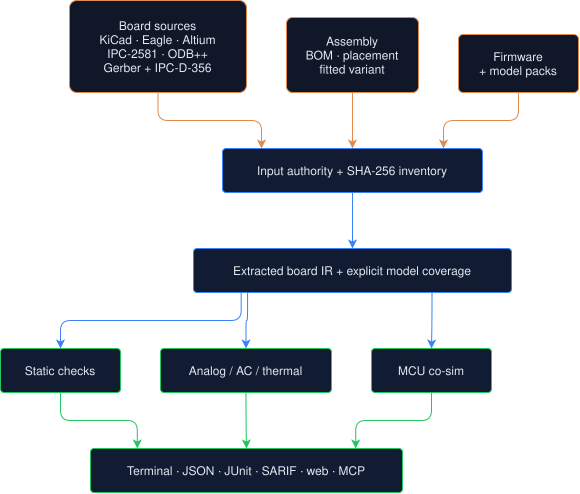

# Hauksbee

**Your design files already contain a running system. Hauksbee executes it.**

Hand Hauksbee the artifacts you already produce: the layout, schematic, fab
archive, BOM and placement data, fitted variant, compiled firmware, or even the
faulty and fixed revisions in a git history. It reconstructs the circuit the
copper actually implements, binds device models, solves it, and can boot the
firmware against the solved board. Findings retain the input, net, component,
coordinate, model, and evidence that produced them.

The refusal is part of the product. If an input is partial, an active component
has no adequate model, a simulator cannot exercise the requested path, or two
manufacturing records contradict one another, Hauksbee reports the valid partial
result and declines the stronger claim. It does not turn missing evidence into a
green board.

A design-rule checker checks geometry against rules. A schematic simulator
executes the circuit it was given. Hauksbee's different job is to execute and
cross-check the evidence that will become the product: native design files,
manufacturing output, assembled-part identity, and firmware. That is why an
authoritative IPC-D-356 member can override a copper guess, a BOM contradiction
can stop analysis before binding, and a firmware-controlled high-impedance net
can remain honestly undecidable until the firmware runs.

**New here?** Start with [START_HERE](docs/START_HERE.md). The authoritative
scope and backend matrix live in [CAPABILITIES](docs/about/CAPABILITIES.md) and
[LIMITATIONS](docs/about/LIMITATIONS.md).


## Five kinds of evidence, one engine

### Board evidence

Native KiCad, Eagle, Altium, IPC-2581, ODB++, schematic-only, and Board-as-Code
inputs become one electrical intermediate representation. Static checks,
model binding, solver construction, and firmware coupling all consume that
same representation rather than separate hand-translated diagrams.

### Fab evidence

Gerber, drill, job metadata, and IPC-D-356 can reconstruct what the factory was
asked to make. The current closed-loop gate records 99.7–100% native-net
partition agreement over located pads across seven routed boards. The located
fraction and missing-drill limits remain part of every result; they are not
silently promoted into full native equivalence.

### Assembly evidence

BOM, placement, and fitted/no-fit variants participate before model binding.
Ambiguous part identity, contradictory dimensions, unknown references, or an
assembly that leaves every active component open cannot produce a green
simulation. The exact assembly inputs travel with the evidence inventory.

### Firmware evidence

Compiled firmware runs on supported MCU backends whose pins and peripherals
couple to the solved circuit. This makes control-state questions executable:
the same copper can pass when firmware drives a gate on time and fail when it
never does. UART output alone is never promoted into proof that GPIO or an
analogue peripheral was exercised.

### Git-history evidence

[`qc/defect_regressions/`](qc/defect_regressions/) turns documented upstream
hardware fixes into two-sided, hash-pinned regressions. Exact parent and fix
bytes run through one Hauksbee binary, and a declared machine field must
discriminate. A detector pair is not automatically a root-cause proof or a
red-to-green board result; the first C64-Saver row is deliberately labelled
`qualified_detector_pair` because its fixed revision remains coverage-invalid.
The LibreSolar MPPT 2420 row goes one step further: an identity-only W25Q80DV
card remains OPEN for simulation, yet its sourced pin map and non-floating
control contract localize `/WP` and `/HOLD` on two one-pad parent nets; both
findings disappear in the direct fix that ties them to +3V3. The fixed board
still has unrelated failures, so that row is qualified too.

## Get Hauksbee

**No terminal required.** On macOS, download `Hauksbee.app` from the
[latest release](https://github.com/hauksbee-dev/hauksbee/releases/latest),
unzip it, and double-click. The app starts the engine locally and opens the
full web interface in your browser: drop a board on the page, get the
plain-language verdict, the full report, live 2D copper, probes, and export.
The app is signed and notarised, so it opens like any other Mac app, and
nothing you drop on it leaves your machine.

Prefer a terminal? One line installs the CLI binaries:

```bash
curl -fsSL https://raw.githubusercontent.com/hauksbee-dev/hauksbee/main/scripts/get-hauksbee.sh | bash
```

Windows (PowerShell):

```powershell
irm https://raw.githubusercontent.com/hauksbee-dev/hauksbee/main/scripts/get-hauksbee.ps1 | iex
```

Docker, for CI or a clean room: `ghcr.io/hauksbee-dev/hauksbee:slim` (static
checks + AVR co-sim) or `:full` (adds Renode, Espressif QEMU, and
autorouting). See [DOCKER](docs/ci/DOCKER.md).

Building from source is one command after a Rust toolchain is present:
`scripts/install.sh` (add simulators with `scripts/install-sims.sh`). Signing,
notarisation, and artifact provenance for every published artifact are
enforced by the release workflow; see
[release and licensing](docs/about/release-and-licensing.md).

## Ninety seconds, no board file required

The binaries carry a small board and a real CI spec:

```bash
hauksbee doctor --json
hauksbee run --example blinky --check --plain
hauksbee serve
```

The second command runs the analysis surface. `hauksbee serve` opens the same
engine through the local browser UI (the same page the app opens), with
sample boards, a checks composer, live 2D copper, probes, and report export.
Captured first-run transcripts are retained under
[`examples/sessions/`](examples/sessions/).

## Every input is an authority, not a hint



This authority chain matters. If a fab archive contains IPC-D-356, Hauksbee
uses that package-authored connectivity instead of guessing nets from copper.
If exporter metadata contradicts a filename, the conflict is visible. If a BOM
or fitted variant contradicts the nominal layout, analysis refuses before model
binding. The same input inventory and causal evidence travels through the human
and machine-readable outputs.

The detailed architecture is in [ARCHITECTURE](docs/about/ARCHITECTURE.md).


## Current proof, with the denominator attached

These are source-bound software, simulation, or emulator results. They are not
measurements on fabricated hardware.

### Raspberry Pi 4 USB-C faulty/repaired pair

Reproduce with
`cargo test -p hauksbee-engine --test usb_c_rpi4 -- --nocapture`.
The generic classifier reports the reconstructed faulty topology as
`AudioAccessory`/VBUS withheld and the repaired topology as healthy. The files
are labelled reconstructions. Hand voltage arithmetic is an independent
oracle, not the product proof.

### Fab-only connectivity recovery

Run the required-corpus `gerber_closedloop` test documented in
[GERBER](docs/ingest/GERBER.md). The seven-board loop currently records
99.7–100% native-net partition agreement over pads that were located. A separate
native-Eagle oracle covers 2,208 shared pad centres and 1,236 reconstructed nets
with zero false merges. Agreement is conditional on located pads. The Eagle row
is one-sided without drill data: missing barrels can still split nets.

### As-built assembly gate

`cargo test -p hauksbee-ci --test assembly_inputs_ci -- --nocapture` runs seven
production tests for BOM, placement, fitted/no-fit variant, exact input hashes,
and contradiction or empty-assembly refusal. This validates the software
contract, not the correctness of a supplier's source data.

### Ordinary ESP-IDF GPIO, no Hauksbee mailbox

`scripts/test-qemu-gpio-source-patch.sh` proves that, with the pinned patched
Espressif QEMU, GPIO output and direction are observed from the SoC's real
OUT/ENABLE MMIO while the mailbox remains unused. The proof requires the
reviewed source patch. GPIO input, SAR ADC, I2C, and SPI retain narrower backend
contracts.

### STM32F072 ADC injection

`cargo test -p hauksbee-mcu --test renode_stm32f072 -- --nocapture` exercises
the built-in ADC input map for channels 0–7. Live proof covers channels 0 and 3
with 12-bit values, and an unsupported channel is dropped explicitly. This is
stock-Renode co-simulation, not hardware timing or watchdog validation.

### Solver performance gate

`cargo test --release -p hauksbee-solve --test speed_gate -- --nocapture`
generates the current table: 7.42x startup-corrected speedup for the rectifier
agreement row and 6.95x for the 90-block array. Both exceed their enforced
floors. The array row is **disclosed drift**, not ngspice agreement. Raw wall
time is host-dependent. See the
[generated table](docs/about/speed-gate-results.md).

The historical-fault matrix is similarly explicit: eight documented in-scope
rows comprise six static catches, one co-simulation catch, and one honest static
miss. Three later live adjudications are reported separately rather than added
to that denominator. Reproduce the matrix with the commands in
[KNOWN_FAULTS_VALIDATION](docs/evidence/KNOWN_FAULTS_VALIDATION.md).

[`qc/defect_regressions/`](qc/defect_regressions/) adds exact public
parent/fix bytes as a growing two-sided suite. The current combined receipt
runs six pairs against hash-pinned executables: Watchy is a true RED-to-GREEN
firmware/electrical pair; C64-Saver, ZSWatch, FPV Controller, LibreSolar
MPPT2420, and the RockSat-X RSXVT2026 camera board (missing uSD CMD/DAT0
pull-ups, caught by `missing_sd_pullup`) are qualified detector pairs whose
targeted findings disappear while the fixed board remains coverage-invalid or
retains unrelated failures. The
harness never launders `FAIL -> INVALID` or `FAIL -> unrelated FAIL` into
`RED -> GREEN`.

## What ships in the engine

### Inputs

- Native KiCad PCB and schematic files, including hierarchy and schematic-only
  analysis.
- Eagle XML layouts, Altium `.PcbDoc`, IPC-D-356, IPC-2581, and ODB++ archives
  or directories.
- Gerber/drill/fab archives, with X2, `.gbrjob`, Altium LDP/EXTREP metadata, and
  explicit authority/refusal handling.
- BOM, pick-and-place, and fitted/no-fit variant inputs before model binding.
- Firmware images and project bundles for supported MCU backends.

Pre-Eagle-6 binary layouts and legacy KiCad 5 `.sch` are intentionally refused.
Format-specific evidence and limitations live under
[`docs/ingest/`](docs/ingest/).

### Checks and analyses

- Copper shorts and clearances, lint, USB-C CC classification, boot straps,
  internal resource conflicts, I2C loading, device configuration decoding, and
  DNP policy.
- Trace ampacity, quasi-static controlled-impedance estimates, topology-aware
  ripple checks, back-power paths, behavioural power ICs, and transient
  brownout scenarios.
- Small-signal AC analysis with gain/phase assertions and a steady-state,
  per-device thermal estimator.
- Typed model coverage and import diagnostics: recovered, partial, unplaced,
  refused, confidence basis, parser stage, and next action. Unplaced objects are
  not drawn at invented coordinates.

Hauksbee's SI checks are closed-form estimates, not a 3D field solver. Thermal
analysis estimates junction temperature per device, not a board thermal field.
AC analysis is linearised about the operating point. Those boundaries are part
of the output, not footnotes added later.

## When a part has no model

An unresolved active part is not the end of the workflow. Hauksbee names the
reference, connected nets, identity evidence, winning model layer, and the
stronger analyses that remain invalid. It binds the part open rather than
inventing plausible behaviour.

The model workflow is data-driven and does not require recompiling Hauksbee:

```bash
hauksbee models coverage board.kicad_pcb --json
hauksbee models prepare board.kicad_pcb --pack-dir model-packs/my-board
# prints the unresolved active-device inventory and asks [y/N] before writing
hauksbee models new U3 --board board.kicad_pcb \
  --kind vreg --out models/u3.toml
hauksbee models lint models/u3.toml
hauksbee run board.kicad_pcb --models-dir models --report --plain
```

`models prepare` is local and approval-gated: it inventories the connected
active devices, shows the exact pack paths it would create, defaults to no, and
does not fetch a datasheet, call an LLM, or install a pack. `models new` starts
from one board identity and refuses to guess the IC's behaviour. `models lint`
applies the same schema and behavioural validation used by binding. `models
resolve` then proves which source and layer won; the full report proves whether
the declared pin roles actually connected. Model packs can be installed,
listed, overridden, and removed without editing the built-in database.

The report separates the stages: a device can be extracted from CAD, matched to
an exact identity/pin map, carry safe static contracts, and still lack the
executable behaviour needed by analog or firmware simulation.
`critical_parts_bound` is the last of those stages (executable behavioural-model
coverage), not a claim that the other critical parts failed to parse.

The browser is the primary human workbench for the same flow. Open
`hauksbee serve`, drop a board, expand **Model coverage**, and click a part to
see its exact winning model, source, pins/nets, implemented behavior, and
declared omissions. **Extend model** makes a local read-only draft; Check uses
the engine validator; Save is a separate reviewed write and refuses overwrite.
No LLM is involved unless the user separately chooses the consent-gated
datasheet-draft action.

Clicking copper is equally direct: watch the trace live, add a voltage, rail,
toggle, or boot assertion, or attach a waveform, pushbutton, or toggle. A live
attachment stamps a real source/contact into the solver and queues the same ID
into ordinary replayable `[[peripheral]]` TOML. Hauksbee never turns a net into
a control merely because it is named `A0` or `INPUT`; the engine must declare a
source or the user must attach one explicitly. The complete browser, CLI, MCP,
approval, and reference-board process is in the
[Board modeling workflow](docs/models/BOARD_MODELING_WORKFLOW.md).

Clicked I²C/SPI parts have the same treatment. Pick or paste a local
register-map spec (or choose a checked-in behavior subset from the browser's
bundled local catalog), set physical inputs, and attach those exact bytes to the
running bus; the browser retains the identical self-contained `[[sensor]]`
entry for replay. The row shows the engine's correlated accept/refuse receipt;
it does not call a queued request successful. Once that behavior is stored in
an exact model card it auto-attaches on future boards. Model cards can require
bus-mode straps and derive a selectable I²C address from exact board
supply/ground ties. Bad spec bytes, typoed inputs, ambiguous straps, unknown CS
nets, and duplicate ids refuse instead of falling back to plausible zeros.
This path is fully local and does not require an LLM.

On the exact public Pedalboard fixture used for that workflow (SHA-256
`3d104bd5c0553fe0749294e695ec2aa5862a06940a7f9fa6b7338f2487aebb49`),
the current staged inventory reports 12/12 connected active ICs identified and
12/12 with executable behavior available. All twelve remain explicitly
`executable_partial`: each card names its supported slice and missing silicon
modes. The broader preparation queue also names the CM4 module boundary as
identity-only. That is the intended distinction between easy setup and honest
completeness, not a return to one opaque “modeled” percentage.

For a local datasheet, `hauksbee models extract --pdf part.pdf --part PART`
can draft a source-labelled model through a consent-gated LLM backend. The
result remains a draft: every pin, parameter, interval, and model limitation
must survive lint, resolution, and a case-specific positive and negative test.
See [MODELS](docs/models/MODELS.md) and the
[extension guides](docs/extending/README.md).

Missing models are therefore a named workflow with a concrete unlocking input,
not a reason to hide an invalid result. CI can also assert the required model
coverage when a project needs that absence to block a build.

## Firmware against solved copper

The engine couples MCU pins and peripherals to the solved board rather than to
a separate breadboard diagram. Current backends include AVR/libsimavr, Renode
platforms for selected STM32, RP2040, nRF52 and RISC-V paths, and Espressif QEMU
for the ESP32 family. GPIO, UART, ADC, I2C, SPI, timing, and peripheral coverage
varies by chip and backend; [MCU.md](docs/cosim/MCU.md) states each proven row and
each unsupported path.

UART boot is not promoted to a GPIO claim. A mailbox-backed peripheral is not
promoted to native register observation. A simulator-only result is not
promoted to hardware validation.

## Faster than SPICE only where accuracy is enforced

Performance is a useful claim only when the same gate checks the waveform. The
current generated speed gate compares matched output timestamps against
ngspice 45.2, records raw and startup-corrected timing separately, and retains
the numerical error row beside the speed row.

Its current rectifier case records a 7.42x startup-corrected speedup while
meeting the enforced agreement bound. The 90-block array records 6.95x but is
labelled **disclosed drift**, not ngspice agreement. Raw wall time varies by
host; neither number is a claim about fabricated hardware.

```bash
cargo test --release -p hauksbee-solve --test speed_gate -- --nocapture
```

The command generates [speed-gate-results.md](docs/about/speed-gate-results.md).
The separate seven-circuit board-style matrix is now measured end to end. On
its exact debug binary, Hauksbee was faster across the observed p10-p90 range
on six cases (median ratios 1.16x to 2.01x) and mixed with ngspice on the gated
BJT/RC case (0.99x median). Only three rows are labelled agreement; four retain
their waveform error as **disclosed drift**. A separate pinned optimized BJT
rerun measured 1.20x median with p10 1.11x, showing that the earlier apparent
slowdown was a debug-build effect rather than evidence for an unsafe solver
shortcut. That follow-up is revision-bound and does not replace a fresh
current-release matrix.

The commands, exact source/binary hashes, per-case runtime spread, waveform
errors and refusal policy live in the
[benchmark harness](qc/benchmarks/ngspice_vs_hauksbee/README.md) and retained
[seven-case artifact](evidence/benchmarks/ngspice-vs-hauksbee-2026-08-15.json).
There is deliberately no aggregate “faster than SPICE” claim, and the old
manually selected 19–37x observations are not current proof.

## Board-as-Code and reproducibility

The extracted board is editable, not a terminal report:

```bash
hauksbee to-code board.kicad_pcb > board.hbee
hauksbee check-code board.hbee
hauksbee from-code board.hbee --output rebuilt.kicad_pcb
hauksbee merge-ses rebuilt.kicad_pcb routed.ses --output routed.kicad_pcb
```

See [BOARD_AS_CODE](docs/ingest/BOARD_AS_CODE.md) for the preserved topology,
current identity limits, and round-trip gates.

For an analysis run, emit an immutable manifest:

```bash
hauksbee run board.kicad_pcb --check --json \
  --emit-manifest evidence/run.manifest.json
hauksbee reproduce evidence/run.manifest.json
```

The manifest binds input bytes, directories, model sources, tool/build
revisions, simulator selection, options, and environment selectors. Numeric
results also carry a typed error budget: solver tolerances, residual status,
invalid windows, timing quantisation, and model uncertainty where available.
See [RUN_MANIFESTS](docs/analysis/RUN_MANIFESTS.md) and
[ERROR_BUDGETS](docs/analysis/ERROR_BUDGETS.md).

## Gate it, if you gate things

CI is one consumer of the engine rather than its definition. Specs can assert
voltage, toggles, boot coverage, rail windows, faults, temperature, protection
trips, peripherals, model coverage, AC gain or phase margin, and hardware-trace
features, with scenarios and fuzzed initial states. The exact schema and
runnable examples are in [CI](docs/ci/CI.md) and
[EXAMPLES](docs/ci/EXAMPLES.md).

```toml
name = "boot_coverage: MOSFET gate driven promptly"
board = "boards/boot_gate.kicad_pcb"
firmware = "../../../testdata/firmware/boot_gate_a/boot_gate.hex"
mcu = "atmega328p"
duration_ms = 50

[[supply]]
net = "+5V"
kind = "ideal"
volts = 5.0

[[assert]]
kind = "boot_coverage"
net = "GATE_CTRL"
min = 3.0
deadline_ms = 20.0

[[assert]]
kind = "no_faults"
```

Run it locally or in CI:

```bash
hauksbee-ci check ci/boot.toml
hauksbee-ci run ci/boot.toml --json --junit out.xml
```

### Fits into an existing repository

```bash
hauksbee-ci init my_board.kicad_pcb
hauksbee-ci hook install
hauksbee-ci github-action
hauksbee watch my_board.kicad_pcb
```

Integration surfaces include:

- a GitHub Action and generated workflow;
- pre-commit hooks that cover native boards, fab archives, IPC-2581 XML, and
  root or nested `ci/*.toml` specs;
- a KiCad plugin;
- a VS Code extension with schema completion, diagnostics, run/check commands,
  and loader-parity tests;
- JSON, JUnit, SARIF/GitHub annotations, self-contained HTML reports, and a
  stdio MCP server for agents.

```bash
claude mcp add --transport stdio hauksbee -- hauksbee-mcp
```

The same causal evidence object is intended to reach every output surface. A
consumer should not receive a greener story merely because it asked through a
browser, an annotation, or an agent tool.


## Verdicts are evidence states

For `hauksbee run`:

- **0**: clean, or report-only output without `--strict`.
- **1**: the input was not analysed (missing, unreadable, unsupported, or an
  LFS pointer).
- **2**: gate-grade findings under `--strict`, or invalid CLI usage.
- **3**: the request was understood, but a trustworthy answer could not be
  produced. The output names the declined claim, missing prerequisite, valid
  partial result, and next action.

For `hauksbee-ci run`:

- **0**: all assertions held and the run was valid.
- **1**: an assertion failed.
- **2**: the spec or board input was invalid.
- **3**: the analysis result was not trustworthy enough to grade.

Evidence labels should be read literally:

- **Source-bound static result:** derived from the identified design bytes and
  documented rules or models.
- **Simulation/emulator result:** observed in the identified solver or backend,
  with its coverage limits.
- **Analytical oracle:** an independently calculated reference used for
  cross-checking.
- **Hardware trace:** measured only when the trace says
  `provenance = "real"`; current bundled trace fixtures are synthetic.
- **Invalid/unassessed:** required evidence is missing. Never a negative finding
  and never green.

Hauksbee is a pre-fab evidence engine, not a substitute for design review,
vendor limits, KiCad/Altium DRC, signal-integrity field simulation, compliance
testing, or the bench.

## Corpus and claim hygiene

The corpus manifest pins 53 upstream entries. The last documented clean fetch
materialised 50 directories containing 305 layouts, 514 schematics, 41
netlists, and 615 Gerber films. Those are inventory counts, not 305 independent
board-health trials. Known-good silence gates use narrower denominators and keep
excluded, refused, unsupported, and unadjudicated inputs visible.

Reproduce the inventory instead of editing README arithmetic:

```bash
scripts/fetch-corpus.sh --dir /tmp/hauksbee-corpus
python3 scripts/check-corpus.py --dir /tmp/hauksbee-corpus
HAUKSBEE_CORPUS_DIR=/tmp/hauksbee-corpus \
HAUKSBEE_REQUIRE_CORPUS=1 \
  cargo test --workspace -- --nocapture
```

The measured inventory, each gate's actual denominator, and the eight
not-known-good exclusions are documented in [CORPUS](docs/evidence/CORPUS.md).
The famous sweep retains its sub-sheet false positive and unadjudicated row; it
does not support an unqualified “zero false positives” claim.

README headline numbers must come from machine-readable, source-bound output.
Manual calculations belong beside the result as independent oracles. Historical
release-candidate observations belong in dated evidence files. A number whose
input, command, denominator, or current revision cannot be reconstructed is not
a current product metric.

## Repository map

- `crates/hauksbee-extract`: CAD, fab, schematic, BOM, and placement ingestion.
- `crates/hauksbee-models`: device and MCU model resolution.
- `crates/hauksbee-ir`: circuit intermediate representation and evidence types.
- `crates/hauksbee-solve`: linear, nonlinear, transient, and AC solvers.
- `crates/hauksbee-mcu`: MCU backends and circuit coupling.
- `crates/hauksbee-engine`: CLI and end-to-end analysis pipeline.
- `crates/hauksbee-ci`: CI spec loader, assertions, reports, and integrations.
- `crates/hauksbee-server`, `frontend/`: local web front door and live board UI.
- `crates/hauksbee-mcp`: structured agent tools over stdio.
- `qc/`: release, unseen-board, and evidence-quality gates.

The KiCad parser/producer layer is vendored under
[`vendor/kicad-forge`](vendor/kicad-forge); provenance and update rules are in
[`VENDORED.md`](vendor/kicad-forge/VENDORED.md).

## Origin, licence, and acknowledgements

Hauksbee grew out of the need to validate a large private analogue board whose
bespoke emulator could only execute the intended circuit. The private board is
not redistributed here, and private-suite evidence is not presented as a
publicly rerunnable result. [PRIVATE_SUITE](docs/about/PRIVATE_SUITE.md) records
that boundary.

Hauksbee source is Apache-2.0; retain [NOTICE](NOTICE) when redistributing it.
The optional in-process AVR backend links GPL-3.0 libsimavr, so a binary built
with that feature is GPL-3.0. Builds without AVR use Renode and Espressif QEMU
as separate processes and retain the permissive Hauksbee licence. Artifact-by-
artifact obligations are in [COMPLIANCE](COMPLIANCE.md).

Major upstream systems include [KiCad](https://www.kicad.org),
[ngspice](https://ngspice.sourceforge.io),
[simavr](https://github.com/buserror/simavr),
[Renode](https://renode.io), and
[Espressif QEMU](https://github.com/espressif/qemu). See the relevant ingest,
solver, co-simulation, and licensing docs for exact provenance.

Contributing and test requirements are in [CONTRIBUTING](CONTRIBUTING.md).
Security reports follow [SECURITY](SECURITY.md).
