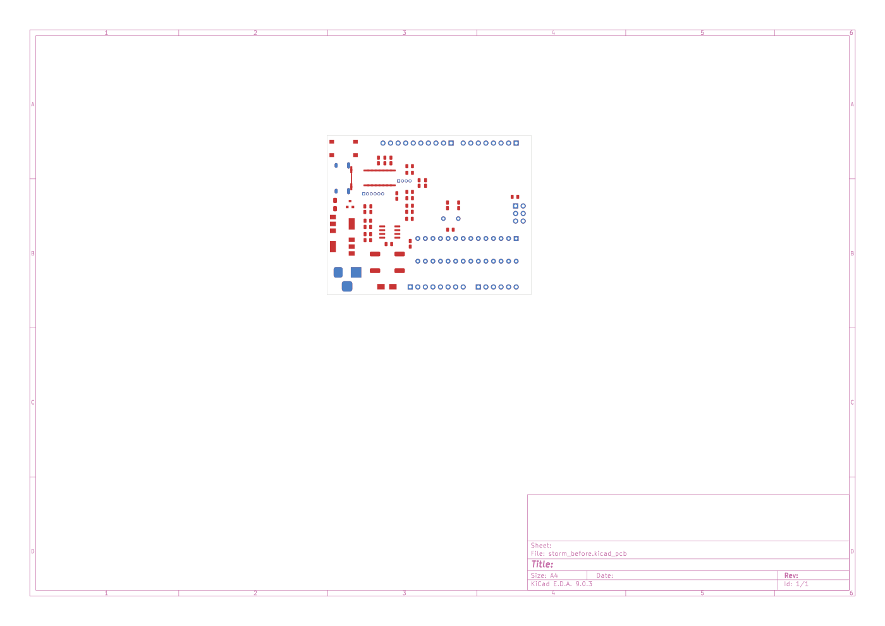
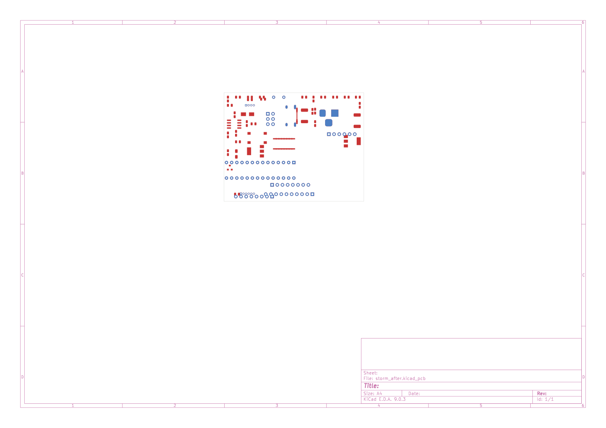
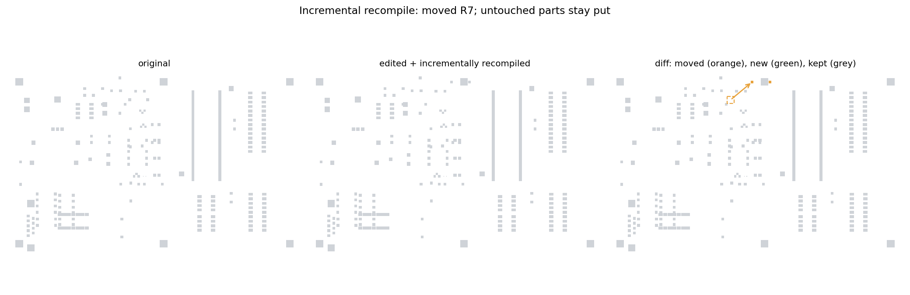
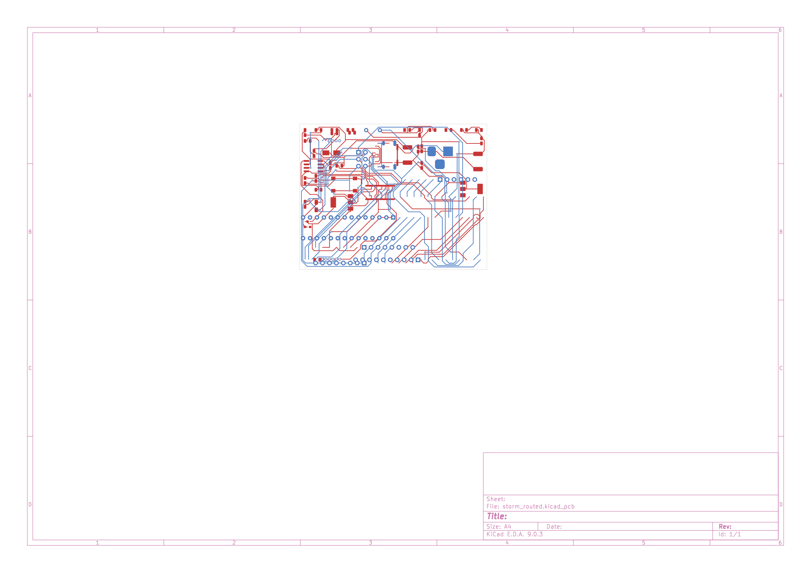

# Board as Code

A PCB is a program that draws itself. Hauksbee makes that program *executable*
and *editable*: you can decompile a real `.kicad_pcb` into readable code, edit
the code (change a part value, fix a wiring swap, add a component), recompile it
back into a coherent board, and run the edit straight through simulation to see
whether your fix actually worked.

This closes a loop that did not exist before. `kicad-forge` already decompiled a
board into a readable, repeat-detected program, but that text dropped net
assignments and was never re-executable; the rebuild step read an in-memory
analysis struct, not source. The Board-as-Code DSL is the missing executable
layer: it carries full pad-level connectivity and round-trips.

## The loop

```text
.kicad_pcb ──to-code──▶ board.board  (editable text)
                              │  edit: value, wiring, add/remove parts, layout hints
                              ▼
                        from-code ──▶ .kicad_pcb'   (recompiled, connectivity-equal)
                              │
                          check-code ──▶ extract ▸ bind ▸ co-sim ▸ stress monitor ▸ report
```

Three CLI verbs, alongside the existing `hauksbee run`:

| command | what it does |
|---|---|
| `hauksbee to-code <board>` | decompile a board into Board-as-Code text |
| `hauksbee from-code <code>` | recompile code back into a `.kicad_pcb` (optionally re-laid-out with `--relayout`/`--incremental` and routed with `--route`) |
| `hauksbee check-code <code>` | recompile, bind, simulate with the stress monitor, print a fault report |

## The DSL

A line-oriented, AI- and human-editable format. Repeated hardware blocks the
decompiler found (a synapse instanced 90 times, a neuron a dozen) become
`fn` blocks; `main` declares the nets and instantiates the blocks, with every
component carrying its concrete pads and per-pad net assignments:

```text
# Board-as-Code (hauksbee board DSL v1)
board version 20171130

# block block_2c_led_0805_2012metric_c_0805_2012metric: 2 slot(s), 3 instance(s)
fn block_2c_led_0805_2012metric_c_0805_2012metric {
    slot 0 lib "Capacitor_SMD:C_0805_2012Metric" val "1k" pads 2
    slot 1 lib "LED_SMD:LED_0805_2012Metric" val "LED" pads 2
}

fn main {
    net "+5V"
    net "/DTR"

    comp R9 lib "Capacitor_SMD:C_0805_2012Metric" val "1K" layer "F.Cu" at 172.82 66.04 rot 0 {
        pad "2" smd roundrect at 0.9375 0 size 0.975 1.4 layers [F.Cu F.Paste F.Mask] net "+5V"
        pad "1" smd roundrect at -0.9375 0 size 0.975 1.4 layers [F.Cu F.Paste F.Mask] net "/DTR"
    }
}
```

The bar for the recompile is **connectivity equivalence**, not byte-exactness:
`board -> code -> board` preserves the component set and every net's wiring (up
to net renaming). On a clean round-trip it also preserves placement. This is
verified on stormduino, pic_programmer, microwave and the full 3443-component
Tarski InputSystem board (`forge-codegen` test `dsl_roundtrip`).

## Worked example: decompile and recompile

```bash
# build the CLI
cargo build -p hauksbee-engine

BIN=target/debug/hauksbee
BOARD="../board-corpus/stormduino/stormduino Rev2.kicad_pcb"

# 1. decompile to code
$BIN to-code "$BOARD" --out storm.board

# 2. recompile back to a board (connectivity-equal to the original)
$BIN from-code storm.board --out storm_rebuilt.kicad_pcb

# 3. run the rebuilt board through the bind + co-sim + stress loop
$BIN check-code storm.board --seconds 0.05
```

`check-code` prints a report like:

```text
Board-as-Code check: stormduino
  51 components, 57 nets, 84% resolved, 0 active nets
  simulated 0.050s
  no faults: circuit is within ratings.
```

## Worked example: a fix, expressed as a code edit

The headline case is the Tarski inhibitory-synapse miswire. The inhibitory
cells cross the dual-NPN's base and collector connections: pin 5 (B2) is wired
to the weight-switch common instead of pin 3 (C2). Enabling the weight then
slams the base toward the rail through the switch's 6 ohm on-resistance.

Expressed as a Board-as-Code edit, the repair is swapping the net names on
IC3906's pad 5 and pad 3:

```rust
let mut prog = Program::parse(&code)?;
let ic = prog.comp_mut("IC3906").unwrap();
let b2 = ic.pads.iter().position(|p| p.number == "5").unwrap();
let c2 = ic.pads.iter().position(|p| p.number == "3").unwrap();
let tmp = ic.pads[b2].net.clone();
ic.pads[b2].net = ic.pads[c2].net.clone();
ic.pads[c2].net = tmp;
let repaired = prog.emit();
```

Recompiling and re-simulating both versions shows the edit changed the physics:

| version | base/sink current | stress faults |
|---|---|---|
| as-wired (code unchanged) | ~689 mA | overcurrent + overpower on IC3906, pin overcurrent on the switch |
| repaired (code edit) | ~0.42 µA | none |

This is the integration test `hauksbee-engine` `boardcode_miswire`
(`code_edit_repairs_the_miswire`). The fault count strictly drops as a direct
consequence of the one-line wiring edit.

## Logical re-layout

`from-code --relayout` recompiles the code to a board arranged by function:
components are grouped by the cluster/function they belong to, the groups tile
the board outline so each function occupies its own region, then a
force-directed relaxation pulls net-connected parts together while a hard
de-overlap pass guarantees no two courtyards (plus their clearances) intersect.
Global power/ground rails are excluded from the attraction so they do not
collapse the whole board into one blob.

The placer respects four real constraints, so the output is something a human
would accept rather than a scramble:

* **Board outline.** The outline is read from the source board's `Edge.Cuts`
  geometry on decompile (and re-emitted as `Edge.Cuts` lines on recompile), or
  set in the DSL with `board size W H` / `board outline X0 Y0 X1 Y1`. Every
  component, courtyard included, is kept inside it; nothing is placed off-board.
* **Courtyards, not points.** Overlap is computed from each footprint's
  rotation-aware pad bounding box, so large parts (a DIP, a connector) genuinely
  reserve their area instead of being treated as a point.
* **Hard clearances.** `space` / `space fn` are enforced as minimum clear
  distances by the de-overlap pass, not soft hints: a test point with `space 3`
  actually gets 3 mm of clear room around it.
* **User position constraints.** `pin <ref> edge <left|right|top|bottom>` holds
  a component against a board edge (the edge-normal coordinate is fixed, the
  along-edge coordinate relaxes), and `lock <ref>` freezes a component at its
  exact coordinates and makes it a fixed keep-out for everything else.

### Constraints in the DSL

```text
board size 60 45                 # constrain the board to 60 x 45 mm

fn main {
    pin J1 edge left             # hold connector J1 against the left edge
    pin J2 edge right
    lock U5                       # never move the MCU; keep its placement
    space fn block_synapse 8     # every synapse instance gets 8 mm clear
    ...
}
```

### Distance fields

Components and whole functions can carry a `space` clearance field that the
placer enforces as a hard minimum clear distance:

```text
comp TP1 lib "TestPoint:TestPoint_Pad_D1" val "TP" layer "F.Cu" at 0 0 rot 0 {
    space 5                       # keep 5 mm clear around this test point
    pad "1" smd circle at 0 0 size 1 1 layers [F.Cu] net N
}

fn main {
    space fn block_synapse 8      # every synapse instance gets 8 mm breathing room
    ...
}
```

### Before / after

Full re-layout of stormduino, exported with `kicad-cli pcb export svg`
(`assets/storm_before.svg`, `assets/storm_after.svg`):

| before | after |
|---|---|
|  |  |

Left is the original placement; right is the function-grouped re-layout, with
every part inside the board outline, courtyards non-overlapping, and clearances
respected. Connectivity is identical (the recompiled board passes the same
connectivity check); only the placement changed.

Regenerate both, the routed board, and the incremental diff with one command:

```bash
hauksbee/scripts/board_as_code_assets.sh
```

## Incremental recompile (the preferred default)

Full re-layout throws away the existing placement. Incremental recompile keeps
it: the *original* board is the base, components whose identity and placement are
unchanged keep their exact coordinates, and only new, moved or value-changed
parts are re-placed, into free space near their net neighbours, without
disturbing the settled board.

```bash
$BIN from-code storm.board --incremental --out storm_patched.kicad_pcb
# re-layout: 0 groups, 4 moved, 47 kept
```

This is the right default for a fix workflow: you edited one resistor or one
wire, so only that part should move. It is exercised by `forge-codegen` test
`incremental_keeps_unchanged`, which moves a single component and asserts
exactly that one component is re-placed while every other keeps its coordinates
and the connectivity is preserved.

(The `4 moved` on the unedited stormduino above is an honest artifact of that
board carrying duplicate reference designators: the base index is keyed by
reference, so the colliding duplicates read as changed. Boards with unique
references report `0 moved` on an unedited round-trip.)

### Before / after / diff

The visualisation below uses `pic_programmer` (which has unique references for a
clean diff): the original board, the board after one textual edit (move a single
resistor) recompiled incrementally, and a diff that highlights the moved part in
orange (with a dashed ghost at its old position and an arrow to the new one),
new parts in green, and the 62 untouched parts in grey.



The middle and diff panels are identical to the original except for that one
part: incremental recompile keeps every untouched component exactly where it
was. Regenerate with `hauksbee/scripts/board_as_code_assets.sh` (renderer:
`scripts/make_incremental_viz.py`).

## Routing

Routing is a hard, well-solved problem, so the production path hands the placed
board to **freerouting** (the standard open-source autorouter, Java) over the
Specctra DSN/SES interchange format rather than growing a bespoke router.

```bash
# route with freerouting (the default when it is installed)
$BIN from-code storm.board --relayout --route --out storm_routed.kicad_pcb
# routed: 49/50 nets (98%), 678 segments, 45 vias, 39.1s (freerouting)
```

The hand-off, in `forge-codegen`'s `route_freerouting` module:

1. **DSN export** (`write_dsn`): serialise the placed board to Specctra DSN, the
   board boundary (from `Edge.Cuts`), one image per footprint, a padstack per
   distinct pad/via geometry, the net list, and a default width/clearance rule.
2. **Invoke freerouting headless** (`run_freerouting`): spawn `java -jar
   freerouting -de board.dsn -do board.ses -mp <passes>` as a child process,
   poll it, and **kill it if it exceeds a wall-clock budget** (autorouting a
   large board can otherwise run for minutes).
3. **SES import** (`parse_ses` + `merge_ses_into_pcb`): read the routed wires and
   vias back and write them onto the board as copper segments and vias on the
   correct nets.



### Installing freerouting

Download a release jar from
[github.com/freerouting/freerouting](https://github.com/freerouting/freerouting/releases)
and either point `FREEROUTING_JAR` at it or drop it in a `tools/` directory up
the tree (the engine auto-discovers it). A JRE (`java`) must be on `PATH`.

**Use the 1.9.0 jar** (`freerouting-1.9.0.jar`). Its headless batch mode
reliably writes the SES and exits even on a partially-routed board. The 2.x line
(tested with 2.2.4) parses and routes correctly but **stalls without writing the
SES unless the board is 100% routed**, which is unworkable for a batch handoff;
the engine prefers a 1.x jar when both are present and passes `-da` only to 2.x.
(The DSN/SES writer was validated against both; the 10x output-resolution quirk
of 1.9.0's SES is handled by detecting the coordinate scale empirically.)

### Grid A* fallback

When freerouting (or a JRE) is absent, `--route` transparently falls back to the
in-tree grid A* router (`route_grid`); `--route-grid` forces it. It connects each
net's pads with Manhattan paths on a single layer, treats component bodies as
keep-outs, and **reports any net it cannot complete rather than silently dropping
it**. Its honest limitations: one layer, no vias, no rip-up-and-retry, and it
bails on boards whose bounding grid would exceed a few million cells. It is
enough to prove a placement is routable in the small and to visualise tracks; it
is not a production autorouter. Use freerouting for real boards.

## Where the code lives

| piece | path |
|---|---|
| executable DSL (emit / parse / build) | `kicad-forge/crates/forge-codegen/src/dsl/` |
| re-layout + incremental + grid router | `kicad-forge/crates/forge-codegen/src/layout.rs` |
| freerouting handoff (DSN / invoke / SES) | `kicad-forge/crates/forge-codegen/src/route_freerouting.rs` |
| re-runnable asset/export script | `hauksbee/scripts/board_as_code_assets.sh`, `scripts/make_incremental_viz.py` |
| connectivity-only board comparison | `kicad-forge/crates/forge-codegen/src/rebuild.rs` (`compare_connectivity`) |
| edit -> simulate loop + CLI glue | `hauksbee/crates/hauksbee-engine/src/boardcode.rs` |
| CLI subcommands | `hauksbee/crates/hauksbee-engine/src/main.rs` |
| DSL round-trip + layout tests | `kicad-forge/crates/forge-codegen/tests/dsl_roundtrip.rs` |
| miswire edit -> simulate demo | `hauksbee/crates/hauksbee-engine/tests/boardcode_miswire.rs` |
