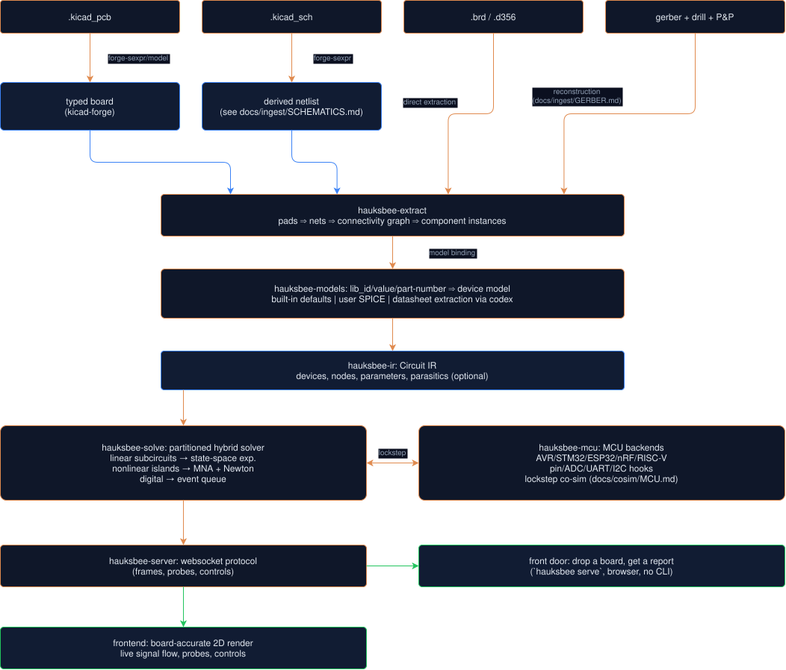

# Hauksbee Architecture

Hauksbee takes PCB and manufacturing artifacts, extracts the circuit they
describe, couples supported firmware emulators to the analogue solver, and
renders the result on the board layout. The exact supported inputs, models,
backends, and evidence boundaries are listed in
[CAPABILITIES](CAPABILITIES.md) and [LIMITATIONS](LIMITATIONS.md).

## Lineage

Hauksbee generalizes the Tarski-Emulator, which proved the approach on one
board: closed-form integration where topology permits, event-driven digital,
and firmware on an emulated MCU coupled through pin-level hooks. Automatic
extraction and a general solver replace Tarski's hand-built network, without
giving up the speed that made it many times faster than ngspice.

## Pipeline

## Solver philosophy (where the speed comes from)

1. **Partition before solving.** hauksbee splits the connectivity graph at
   device boundaries into islands. Purely linear islands get state-space form
   `x' = Ax + Bu` solved by matrix exponential (exact at any step size, the
   Tarski trick generalized). Digital components are event-driven. Only
   genuinely nonlinear analog islands pay for MNA + Newton, and each island
   solves its own small matrix instead of one giant one.
2. **Compile, do not interpret.** The IR can be lowered to specialized Rust
   (or a precompiled stamp plan) so the per-step inner loop is flat code
   with fixed sparsity, with no per-step model dispatch.
3. **Solver debugging controls.** Every effect (parasitics, temperature
   dependence, charge storage, tolerances) is toggleable, and granularity is
   adjustable. Turning physics off is a feature for debugging and speed.

## Accuracy

Unlike Tarski-Emulator's bespoke behavioral models, device models are real:
SPICE-level diode/BJT/MOSFET equations, temperature-dependent, validated
against ngspice on reference circuits to tight tolerances. Behavioral models
remain available for digital ICs and for speed toggles.

## Checks and analyses

The static checks and the dynamic analyses each have their own write-up:

- **DRC / copper shorts**: [SHORTS.md](../checks/SHORTS.md).
- **Connectivity lint, strap-pins, resource conflicts**: [RESOURCE_CONFLICTS.md](../checks/RESOURCE_CONFLICTS.md).
- **Signal integrity** (crystal load caps, decoupling, antenna keepout, USB skew, and controlled-impedance from trace geometry + stackup, a quasi-static closed-form estimate, not a field solve): [SI_CHECKS.md](../checks/SI_CHECKS.md).
- **Transients and brownouts**: [TRANSIENTS.md](../checks/TRANSIENTS.md).
- **AC / small-signal** (Bode, phase margin, gain crossover, averaged small-signal about the DC operating point, not cycle-by-cycle switching): [AC_ANALYSIS.md](../analysis/AC_ANALYSIS.md).
- **Steady-state thermal** (per-device junction temperature `Tj = Tambient + P * theta_JA`, not a board thermal field solve): [THERMAL.md](../checks/THERMAL.md).

Each report runs from `hauksbee run <board> --report/--drc/--lint/--si/--resources/--ampacity/--usb-c/--thermal` or `--ac`, or all the static ones at once with `--check` (alias `--all`). They are informational and exit 0 by default, with two exceptions that refuse to vouch for themselves: an analysis that would be meaningless is invalid (exit 3), and a PARTIAL-coverage `--thermal` result exits 3 by default (`--no-strict-thermal` opts out; see [CI.md](../ci/CI.md#exit-codes-the-pipeline-contract)). Add `--plain` (alias `--explain`) for a non-engineer verdict, or `--strict` (alias `--fail-on-findings`) to fail a pipeline directly. For the full assertion flow, including `phase_margin` / `ac_gain` / `max_temp`, see [CI.md](../ci/CI.md). Runnable examples, including the `hauksbee serve` web front door, are in [EXAMPLES.md](../ci/EXAMPLES.md).

## Layout

- `vendor/kicad-forge` (vendored in this repo): lossless KiCad parse/produce,
  typed model, board-to-code with repeat detection.
- The workspace crates: extraction, models, solver, MCU co-sim, server, UI.
- The server layer ships as three binaries: `hauksbee` (CLI + web front door),
  `hauksbee-ci` (the CI gate), and `hauksbee-mcp` (a stdio MCP server exposing
  the same engine to coding agents).
