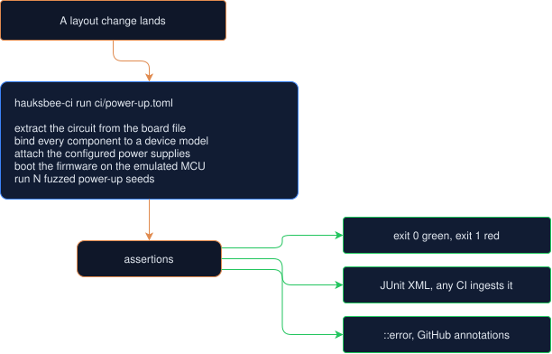

# CI for hardware

**On every layout change: boot the firmware on the emulated board, assert the
rail comes up above 4.9 V, assert the UART says hello, assert the LED blinks.**

One habit transformed software: run the tests on every commit. A red build
stops a regression before it reaches anyone. Hardware has had nothing like it.
A board change goes from a layout edit to a fab order to a reflow oven to a
bench session weeks later. The first time anyone learns the rail browns out is
with a multimeter in hand.

`hauksbee-ci` closes that loop. It runs the hauksbee PCB emulator headless in
a pipeline. Point it at a board file and (optionally) a firmware ELF, and give
it a short list of assertions in a checked-in TOML file. It boots the firmware
on the board the layout actually implements. It then reports, with an exit
code, a JUnit report, and inline annotations, whether the board still does
what it is supposed to. The bug that cost weeks on the bench becomes a
one-line regression that fails on the broken layout forever.

This is not lint and it is not a DRC. It is the board, alive, under
assertions: the analog rails, the firmware's serial output, the blink
frequency, the stress ratings, all checked the way a test suite checks a
function.

**Where the web page fits.** `hauksbee serve`'s drop-a-board page is the quick
look: one board, one optional firmware image, one plain-language report. The
TOML spec on this page is the *repeatable* check: it pins down how the board
is powered, which firmware boots, and what must hold, so a pipeline can run it
on every commit. Assertions exist only in specs and run only through
`hauksbee-ci`. The browser never evaluates them. When a quick look turns into
something you want to keep true, `hauksbee-ci init <board>` turns the board
into a starter spec.

**Prerequisites.** A Rust toolchain if you build from source (`cargo build
--release -p hauksbee-ci`, or `scripts/install.sh` to put both binaries on
PATH), or grab the prebuilt release bundle and skip the build entirely.

## Contents

- [How a check runs](#how-a-check-runs)
- [Quick start](#quick-start)
- [Spec format](#spec-format): [top-level keys](#top-level),
  [`[[supply]]`](#power-supplies-supply), [`[[net_drive]]`](#net-drives-net_drive),
  [`suppress_rail`](#rail-suppression-suppress_rail),
  [`[[override]]`](#component-overrides-override),
  [the as-built overlay](#the-as-built-overlay-asbuilt),
  [`[fuzz]`](#initial-state-fuzzing-fuzz),
  [tolerances + `[ensemble]`](#component-tolerances-tolerance--ensemble)
- [Assertions: `[[assert]]`](#assertions-assert)
- [Waiving a finding you have judged](#waiving-a-finding-you-have-judged)
- [Output](#output)
- [Worked example: the Tarski power-up brownout](#worked-example-the-tarski-power-up-brownout)
- [Boot coverage](#boot-coverage-watching-the-firmware-define-a-hi-z-control-net)
- [Schematic-stage CI](#schematic-stage-ci)
- [Wiring it into your repo](#wiring-it-into-your-repo):
  [the zero-config gate](#the-zero-config-gate-artifacts-without-a-spec)
- [Exit codes (the pipeline contract)](#exit-codes-the-pipeline-contract)
- [Limitations](#limitations)
- [For contributors: the static-check corpus gates](#for-contributors-the-static-check-corpus-gates)

## How a check runs



One spec describes one headless co-simulation and the things that must hold for
the build to pass. Check it into the hardware repo next to the board. Wire it
into GitHub Actions (`integrations/github-action`) or run it from KiCad
(`integrations/kicad-plugin`) or call the binary from any CI.

## Quick start

Rather than hand-write a spec from a blank page, scaffold one from your board,
`init` detects the supplies, MCU, and nets and emits a starter spec you edit:

```bash
hauksbee-ci init my_board.kicad_pcb   # writes my_board.toml into the CURRENT directory
# edit the scaffolded spec's [[assert]] blocks, then:
hauksbee-ci run my_board.toml
```

`init` writes into the directory you are standing in (so `cd ci &&
hauksbee-ci init ../hardware/my_board.kicad_pcb` lands the spec in `ci/`,
where the pre-commit hook and the GitHub action look), or wherever `--out
<dir-or-file.toml>` says. The generated `board = "..."` path is written
relative to where the spec lands, so it is valid on arrival.

Or run the bundled examples straight away. Every command on this page assumes
`hauksbee-ci` is on PATH (`scripts/install.sh` puts it there, or use the
release bundle); from a bare source checkout, substitute
`./target/release/hauksbee-ci` after `cargo build --release -p hauksbee-ci`.

```bash
# Boot the demo firmware on a small board and check rail + UART + blink.
hauksbee-ci run crates/hauksbee-ci/examples/blinky.toml

# The flagship regression: the Tarski power-up brownout (this one FAILS).
hauksbee-ci run crates/hauksbee-ci/examples/tarski_brownout.toml
echo $?   # 1: the rail collapses on a fuzzed power-up state

# The same board, repaired (this one PASSES).
hauksbee-ci run crates/hauksbee-ci/examples/tarski_brownout_repaired.toml --junit results.xml
echo $?   # 0
```

### Custom parts: the model library and `--models-dir`

`hauksbee-ci run` binds the board against the same layered model library as
`hauksbee run`: the builtin db, then installed packs, then the user model dirs
(`~/.hauksbee/models`, `~/.config/hauksbee/models`), then `--models-dir DIR`
(highest priority). A custom `[[models]]` entry, including a
`kind = "mcu"` routing entry that maps a part value to a `renode:<part>` /
`qemu:<part>` backend and its SoC descriptor, therefore binds in CI exactly
as it does interactively:

```bash
hauksbee-ci run ci/board.toml --models-dir hardware/models
```

MCU SoC descriptors themselves resolve from `$HAUKSBEE_MCU_DIR` /
`~/.config/hauksbee/mcu` before the built-ins, in CI and interactive runs
alike (see `docs/extending/add-an-mcu-variant.md` for the full two-file
recipe). `hauksbee-ci init`'s scaffold uses the same layered library, so the
detected MCU matches what a run would bind. Note: the spec's top-level `mcu`
key does NOT select the MCU. It is an informational note only. The board's
part value plus the routing entries decide.

## Spec format

A spec is TOML, designed to be pleasant to hand-write. Unknown keys, unknown
nets, and unknown component references are loud errors, and a misspelled net
name lists its near-matches ("did you mean `ANALOG_VDD`?").

### Top level

Every key the loader accepts, in one place. Unknown keys are rejected.

| Key             | Type     | Default       | Meaning                                                       |
| --------------- | -------- | ------------- | ------------------------------------------------------------- |
| `name`          | string   | `"hauksbee-ci"`| Label shown in reports.                                       |
| `board`         | path     | required      | Board file: `.kicad_sch` (schematic), `.kicad_pcb`, `.net`, Eagle `.brd`, IPC-D-356, Altium `.PcbDoc`, a gerber folder/zip, or Board-as-Code `.board` (bare or zipped; compiled in-process, no routing step needed). The same formats `hauksbee run` accepts. |
| `firmware`      | path     | none          | Firmware to boot on the detected MCU: a compiled ELF/hex, a PlatformIO project directory, or a zip of either (same three input tiers as `run --firmware`, see [`../cosim/MCU.md`](../cosim/MCU.md)). |
| `mcu`           | string   | none          | Informational note only, nothing reads it. The MCU comes from the BOARD's part value via `[[models]] kind = "mcu"` routing entries (builtin, user model dirs, `--models-dir`); this field cannot force a backend. Distinct from the `mcu` field inside a `uart` `[[assert]]`, which IS load-bearing (it selects which MCU's UART the assertion reads). |
| `duration_ms`   | float    | `100`         | Simulated time to run.                                        |
| `frame_ms`      | float    | `1`           | Sampling cadence (how often nets are read).                   |
| `[timing]`      | table    | none          | Strict timing contract: `min_pulse_us` and/or `max_edge_error_us`. Poll backends adapt their real chunk or the run is INVALID; every report states measured coverage. |
| `ambient_c`     | float    | `25`          | Ambient temperature (C) for the steady-state junction-temperature estimate `max_temp` checks against. |
| `asbuilt`       | path     | none          | `.asbuilt.toml` overlay: the physical rework delta (cut traces, jumpers, lifted pins, fitted values) applied to the bound board before every run. See [the as-built overlay](#the-as-built-overlay-asbuilt). |
| `fit`           | [string] | `[]`          | DNP part references to simulate as fitted regardless of `dnp`. Unknown references are loud errors. See [DNP.md](../ingest/DNP.md). |
| `no_fit`        | [string] | `[]`          | DNP part references to leave open regardless of `dnp`. See [DNP.md](../ingest/DNP.md). |
| `dnp`           | string   | `"fit-except-links"` | Policy for DNP parts neither list names: `fit-except-links`, `fit-all`, or `honour`. See [DNP.md](../ingest/DNP.md). |
| `suppress_rail` | [string] | `[]`          | Nets whose auto-rail is removed (fed only through the board). |
| `[[supply]]`    | blocks   | none          | Power-supply legs (ideal / bench / wall / usb / battery). See [below](#power-supplies-supply). |
| `[[net_drive]]` | blocks   | none          | Nets forced to a fixed voltage for the whole run. See [below](#net-drives-net_drive). |
| `[[override]]`  | blocks   | none          | Component value swaps applied before binding. See [below](#component-overrides-override). |
| `[[tolerance]]` | blocks   | none          | Component-tolerance rules sampled per ensemble seed. See [below](#component-tolerances-tolerance--ensemble). |
| `[ensemble]`    | table    | none          | Tolerance-ensemble execution config (seed count, monte-carlo vs corners). |
| `[fuzz]`        | table    | none          | Initial-state fuzzing (random power-up levels on named nets). See [below](#initial-state-fuzzing-fuzz). |
| `[[scenario]]`  | blocks   | none          | Transient load scenarios that `rail_window` / `protection_trip` judge over. See [TRANSIENTS.md](../checks/TRANSIENTS.md). |
| `[[profile]]`   | blocks   | none          | Spec-local load-profile definitions a `[[scenario]]` can reference, in addition to the built-in profile database. See [TRANSIENTS.md](../checks/TRANSIENTS.md). |
| `[decoupling]`  | table    | none          | Opt-in capacitor parasitics (ESR/ESL) for the run. See [TRANSIENTS.md](../checks/TRANSIENTS.md). |
| `[ac]`          | table    | none          | Small-signal AC sweep that drives `phase_margin` / `ac_gain`. See [AC_ANALYSIS.md](../analysis/AC_ANALYSIS.md#ci). |
| `[[peripheral]]`| blocks   | none          | Buttons, pots, encoders, stimuli, bus slaves, VCD sinks attached for the run. See [PERIPHERALS.md](../cosim/PERIPHERALS.md). |
| `[[sensor]]`    | blocks   | none          | Declarative I2C/SPI register-map sensors attached for the run. See [PERIPHERALS.md](../cosim/PERIPHERALS.md). |
| `[[assert]]`    | blocks   | at least one  | The assertions, all of which must pass. See [Assertions](#assertions-assert). |

Paths are resolved relative to the spec file's directory.

### Timing coverage (`[timing]`)

Use a timing contract when an assertion depends on a firmware edge or pulse
being represented, rather than merely on the final settled voltage:

```toml
[timing]
min_pulse_us = 20.0
max_edge_error_us = 4.0
```

The policy is derived from the live backend. simavr reports each GPIO callback
at its MCU cycle, so timestamp precision and the guaranteed pulse floor are one
clock period (`1 / frequency`). Renode and QEMU discover GPIO by polling after
`run_micros`; Hauksbee therefore shrinks their actual chunk to the tighter of
`min_pulse_us / 2` and `max_edge_error_us`. Two polls per requested pulse ensure
one poll lies inside it even when an edge lands on a boundary. The poll bridge
takes integer microseconds, so a request needing a chunk below 1 µs is refused
as unrepresentable instead of rounded into false precision. Chunk subdivision
uses a ceiling, so the slice actually executed never exceeds the negotiated
maximum when a frame is not an exact multiple of it.

A `toggle` assertion on a poll backend must declare `timing.min_pulse_us`.
Without a pulse width, polling cannot prove that a rise and fall did not both
occur between samples. Exact callback backends count the ordered edge log, so a
pulse that begins and ends inside one analog chunk still contributes both
toggles to the assertion and activity reports.

An unmet contract, a cycle-stamped pulse proven to have been missed by a
tick-evaluated sequential part, or a GPIO edge storm that exceeds the bounded
analog PWL replay budget makes every assertion `INVALID` and exits 3.
It cannot be waived into green. The terminal, JSON, JUnit, GitHub checks UI and
web checks panel all publish the actual per-MCU timestamp precision, guaranteed
pulse floor, chunk, stamp tier, and any explicit refusal. Without `[timing]`,
those measurements are still reported, but no additional pulse-width claim is
requested and external backends retain their performance-oriented coarse default.

### Power supplies: `[[supply]]`

The engine already models bench, wall, USB, battery, and ideal legs. Attach one
to a supply net to run the board under a realistic source.

```toml
[[supply]]
net = "+5V"
kind = "bench"            # ideal | bench | wall | usb | battery
volts = 5.0
current_limit_a = 1.0     # bench: CC foldback above this
```

Per kind (the first field of each is REQUIRED; the loader rejects a leg
without it rather than assuming a voltage that could fabricate faults):

- `bench` takes `volts` (required), `current_limit_a`.
- `wall` takes `volts` (required), `r_out_ohms`, `ripple_vpp`, `ripple_hz`.
- `usb` takes `usb = "5v0.5a" | "5v1.5a" | "5v3a"` (required).
- `battery` takes `chemistry = "liion" | "alkaline" | "nimh" | "lifepo4"`
  (required), `cells`, `capacity_mah`, `soc`, `r_internal_ohms`.
- `ideal` takes `volts` (required).

### Net drives: `[[net_drive]]`

Force a net to a fixed voltage for the whole run: external stimulus, a strap, or
a register bit that the firmware does not set.

```toml
[[net_drive]]
net = "WSEL"
volts = 5.0
```

### Rail suppression: `suppress_rail`

By default hauksbee attaches an ideal rail to every recognised supply net. When a
rail is physically fed *through* a board component (a sense shunt, a ferrite, a
regulator you want to exercise), suppress its auto-rail so the droop or collapse
is visible:

```toml
suppress_rail = ["ANALOG_VDD"]
```

### Component overrides: `[[override]]`

Swap a component's value before binding. This is how a repair is expressed:
change the wrong part to the right one and re-run the same assertions.

```toml
[[override]]
ref = "R_Shunt15301"
value = "0.05"            # the documented milliohm sense shunt
```

### The as-built overlay: `asbuilt`

`[[override]]` swaps a component's *value string* before binding. Some boards
differ from their design files more radically: traces cut with a knife, pins
lifted, jumper wires soldered, parts replaced. That is the physical rework
record. That delta lives in a declarative `.asbuilt.toml` overlay, and a spec
can reference one. hauksbee applies it to the bound board before every run,
ahead of any harness attachment:

```toml
asbuilt = "tarski.asbuilt.toml"   # relative to the spec file, like `board`
```

The overlay is fail-loud: an entry that matches nothing (or a different number
of devices/terminals than it declares) aborts the run with a line-numbered
error and a did-you-mean suggestion. The flagship example is the Tarski
board's validated surgery, `testdata/tarski.asbuilt.toml`. This is the same
file the engine CLI takes as `hauksbee run board --asbuilt
board.asbuilt.toml`.

### Initial-state fuzzing: `[fuzz]`

Real boards power up with undefined register and latch states. Fuzzing runs the
sim under several seeds, each strapping the listed nets to a random level. An
assertion passes only if it holds on **every** seed, which is exactly what
catches a bug that only one power-up state triggers (see the brownout below).

```toml
[fuzz]
seeds = 16
nets = ["WSEL", "OE_N", "RCLK"]   # undefined power-up bits
levels = [0.0, 5.0]               # the two states each is strapped between
```

Seed 0 is always the all-low baseline. The rest are spread deterministically,
so a run is reproducible.

### Component tolerances: `[[tolerance]]` + `[ensemble]`

A board that only meets its assertions at *nominal* component values is a
latent defect: real parts are ±1% / ±5% / ±10%, and some fraction of assembled
units will land outside the window. Declare the tolerances and hauksbee-ci
replays the whole assertion set across an **ensemble** of sampled builds, on
every commit.

```toml
[[tolerance]]
ref = "R*"                 # a literal ref, or a pattern (* matches any run)
percent = 10.0             # ±10% of the component's value
distribution = "gaussian"  # optional; default "uniform"

[ensemble]
seeds = 24                 # Monte-Carlo member count (default 16)
mode = "monte-carlo"       # "monte-carlo" (default) | "corners"
```

Rules apply in order and the **last matching rule wins** per component, so a
broad `ref = "R*"` can be followed by a tighter `ref = "R7"`. The nominal is
the component's board value (after any `[[override]]`). An override can also
declare its own spread, and then the `value` becomes the nominal:

```toml
[[override]]
ref = "R_Shunt15301"
value = "0.05"
tolerance = 1.0            # the repaired shunt is a ±1% part
```

Distributions: `"uniform"` samples the full ±tolerance band (assumes nothing
about vendor binning, stresses the edges hardest, and is the default).
`"gaussian"` uses the standard EDA convention, sigma = tolerance/3 truncated
at the tolerance bound (a part outside its marked tolerance would have been
binned out at the factory).

**What a green ensemble means, and does not.** Monte-Carlo is *sampled
coverage*: "passed 24/24 sampled tolerance seeds" is statistical evidence over
the tolerance space, **never a worst-case proof**, and the report words it
exactly that way. An assertion passes only if it holds on **every** member.

**Corner mode** (`mode = "corners"`) is the deterministic complement: instead
of random samples it enumerates every all-min/all-max combination of the
toleranced components (2^n runs). For a response that is *monotonic* in each
component value (dividers, ladders, most DC bias networks) the true worst
case is a corner, so a green corner run bounds it. For non-monotonic responses
(filters peaking mid-band, matched pairs) the interior can be worse than any
corner.

That condition is not left as a caveat with nothing behind it. Alongside the corners, corner
mode runs a small stratified **Latin-hypercube sample of the interior**: 4
probes for one toleranced component, 6 for two, 8 from three up, so the check
is a bounded handful of extra runs and never a multiple of the corner set. An
interior probe that fails where every corner passed **fails the assertion**
and says so, because the corners demonstrably did not bound that response.

A clean probe set is evidence for the monotonicity the bound needs, not proof
of it, and the report words it that way. Two limits are stated rather than
glossed: the probes sample the interior, so a non-monotonicity between them is
still possible; and each member is judged against the assertion's own window,
so a probe worse than every corner still passes while it stays in band.
Interior probes are numbered on from the last corner, so `--seed k` isolates
one exactly like a corner; the report calls them `interior probe k`.

Full enumeration is capped at 10 toleranced components (2^10 = 1024 corner runs, plus the interior probes). Above 10
toleranced components, corner mode refuses and points at Monte-Carlo. Corner
mode does not compose with `[fuzz]` (the corner index enumerates min/max
combinations, not fuzz seeds). Monte-Carlo does compose with `[fuzz]`.

**Reproducibility is doctrine.** Re-running a member reproduces it
byte-identically, which is what makes a red build investigable. Every
Monte-Carlo sampled value is a pure function of (seed, component reference,
rule): in Monte-Carlo mode seed 0 is the nominal baseline, the tolerance stream
is domain-separated from the net-fuzz stream (adding a tolerance never changes
which fuzz levels seed N straps), and when `[fuzz]` and `[ensemble]` are both
present one shared seed stream drives both (the member count is the larger of
the two `seeds`). Corner mode has no nominal member (member 0 is the all-min
corner), and its member indices, corners and interior probes alike, are
renumbered by adding a tolerance rule: an index names a point within one spec
revision, which is what `--seed` replay needs. A failure names the seed and
the exact sampled values:

```
[FAIL] VOUT stays in [2.4, 2.6] V across the tolerance ensemble
      seed 8: VOUT: min=2.695V (>= 2.4V), max=2.708V > allowed 2.6V <- FAILED HERE ... [R1=9.17k, R2=10.7k]; passed 19/24 seeds (failing: 8, 10, 16, 18, 19)
      why: VOUT rose to 2.708 V, 0.108 V above your 2.6 V ceiling ...
```

(The violated bound carries the `<- FAILED HERE` marker with the observed
extreme; the passing lower bound is reported un-annotated beside it. Note the
lowest VOUT ever sat on seed 8, 2.695 V, is itself above the 2.6 V ceiling:
this divider is high across the board on that draw.)

Re-run that one build in isolation. It reproduces byte-identically:

```bash
hauksbee-ci run ci/divider.toml --seed 8
```

A runnable two-sided demo ships in the examples: the same 10k/10k divider
passes at nominal and fails across the ±10% ensemble
(`crates/hauksbee-ci/examples/tolerance_divider.toml`), and its corner variant
lands exactly on the hand-computable [2.25, 2.75] V envelope
(`tolerance_divider_corners.toml`). Both are pinned as integration tests
against that analytic envelope (`crates/hauksbee-ci/tests/tolerance.rs`).

### Assertions: `[[assert]]`

At least one is required (a check with no assertions passes vacuously, so the
loader rejects it). Each `kind`:

**`voltage`**: a net within bounds, optionally only after the rail settles.

```toml
[[assert]]
kind = "voltage"
net = "ANALOG_VDD"
min = 4.9            # and/or max
after_ms = 50        # only sample at/after this time
```

A `min` checks the worst (lowest) the net dipped to in the window. A `max`
checks the worst (highest) it rose to.

**`uart`**: the firmware's serial output contains a string or matches a regex.

```toml
[[assert]]
kind = "uart"
contains = "hauksbee-demo v1"   # or: matches = "v\\d+\\.\\d+"
mcu = "U1"                      # optional; defaults to all MCUs
```

This `mcu` (which MCU's UART to read, by reference) is load-bearing, unlike
the top-level `mcu` key, which is an informational note nothing reads.

**`toggle`**: a net toggles at an expected frequency (a blink check) or a
minimum number of times. A COUNT is trustworthy on every backend. A FREQUENCY
rests on the backend's clock rate matching the part, which is measured on
`simavr:atmega328p` and every Renode platform (the clock-truth gates: SysTick
on the STM32/nRF parts, `mtime` on the FE310, stock pico-sdk timing on the
RP2040). The ESP32 family is the exception: its virtual time is wall-paced
and host-load dependent, the run says so as a timing coverage warning, and a
minimum count is the sturdier assertion there. `docs/about/LIMITATIONS.md`
tells the full clock story.

```toml
[[assert]]
kind = "toggle"
net = "D13"
freq_hz = 5.0        # or: min_toggles = 8
tolerance = 0.25     # a fraction of freq_hz in (0, 1]; default 25%
```

**`no_faults`**: the stress monitor raised no over-current / over-voltage /
over-power / reverse-bias / over-temperature faults across the run.

```toml
[[assert]]
kind = "no_faults"
```

**`max_current`**: a component's peak through-current stays below a ceiling.
(Tracked for resistors and diodes. Other kinds are covered by `no_faults`.)

```toml
[[assert]]
kind = "max_current"
ref = "R1"
amps = 0.02
```

**`max_temp`**: a component's steady-state junction temperature
(`Tj = Tambient + P * theta_JA`) stays below an explicit `celsius` ceiling.
The ambient is set once per spec with the top-level `ambient_c` key (default
25 C). See [THERMAL.md](../checks/THERMAL.md) for the model.

```toml
ambient_c = 70          # top-level: hot-enclosure ambient for the whole run

[[assert]]
kind = "max_temp"
ref = "U1"
celsius = 125           # your ceiling; the form to reach for first
```

`celsius` may be omitted only when the part's model carries a real datasheet
Tj(max): the check then gates on the device's own limit. On a part bound to a
generic fallback model that form is refused at load, because the per-package
default ceiling sits above where the overpower monitor trips, so it could
never fail: a green that checks nothing. A `max_temp` whose target never
dissipates measurably during the run fails with "the guard was never
evaluated" rather than passing vacuously.

**`boot_coverage`**: a control net (a gate / enable / reset / chip-select) that
the firmware must *actively drive* to a defined level within a deadline of
reset, with no stress fault during the boot window before it is first driven.

```toml
[[assert]]
kind = "boot_coverage"
net = "GATE_CTRL"     # the control net to watch
min = 3.0             # the driven level (V) the firmware must reach
deadline_ms = 20.0    # by this long after reset
```

`boot_coverage` was spelled `boot-coverage` before every kind settled on one
naming convention; the old spelling is accepted as a silent alias, forever,
so a spec that was correct when written stays correct. New specs and waivers
should use `boot_coverage`.

See [the boot_coverage section](#boot-coverage-watching-the-firmware-define-a-hi-z-control-net) for what problem this solves and the two-sided demo.

**`model_coverage`**: how much of the board bound to a real device model.

Analogue accuracy is capped by model availability, and part of that cap is
outside your control: many vendors encrypt their SPICE and IBIS models. What
you can control is whether the number is visible and whether it is allowed to
fall. Pin what your board reaches today, and the day a new part drops coverage
the build says so instead of quietly simulating a hole.

```toml
[[assert]]
kind = "model_coverage"
min_critical = 1.0          # every active IC binds to a real model
max_active_unresolved = 0   # nothing unresolved sits on a connected net
# min_resolved = 0.85       # optional: all parts, as a board-wide trend line
```

`min_critical` is the metric that matters. An unbound regulator changes the
answer, an unbound 0402 resistor usually does not, so the ratio counts active
ICs rather than every part on the board. `max_active_unresolved` counts the
unresolved parts whose pins touch a real node, which are the ones whose open
default actually moves the solve.

A failure names the parts, because that list is the next action (this is the
real output of the spec above against the bundled Watchy board):

```
[FAIL] model_coverage
      active ICs bound 4/6 (66.7%), floor 100.0%; 8 unresolved on connected nets (limit 0): M1, L1, C9, U6, AE1, C7, R12, U1
```

Each name is either a model you can write, which takes one TOML file and no
recompile ([extending/](../extending/README.md)), or a part whose vendor keeps
its model closed. Those need different responses, and the report tells them
apart by naming both.

At least one threshold is required. An assertion with none would sit in a spec
looking like a coverage gate while checking nothing, which is the failure this
assertion exists to prevent, so the spec loader rejects it.

**`phase_margin` / `ac_gain`**: small-signal loop-stability and frequency-response
gates, driven by an `[ac]` sweep block on the spec. `phase_margin` bounds the
feedback loop's phase margin (degrees) and `ac_gain` bounds a net's magnitude
(dB) at a frequency. The spec format and worked assertions live in
[AC_ANALYSIS.md](../analysis/AC_ANALYSIS.md#ci), since the sweep block is documented
alongside the analysis it drives.

**`rail_window`**: over a transient `[[scenario]]` window, a rail's min/max
voltage stays within bounds and any dip below a floor recovers within a deadline
(the brownout/inrush check). The scenario it judges over is a complete block of
its own: `part` (required, the component drawing the load) plus a load
`profile`, built-in or defined inline as a `[[profile]]`. Profiles and the rest
of the scenario fields are documented in
[TRANSIENTS.md](../checks/TRANSIENTS.md).

```toml
[[scenario]]
id = "load_step"
part = "U5"               # required: the part the load current attaches to
profile = "esp32_boot_wifi"  # built-in profile id, or an inline [[profile]]
supply_net = "VBUS"       # optional; inferred from the part's power pins
start_ms = 1.0

[[assert]]
kind = "rail_window"
net = "VBUS"
scenario = "load_step"    # the [[scenario]] whose window to judge over
min = 3.0                 # brownout floor
dip_below = 3.1           # optionally: how long it may sit below a level
for_max_ms = 5
recover_to = 3.2
recover_within_ms = 20
```

**`protection_trip`**: a battery/e-fuse protection cutoff fired (or must NOT
have fired) within a scenario window, `supply_net`, `expect_trip = true|false`,
optional `scenario`.

**`peripheral`**: a bus-slave / sensor / VCD-sink peripheral's end-of-run state,
by `id` and `field` (e.g. a `vcd_sink`'s `transitions` count, an EEPROM's last
address). Pairs with a `[[peripheral]]` block below.

**`hwtrace`**: compare the simulated waveform against a captured scope trace
(features like period / rise-time / overshoot within tolerance), `trace =
"trace.toml"`. See [the hardware-trace docs](../../testdata/hwtraces) for the
capture format.

Beyond `[[assert]]`, a spec can also declare **`[[peripheral]]`** (attach an I2C/
SPI slave model, a VCD waveform sink, or an ADC feed to the co-sim),
**`[[sensor]]`** (a declarative register-map sensor defined inline), and
**`[[scenario]]`** (a transient load profile + optional decoupling ESR/ESL that
the `rail_window` / `protection_trip` assertions judge over). The field
reference for each block is in [PERIPHERALS.md](../cosim/PERIPHERALS.md) (peripheral /
sensor) and [TRANSIENTS.md](../checks/TRANSIENTS.md) (scenario). For a runnable
`[[sensor]]` example see `lm75_thermostat.toml` in
`crates/hauksbee-ci/examples/`. `[[peripheral]]` and `[[scenario]]` blocks are
exercised by `crates/hauksbee-ci/tests/peripherals.rs` and
`tests/spec_and_assertions.rs` (copy-paste-able TOML fixtures).

## Waiving a finding you have judged

One `hauksbee-waivers.toml` beside the board reaches every gate in the
pipeline: `hauksbee run --check --strict`, the single-check gates (`--drc`,
`--lint`, `--si` under `--strict`), and `hauksbee-ci run`. A board plus its
waiver file gives the same verdict whichever gate reads it, so a waiver is a
real staged-rollout mechanism: land the board, waive the one finding you have
judged (with a reason and an expiry), and the rest of the suite keeps gating.

A check that fires on your board and is wrong leaves you two bad options: live
with a red build, or stop running the check. Nobody removes one rule, they drop
the suite, and then the tool stops catching the things it was right about.

A waiver is the third option. Put `hauksbee-waivers.toml` beside the board:

```toml
[[waive]]
check = "si"                      # "si", "lint", "drc", or "ci"
kind = "controlled_impedance"     # the rule, as it appears in --json
nets = ["USB_DP", "USB_DM"]       # or refs = ["U3"]
reason = "measured 92 ohm on the fab's stackup; our stackup file is wrong"
until = "2026-12-31"

[[waive]]
check = "ci"                      # a hauksbee-ci assertion failure
kind = "voltage"                  # the assertion kind
nets = ["+5V"]                    # the net(s) the assertion judges
reason = "bench-verified; the model's supply ESR is pessimistic on this rail"
until = "2026-12-31"
```

For `check = "ci"`, `kind` is the assertion kind (`voltage`, `no_faults`,
`boot_coverage`, ...), `nets` matches the assertion's `net`/`supply_net`, and
`refs` matches its `ref`. A waived assertion failure stays on every surface:
`[WAIVED]` in the terminal report, a `<skipped>` testcase (with the reason) in
the JUnit file, and a `::warning` annotation on GitHub; it just does not turn
the exit code red. An INVALID result (exit 3) can never be waived: a waiver
overrules a finding, and an INVALID is the absence of one, so waiving it would
green an untrustworthy run.

`hauksbee run <board> --check` reads the same file. Findings an active waiver
covers come out of the gate and appear in their own section:

```
== Waived (2) ==
These findings fired and were overruled. They are not in the gate.
  drc/short: GND to +5V on B.Cu
      because: the pour bridges these on purpose (until 2026-12-31)
```

Four rules, all enforced rather than suggested:

- **`reason` is required.** Six months on, a waiver with no reason cannot be
  told apart from a bug.
- **`until` is required.** A waiver that never lapses is a disabled check
  wearing a different hat. On the date it expires the finding comes back, and
  the report names the lapsed waiver so the red is explainable.
- **`nets` or `refs` is required.** Without one, the waiver silences the rule
  across the whole board, which is turning the check off with extra steps. A
  second occurrence elsewhere still gates. Matching is AND, not OR: every net
  you list must appear in one finding's own net set for the waiver to cover
  it, so a waiver listing eight nets does not cover eight findings, it covers
  only a finding that touches all eight. To overrule several findings, write
  one `[[waive]]` block per finding.
- **Waived is not hidden.** A board carrying ten overruled findings must not
  look like a clean one. Active waivers that matched nothing are called out
  too, since either the finding is fixed or the waiver no longer describes what
  fires.

A waiver file that does not parse is a warning, not a failed run, and every
finding it would have covered gates. A typo must never quietly disable a check.

Clearance violations are not waivable: they do not gate on their own, so there
is nothing to excuse them from.

## Output

- **Human report** to stdout: each assertion `PASS`/`FAIL` with the measured
  value, then a `GREEN`/`RED` summary.
- **Exit code**: `0` if every assertion passed, `1` if any failed, `2` on a
  spec/board error, `3` when the run is invalid for analysis (see
  [Exit codes](#exit-codes-the-pipeline-contract)).
- **JUnit XML** with `--junit out.xml`: one `<testcase>` per assertion, so
  GitLab, Jenkins, GitHub, Buildkite, or anything else surfaces the results.
  A waived failure appears as a `<skipped>` testcase carrying the waiver
  reason. A multi-spec run writes ONE merged document, one `<testsuite>` per
  spec, with honest aggregate counts.
- **JSON** with `--json`: one typed run object containing the exact
  `inventory`, canonical `assumptions`, and one causal `evidence` map per
  result as well as the verdict fields. Numeric assertions carry their solver
  error budget; human, JUnit, and GitHub output summarize the same object. See
  [Numerical error budgets](../analysis/ERROR_BUDGETS.md) for units, unknowns,
  and refusal semantics. An evidence map whose derived status is `undermined` makes the
  assertion INVALID (exit 3), never green; a live waiver is a visible,
  assertion-scoped `waived` assumption. The checked-in contract is
  `crates/hauksbee-ci/schemas/hauksbee-ci-report.schema.json` and its drift
  test is `crates/hauksbee-ci/tests/ci_report_schema_drift.rs`.
- **GitHub annotations**: when `GITHUB_ACTIONS` is set, `::error` workflow
  commands are emitted for failing/INVALID assertions so they show inline in
  the Checks UI. GitHub truncates at 10 annotations per type per step, so the
  budget is spent on verdicts: passing assertions emit no per-assertion
  `::notice` (the log and JUnit carry them), per-assertion errors are capped
  at 8 plus an overflow line plus the rollup, and warnings (dead rails,
  waived failures, typed evidence assumptions, substitutions, coverage holes)
  are capped at 9 plus an overflow line. The same stable assumption id and
  constructor-composed wording appear in JSON, human, JUnit and GitHub output.
- **Several specs at once**: `hauksbee-ci run a.toml b.toml` (or a shell glob,
  `hauksbee-ci run ci/*.toml`) runs each spec in turn, prints a per-spec
  verdict summary at the end, merges everything into the one `--junit` file,
  and exits with the worst code of the set (severity order 3 > 2 > 1 > 0, so
  an untrustworthy run outranks a spec error, which outranks a red). One
  desynced spec does not stop the others from running. With `--json`, one
  JSON object is printed per spec, one per line.
- **`--json`**: one object per spec on stdout, NDJSON. The shape is published
  as a JSON Schema (`crates/hauksbee-ci/schemas/hauksbee-ci-report.schema.json`,
  generated from the types and drift-tested against them) and the field-by-field
  contract, including which keys are absent rather than null and what counts as
  an additive change, is [JSON_OUTPUT.md](JSON_OUTPUT.md).

For a machine-readable single-board result outside the assertion runner,
`hauksbee run <board> --json` emits a documented object with a top-level
`ok`/`verdict`/`serious_count` rollup, see [JSON_OUTPUT.md](../analysis/JSON_OUTPUT.md).

## Worked example: the Tarski power-up brownout

This is the bug that motivated the whole project, turned into a regression
test.

On the Tarski board the analog rail `ANALOG_VDD` is fed through a part
labeled a "shunt", `R_Shunt15301`, which is **1 kΩ**. A current-sense shunt
should be milliohms. Separately, the 74HC595 weight registers power up in
undefined states (no pull-ups on `OE'`/`SRCLR'`/`RCLK`, and the bootloader
clocks garbage in over SCLK), so a stray bit can enable an inhibitory synapse
weight at boot. That weight drives a miswired base path that pulls
destruction-scale current. Through the 1 kΩ shunt, that single cell collapses
the *entire* rail.

No single-defect tool predicts this. It is an interaction: a wrong resistor
value, plus a floating register, plus a wiring error, compounding. On the
bench it showed up as "voltages low enough to affect operation" and cost
weeks.

The flagship spec encodes it. The board is the real brownout cell, extracted
verbatim from the 3,442-component Tarski input system and checked in as a
standalone netlist (`testdata/tarski_brownout_cell.net`), bound by the ordinary
pipeline:

```toml
# crates/hauksbee-ci/examples/tarski_brownout.toml
name = "tarski power-up brownout (as designed)"
board = "../../../testdata/tarski_brownout_cell.net"
duration_ms = 1

suppress_rail = ["ANALOG_VDD"]            # rail fed only through the shunt

[[net_drive]]
net = "+5V"
volts = 5.0
[[net_drive]]
net = "+5P"
volts = 5.0
[[net_drive]]
net = "Net-(ANALOG_SWITCH3905-S)"          # the 74HC595 Q4 weight bit
volts = 0.0

[fuzz]                                     # power-up the weight bit randomly
seeds = 8
nets = ["Net-(ANALOG_SWITCH3905-S)"]
levels = [0.0, 5.0]

[[assert]]
kind = "voltage"
name = "ANALOG_VDD comes up across all power-up register states"
net = "ANALOG_VDD"
min = 4.9
```

Run it:

```
[FAIL] ANALOG_VDD comes up across all power-up register states
      seed 1: ANALOG_VDD: min=0.802V < required 4.9V <- FAILED HERE [settled 0.802V]; passed 5/8 seeds (failing: 1, 2, 7)
      why: ANALOG_VDD settled 4.098 V below your floor (0.802 V vs min 4.9 V)

0/1 assertions passed - RED
```

Seed 1 is the first seed where a weight bit booted high. The rail collapses
from **4.987 V to 0.802 V**: one stray boot-time bit makes the whole network
non-functional, and the fuzzing is what surfaces it (a single all-low run would
have looked healthy; five of the eight power-up states do).

Now the repair. The documented fix is a real milliohm sense shunt. Expressed as
a one-line override on the same board, same fuzz, same assertion:

```toml
# crates/hauksbee-ci/examples/tarski_brownout_repaired.toml
[[override]]
ref = "R_Shunt15301"
value = "0.05"            # milliohm-class sense shunt instead of 1 kΩ
```

```
[PASS] ANALOG_VDD comes up across all power-up register states
       ANALOG_VDD: min=4.987V (>= 4.9V) [settled 4.987V] (held across 8 seeds)

1/1 assertions passed - GREEN
```

With the milliohm shunt the same enabled weight cannot drop the rail. It
holds at **4.987 V** across all eight power-up states. The single override is
the whole difference between RED and GREEN. That is the model: a bug that
cost weeks on the bench is now caught in 0.1 s, on every layout change, by a
regression that can never be silently lost.

These two specs are also an integration test
(`crates/hauksbee-ci/tests/flagship_brownout.rs`), so hauksbee's own CI
proves the broken layout stays red and the fixed one stays green.

## Boot coverage: watching the firmware define a Hi-Z control net

There is a class of fault the *netlist alone cannot adjudicate*. A control
net (a MOSFET gate, a level-translator enable, a display reset, a
chip-select) is driven only by an MCU GPIO that goes high-impedance at reset.
Its power-up default is therefore undefined. Whether that is a *bug* depends
on the intended default state of the controlled load, and the netlist does
not encode that: a display that must be on by default and a haptic motor that
must be off by default have byte-identical netlist topology. Two real such
faults (Watchy e-paper RES#, ZSWatch DISPLAY-EN) are recorded as honest
misses of the static checks for exactly this reason. A static check firing
there would be a confident false positive on a shipped board, on the very
same topology that is correct elsewhere.

The `boot_coverage` assertion makes the class decidable by running the
firmware. Instead of guessing the intended default, it **watches what the
firmware actually does**. It runs the co-sim from reset and requires the MCU
to drive the named control net to a defined level within a deadline, with no
stress fault during the boot window before the net is first driven (rails
hold while the input is still undefined).

### The two-sided demo

One constructed board, `crates/hauksbee-ci/examples/boards/boot_gate.kicad_pcb`:
an ATmega328P whose PB0 drives a 2N7002 N-MOSFET gate, with **no pull resistor on
the gate net** - so at reset the gate floats (Hi-Z), exactly the undefined-default
shape. Two real AVR firmware variants (built with `avr-gcc`,
`testdata/firmware/boot_gate_{a,b}/`):

```bash
# variant A configures PB0 promptly and drives the gate HIGH -> PASS
hauksbee-ci run crates/hauksbee-ci/examples/boot_gate_pass.toml
#   [PASS] GATE_CTRL driven to >= 3 V within 20 ms of reset
#          control net 'GATE_CTRL' driven to >= 3 V at 1.00 ms (<= 20 ms), boot window clean

# variant B never touches PB0; the gate floats the whole run -> FAIL
hauksbee-ci run crates/hauksbee-ci/examples/boot_gate_fail.toml
#   [FAIL] GATE_CTRL driven to >= 3 V within 20 ms of reset
#          control net 'GATE_CTRL' was never driven to >= 3 V (firmware left it
#          Hi-Z / undefined through the whole run); observed range [-0.000, -0.000] V
```

The check has teeth only because variant B goes RED: the same board, the
same assertion, two firmwares, opposite verdicts. This is pinned as an
integration test, `crates/hauksbee-ci/tests/boot_coverage.rs`.

### Backend reach (stated honestly)

This proof uses the **AVR (simavr)** backend, one of hauksbee's **three**
co-sim backends. The mechanism is backend-agnostic and runs on all three.
Besides AVR, the **Renode** backend co-sims STM32, **nRF52**, and SiFive
RISC-V, and the **QEMU** backend co-sims ESP32 / ESP32-S3 / ESP32-C3 (see
`docs/cosim/MCU.md` for the full matrix). nRF52 works out of the box today:
`hauksbee run` boots the bundled
`testdata/firmware/renode_demos/nrf52840-zephyr_shell.board` +
`nrf52840-zephyr_shell.elf` pair to the Zephyr `uart:~$` prompt through
Renode.

A backend covers both faulted boards named above: ZSWatch is nRF52 (Renode)
and Watchy is ESP32 (QEMU), and both architectures co-sim. What each still
needs to run *this* boot_coverage check is its own firmware image built for
the target.

Honest per-backend caveat for boot_coverage: GPIO-drive detection reads the
port's output register once per co-sim chunk. On AVR (cycle-accurate simavr)
and Renode (STM32/nRF52 ODR poll) that read is direct. The ESP32 QEMU model
does not expose GPIO output read-back, so the firmware must mirror its output
word to the RAM mailbox the backend reads (the bundled ESP32 demo does).
Edges faster than the chunk alias on the poll bridge either way, so match the
firmware switching rate to the chunk size (see `docs/cosim/MCU.md`
limitations).

## Schematic-stage CI

**Catch it before you even lay out the board.** Point a spec's `board` at a
`.kicad_sch` and hauksbee-ci runs the same headless co-simulation against the
schematic, with no PCB in existence yet. hauksbee derives the netlist
geometrically from the schematic, the way eeschema derives it (wires, pins,
junctions, labels, power symbols, hierarchy). See `docs/ingest/SCHEMATICS.md`.
Everything else in this document, supplies, drives, fuzzing, every assertion
kind, works unchanged.

This is where the most expensive hardware bugs are cheapest to catch. They
are schematic-level faults: the original Raspberry Pi 4's USB-C port that
would not charge from compliant cables was a *schematic* mistake (the two CC
pins shared one resistor instead of one each), shipped on millions of boards.
A rail that browns out, a missing pull-up, a power pin on the wrong net, an
interaction between a wrong value and a floating strap: these are all
decidable from the schematic alone, weeks before a layout exists.
Schematic-stage CI is the commit that turns "we found it on the bench" into
"the build went red."

```toml
# A schematic-stage spec: board is a .kicad_sch hierarchy root.
name = "power-up sanity (schematic)"
board = "hardware/myboard.kicad_sch"
duration_ms = 1

[[supply]]
net = "VCC"
kind = "ideal"
volts = 5.0

[[assert]]
kind = "voltage"
net = "VCC"
min = 4.99
max = 5.01

[[assert]]
kind = "no_faults"
```

A runnable example against KiCad's own `pic_programmer` demo (a 2-sheet
hierarchy) ships at `crates/hauksbee-ci/examples/pic_programmer_schematic.toml`:

```bash
hauksbee-ci run crates/hauksbee-ci/examples/pic_programmer_schematic.toml
```

### Load the hierarchy root, not a sub-sheet

hauksbee loads a `.kicad_sch` board **by path** so its sheet hierarchy
resolves: sub-sheets live in sibling files, and only the path-based loader
follows them. Point the spec at the **hierarchy root**. If you point it at a
sub-sheet (a file referenced by another `.kicad_sch` in the same or parent
directory), hauksbee-ci stops with a clear error naming the root, rather than
silently extracting one page and running a partial board:

```
invalid spec: board pic_sockets.kicad_sch is a sub-sheet of
pic_programmer.kicad_sch. Point the spec at the hierarchy root
(pic_programmer.kicad_sch) so the whole design is loaded, not one page of it
```

### The agreement guarantee

For a project that has *both* a schematic and a layout, the same spec run at
either stage returns the same verdict. Tests validate that the schematic
netlist and the PCB netlist induce the identical partition of pins into nets
(see hauksbee-extract's cross-validation tests), so a `voltage` / `no_faults`
/ blink check passes on the `.kicad_sch` exactly when it passes on the
`.kicad_pcb`.

That property matters: the schematic-stage check is not a weaker
approximation you re-do later. It is the *same* check, available earlier. An
integration test enforces this
(`crates/hauksbee-ci/tests/schematic_ci.rs`): it runs the `pic_programmer`
spec against both the schematic and the layout, and the per-assertion results
must agree.

### Editor integration: the honest state

KiCad's PCB editor (pcbnew) has an action-plugin API, and hauksbee-ci ships a
plugin for it (`integrations/kicad-plugin`). The **schematic editor
(eeschema) has no equivalent yet**: KiCad's new IPC plugin API is implemented
for the PCB editor only in KiCad 9 and 10, schematic-editor support is
explicitly future work, and headless operation through `kicad-cli` only
arrives in KiCad 11. This documentation does not fake an eeschema button that
cannot exist.

So drive schematic-stage CI the way it is actually natural to drive it:

- **Pre-commit hook** (recommended): `integrations/pre-commit` runs the matching
  spec whenever a staged `.kicad_sch` (or `.kicad_pcb`) changes and blocks the
  commit if it goes RED. The commit, not the editor, is the right gate for a
  schematic-level fault, and this is the most natural schematic-stage
  integration anyway.
- **CLI**: `hauksbee-ci run myboard-schematic.toml` from a Makefile, a watch
  script, or by hand.
- **From pcbnew, on the project**: the pcbnew plugin discovers every spec next to
  the board (and in a sibling `ci/`), including specs whose `board` is the
  project's `.kicad_sch`, so you can run a schematic-stage check from the PCB
  editor on the same project today.

When eeschema gains a plugin API, the entry point drops in next to the
existing one: the shared core (`hauksbee_ci_core.py`) is already
file-type-agnostic. It only handles the spec path, and the binary does the
rest.

## Wiring it into your repo

The two wirings most repos want, hauksbee-ci installs itself. Neither needs you
to copy a file out of this repository, and both are idempotent, so running them
twice is not a mistake:

```bash
hauksbee-ci hook install          # the pre-commit gate
hauksbee-ci github-action --write  # .github/workflows/hauksbee.yml
```

`hook install` detects which mechanism the repo already uses: a repo with a
`.pre-commit-config.yaml` gets the hauksbee-ci entry added to that file (then run
`pre-commit install` as usual), and any other git repo gets a plain,
self-contained `.git/hooks/pre-commit`. An existing hook is preserved rather than
replaced. `github-action` prints the workflow to stdout so you can read it before
committing to it; `--write` lands it at `.github/workflows/hauksbee.yml`, or at a
path you pass, and refuses to overwrite a file that has diverged from what it
would write. `hauksbee-ci init` ends by offering both.

A run tells you which of the two is still missing. A GREEN run closes with
`next: gate commits locally too: hauksbee-ci hook install` until the hook is
there, and goes quiet once the hook and the workflow both exist. A RED run closes
with a link to the section of this document covering the assertion kind that
failed, so the report points at its own documentation rather than making you
search for it.

What `github-action` writes is deliberately minimal: it runs on every push and
pull request and takes the auto-detect path, which is the right default for a repo
that has one spec or one board. The copy-it-yourself workflow below is the fuller
one, with `paths:` filters so an unrelated commit does not spend a runner, and
with the options spelled out. Start with the generated file, move to the example
when you want the filters.

- **Pre-commit (schematic or layout)**: the `repos:` entry lives in
  `integrations/pre-commit/.pre-commit-config.yaml` if you would rather paste it
  yourself. Hardware checks then run before a commit lands. See
  `integrations/pre-commit/README.md`.
- **GitHub Actions**: `integrations/github-action/example-workflow.yml`
  is the annotated, path-filtered version. The action runs in two modes: `mode: spec` (a
  `spec:` or `specs:` input naming one or more hauksbee-ci TOML files, globs
  included, merged into one JUnit report) and `mode: check` (a `board:`
  input, gated with `hauksbee run <board> --check --strict`, no spec needed).
  With neither given it auto-detects: exactly one spec in `ci/` runs as spec
  mode, else exactly one board file runs as check mode. It publishes the
  JUnit results to the Checks tab. See `integrations/github-action/README.md`.
- **KiCad (pcbnew)**: install the pcbnew action plugin from
  `integrations/kicad-plugin` to run a spec on the open board and see the
  verdict in a dialog. eeschema has no plugin API yet (see above). Use the
  pre-commit hook or CLI for schematic-stage checks.
- **Any CI**: call `hauksbee-ci run spec.toml --junit results.xml` (or
  `ci/*.toml` for the whole set) and consume the exit code and the JUnit
  file. Ready-made GitLab CI, Jenkins, Azure DevOps, and Buildkite blocks are
  in [RECIPES.md](RECIPES.md).

### The zero-config gate: artifacts without a spec

The spec path above is the one that asserts behaviour, and it is worth writing.
But a board with no spec yet can still gate, and still publish artifacts your CI
knows how to render, from the static suite alone:

```bash
hauksbee run my_board.kicad_pcb --check --strict \
  --junit hauksbee.xml --sarif hauksbee.sarif
```

`--junit <file>` and `--sarif <file>` are flags on `hauksbee run`, not just on
`hauksbee-ci`. They write the whole static suite (bind, DRC, lint, SI, USB-C,
with waivers already applied) regardless of which report flag you asked for, so
the file lands even on a `--drc`-only run. Waivers are applied before the file is
written, so a waived finding is absent rather than present-and-ignored.

- **JUnit** gives one `<testsuite>` per check and one `<testcase>` per finding,
  with serious findings as `<failure>` elements. A check that found nothing
  carries a single passing `no findings` testcase, so a green suite is visible in
  the report rather than missing from it.
- **SARIF** is 2.1.0, so GitHub code scanning and anything else that speaks SARIF
  will annotate the pull request. Serious findings come through as `error` and
  everything else as `warning`, each rule id being `check/kind` (`drc/short`,
  `si/crystal_load_cap`). The location is the board file; SARIF has no notion of
  a millimetre, so the coordinates stay in the message text.

Each file is written before the chosen report renders, and the run says so on
stderr (`wrote JUnit report to hauksbee.xml`). That ordering means the artifact
survives a red build, which is the case you actually want it in. Pair them with
`--strict`: without it the run exits 0 and the pipeline goes green next to a
JUnit file full of failures. The GitHub Action's `mode: check` is this path
pre-wired.

## Exit codes (the pipeline contract)

Two commands gate, with two deliberately different contracts:

`hauksbee-ci run <spec.toml>` is the gate for specs (assertions):

| exit | meaning |
|---|---|
| 0 | every assertion held, or every failure is covered by an active waiver (GREEN) |
| 1 | at least one assertion failed and no active waiver covers it (RED) |
| 2 | spec / board error (desynced spec, missing board, bad TOML), a usage error, or a requested output file (`--junit`, `--sarif`) that could not be written |
| 3 | invalid for analysis: the analog solve aborted, or an assertion's evaluation window overlapped a failed solve span, so the result is not trustworthy and the run refuses to pretend |

Two of those rows are easy to misread from the table alone. A waived failure
exits 0 while its own result still reports `passed: false`, so a consumer reading
per-assertion results sees a failure on a green build: that is deliberate, and
`docs/ci/JSON_OUTPUT.md` says how to read the three verdict fields together.
Exit 3 does not require the solve to have given up entirely; a single assertion
whose window overlapped one failed chunk is enough, which is the point, because
that assertion's answer rests on voltages nobody solved.

A multi-spec invocation (`hauksbee-ci run ci/*.toml`) exits with the worst
code of the set, severity order 3 > 2 > 1 > 0. Copy-paste pipeline blocks for
GitLab CI, Jenkins, Azure DevOps, and Buildkite (including how each maps
exit 3 to "unstable" rather than a plain red) live in
[RECIPES.md](RECIPES.md).

`hauksbee run <board>` static reports (`--lint`, `--drc`, `--si`, `--usb-c`,
`--check`, bare `--json`) are **report commands: they exit 0 even when they
print a serious finding**, unless you pass `--strict` (alias
`--fail-on-findings`). Gating a pipeline on `hauksbee run` without `--strict`
gates on nothing. When a gate-grade finding is printed without `--strict`,
the CLI says so on stderr.

| exit | meaning |
|---|---|
| 0 | clean, or a report-only run without `--strict` |
| 1 | the run never happened: the board could not be read (unrecognized format, a Git LFS pointer, a missing file, an ASCII-Protel `.PcbDoc`) or the analysis could not be set up |
| 2 | gate-grade findings, under `--strict` (or `--strict-boot` for the boot-safety advisory; co-sim stress faults also gate under `--strict`, and they outrank a zero-activity refusal: a run that saw faults was analysable). Also a usage error, such as two report flags at once |
| 3 | invalid for analysis (aborted analog solve, zero-activity co-sim under `--strict` that raised no faults, thermal table with no usable coverage, a PARTIAL-coverage `--thermal` result, undermined run-level evidence under `--strict`, or unbound verdict-critical parts on a model-dependent surface under `--strict`, see below) |

`--thermal` gates on coverage **by default**: a partial-coverage table (real
rows while an active power IC on the live circuit is open/unresolved) exits 3,
because a table that understates the true thermal load must not read as "runs
cool". This is a deliberate default flip: a pipeline that ran bare `--thermal`
on a partial-coverage board and relied on exit 0 will now see exit 3, and the
fix is either to bind the named power ICs or to pass `--no-strict-thermal`.
The opt-out restores the old non-strict behaviour (exit 0 for partial coverage
and for undermined thermal evidence) while the INCONCLUSIVE coverage caveat
still prints on stderr and rides the JSON `notes`. `--strict-thermal` is
accepted as a quiet no-op: it used to opt in to what is now the default, so
invocations that passed it keep their exact behaviour.

The INCONCLUSIVE verdict never moves an exit code on its own. When
current-carrying / active parts have no model, `--lint` / `--si` / `--check`
print "INCONCLUSIVE: N current-carrying / active part(s) have no model (U3,
Q1, ...)" instead of a clean bill, and the same sentence rides the JSON
`notes` (kind `coverage`). Without `--strict` the exit code stays 0: prose
honesty and exit-code policy are deliberately separate contracts, and making
INCONCLUSIVE alone exit non-zero would change what `--lint` and `--si` mean to
every pipeline that calls them without `--strict`. Under `--strict` those
same model-dependent surfaces exit 3, because their machine `verdict` field
already reads `invalid` for the unbound part and an exit code that disagreed
with the document beside it would give a pipeline two answers. The copper
(`--drc`) and descriptive (`--report`) surfaces are exempt on both: copper
reads the layout and owes nothing to device models, and `--report` describes
the binding rather than judging it, so it never gates and its verdict never
turns the incomplete binding it prints into a refusal.

Exit 1 and exit 2 are worth keeping apart in a pipeline: 1 means your input was
never analysed, 2 means it was analysed and the board is at fault. A CI step that
treats both as "hardware failed" will report a broken file path as a broken
board.

What `--strict` gates on, per report: `--drc` true copper shorts (clearance
notes never gate), `--lint` high/medium findings, `--si` any real finding,
`--usb-c` a serious CC verdict, and `--check` / bare `--json` the union of
these. On a board format newer than the validated range (KiCad 10+),
possibly-phantom shorts do not gate. The printed caveat says to cross-check.

Each gate is per surface, and when it is armed it agrees with that surface's
own machine verdict on the same board: `fail` exits 2, `invalid` exits 3, `pass`
exits 0. Those gates are deliberately wider than the `serious` severity
(`--lint` gates on medium findings, `--si` on any real finding), so a run gating
on a `warning`-severity finding reads `verdict: "fail"` in the very document its
exit code was printed beside.

Do not use a non-strict run to predict a strict one. On the static surfaces the
document does not change with the flag (a refusing verdict prints beside exit 0
without `--strict`), so reading it there is at worst incomplete. On the co-sim
path it is misleading: the zero-activity refusal is only constructed under
`--strict` and the boot advisory is only gate-grade under `--strict-boot`, so
those documents read `pass` until the flag is passed. In the other direction,
`--thermal --no-strict-thermal` opts out of the PARTIAL-coverage escalation
permanently, so that document can read `invalid` at exit 0 whatever else is
passed; a thermal table with no usable coverage at all still exits 3 through the
flag. Run the gate you intend to gate on. `--report` has no gate at all.

Two co-sim paths deliberately keep exit 3 over a `fail` document, because there
the run is not analysable even though it observed faults: an aborted analog
solve (the faults may come from the windows the solve failed on) and a runtime
timing refusal. Everywhere else an armed gate and its verdict agree.

## Limitations

- The MCU co-sim runs on three backends, each co-simming its own cores (no
  silent fall-back to AVR): **AVR** (ATmega/ATtiny via simavr), **Renode**
  (STM32, nRF52, SiFive RISC-V), and **QEMU** (ESP32/-S3/-C3). Renode and
  QEMU are external emulators located at run time. If the emulator is not
  installed, instantiation fails with a clear install message rather than
  degrading to a different core. `hauksbee doctor --backends` reports which
  backends this build can actually locate. GPIO edges are sampled once per
  co-sim chunk, so signals faster than the chunk alias (see
  `docs/cosim/MCU.md`).
- `max_current` peak tracking covers resistors and diodes directly. The
  `no_faults` stress monitor covers other component kinds instead of a
  numeric ceiling.
- Fuzzing perturbs the named nets' initial logic levels (the undefined
  power-up bits). It does not yet randomize internal MCU RAM.
- Tolerance-ensemble members run serially. Each member is an independent
  bind+solve, so a parallel runner is a natural follow-up, but the co-sim
  backend's thread-safety is unproven and a racy runner would be worse than a
  slow one.
- Tolerance sampling lives in the CI spec layer. Deck-level `{mc(nominal,
  tol)}` / `{gauss(nominal, tol, sigma)}` parameter functions for
  `hauksbee sim` SPICE decks are a planned follow-up, not yet implemented.
- Schematic-stage CI loads the hierarchy root and recurses its sub-sheets.
  The "you pointed at a sub-sheet" guard is best-effort: it detects a
  sub-sheet referenced from the same or parent directory (the layouts real
  projects use). A hierarchy nested more than one directory deep can slip
  past the guard. The fix is the same either way: point the spec at the root
  `.kicad_sch`.
- Bus membership in schematics is not yet modelled, so a design that carries
  nets over buses extracts those nets split into their members (it never
  over-connects). Cross-validated corpus projects without buses match their
  layout net-for-net. See `docs/ingest/SCHEMATICS.md`.
- The flagship brownout fixture is a trimmed cell of the full Tarski board,
  so the regression runs in milliseconds. The full 3,442-component board
  extracts in ~0.3 s but is heavier to co-simulate. Trim to the subcircuit a
  given check cares about, the way the fixture does.

## For contributors: the static-check corpus gates

The real-browser release layer is documented separately in
[`RELEASE_BOARD_GATES.md`](RELEASE_BOARD_GATES.md). It distinguishes the
exhaustive known-corpus journey from the exactly-five external unseen-board
iteration and records append-only, content-addressed evidence. These browser
gates complement the static-check calibration below; neither is evidence that
the other ran.

This section is about hauksbee's own test discipline, not about writing specs.
The bring-up CI this page documents runs *firmware on a board under
assertions*. The static checks (`--drc`, `--lint`, `--si`) have a separate,
complementary enforcement layer: a **zero-false-positive corpus gate**, the
standing discipline that a check ships only if it raises no findings on the
famous corpus (the fetched corpus of well-known open-hardware boards,
`corpus.toml`, which is treated as known-good). These are encoded as
corpus-gated cargo tests rather than spec assertions:

- **DRC clearance tolerance**: `cargo test -p hauksbee-extract --test drc`
  (boundary/at-rule/sub-rule cases) plus the `drc_corpus` / `eagle_drc_corpus`
  sweeps stay green. The at-rule noise drops (bms-c1 137 -> 0, pd-sink 66 -> 4).
- **Trace ampacity + input-cap ripple** (`--si` checks 6, 7):
  `HAUKSBEE_REQUIRE_CORPUS=1 cargo test -p hauksbee-engine --test si_ampacity_ripple`
  asserts the checks fire on a genuinely undersized routed trace and raise
  **zero findings** across the famous corpus (the
  `famous_corpus_has_no_ampacity_or_ripple_findings` sweep is the assertion).
  The hand-checked mppt-1210 C1 1.66x ripple case is a unit test in
  `checks::ripple`.
- **Device-decode** (`--lint`): `cargo test -p hauksbee-engine device_decode`
  pins the CYPD3177 Table-2 decode against hand-derived detent values from the
  datasheet.

Run `HAUKSBEE_REQUIRE_CORPUS=1` to turn a missing corpus into a hard failure so
none of these gates can vacuously green-out.
