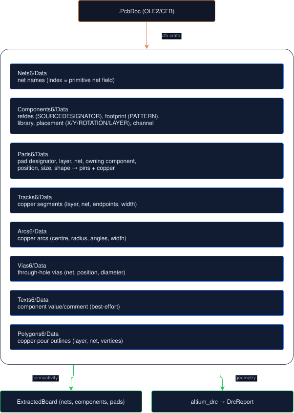

# Altium `.PcbDoc` Ingest

Altium Designer is the dominant professional / enterprise / regulated-industry EDA tool. A large, serious tier of hardware (medical, aerospace, industrial, high-speed digital, satellites) is authored in Altium and never touches KiCad or Eagle. Reading those designs natively brings that tier into hauksbee's bind

- DRC + lint + simulation pipeline.

## If you use Altium

The whole path, with no conversion step and no flag:

```bash
hauksbee run MyBoard.PcbDoc --report --plain   # which parts were modelled
hauksbee run MyBoard.PcbDoc --drc --plain      # shorts and clearance from the copper
hauksbee run MyBoard.PcbDoc --lint --plain     # design lint in plain language
```

`hauksbee run` sniffs the file content, so a `.PcbDoc` works wherever a `.kicad_pcb` does, including as the `board` key of a `hauksbee-ci` spec.

**Which file.** The `.PcbDoc` from your Altium project, as is. It carries the full net connectivity in one file, so it is the complete source of truth and you do not need the rest of the project.

**Binary Altium and ASCII Protel are both accepted.** hauksbee reads the binary OLE2 `.PcbDoc` that Altium Designer writes and the pipe-delimited `Protel_Advanced_PCB` text form emitted by EasyEDA and several converters. The binary reader supports connectivity and copper geometry; the ASCII reader supports connectivity but not track/pour clearance geometry. Content sniffing selects the reader, so the filename extension and capitalization do not matter.

**Git LFS pointers.** Large `.PcbDoc` files are commonly stored in Git LFS. A fresh clone without `git lfs pull` gives you a few hundred bytes of text instead of the board. Run `git lfs pull` first.

An LFS pointer does not fall through to a generic "cannot read this" error. It is identified as a missing payload because that needs a different action from an unsupported file:

```
$ hauksbee run board.PcbDoc --report
error: 'board.PcbDoc': this is a Git LFS pointer, not the board file itself: the repository stores the real file in Git LFS and it was never downloaded. Run `git lfs install && git lfs pull` in the repository, then retry with the real file
```

An ASCII pipe-record file whose `KIND` is not `Protel_Advanced_PCB` is also identified precisely: it is a Protel export, but it is not a supported board document. Only a file that matches none of the readers gets the generic message, which lists every format hauksbee does read. Input failures exit 1, distinct from a report that ran and found something (see the [exit-code contract](../ci/CI.md#exit-codes-the-pipeline-contract)).

**What to expect from bind coverage.** Altium keeps the displayed component value as a bound field that resolves through a string table hauksbee does not parse yet, so on many boards the `Value` column comes out blank and those parts report as unresolved rather than being silently guessed. Refdes, footprint, and connectivity are solid, so **the copper checks (DRC, netlint, signal integrity) are unaffected**; it is the analog, AC, thermal, and firmware results on those specific nets that a blank value limits, and the report's bottom line says which. Passives whose value you need are worth adding as models, one small TOML file each and no recompile (`[../extending/add-an-analog-part.md](../extending/add-an-analog-part.md)`). The full statement is under "Honest limitations" below.

**No Altium project at all, or an unreadable one?** Gerbers plus a pick-and-place file are the universal fallback, and Altium exports both. hauksbee reverse-extracts the board from copper geometry alone (`[GERBER.md](GERBER.md)`).

The rest of this document is the format internals: how a `.PcbDoc` is parsed, what is cross-validated against KiCad, and where the limits are.

Entry points:

- `ExtractedBoard::from_altium_pcb(bytes)` reads connectivity (nets, components, netted pads) into the same `ExtractedBoard` the KiCad / Eagle / IPC / gerber paths produce.
- `ExtractedBoard::from_protel_ascii(text)` reads connectivity from an ASCII `Protel_Advanced_PCB` export into that same shape.
- `ExtractedBoard::altium_drc(bytes)` runs the geometric short / clearance DRC over the board's copper: the binary twin of `ExtractedBoard::drc(text)`.
- `ExtractedBoard::from_auto_bytes(bytes)` performs a content sniff. It auto-detects an Altium `.PcbDoc` from the OLE2 magic (`D0 CF 11 E0`) plus the presence of Altium record streams, then dispatches accordingly. The CLI (`hauksbee run <board>`) reads the file as bytes and routes binary boards here automatically, exactly as it auto-detects the Eagle path from XML. There is no new CLI surface and no new flag: `.PcbDoc` works wherever `.kicad_pcb` / `.brd` does.

## The format

An Altium Designer `.PcbDoc` is a Microsoft OLE2 / Compound File Binary (CFB) container: a filesystem-in-a-file of *storages* (directories) and *streams* (files). We open it with the battle-tested `[cfb](https://docs.rs/cfb)` crate rather than hand-rolling the FAT / DIFAT. An ASCII Protel board instead stores one `|KEY=VALUE|...` record per line; its explicit `ID`, `NET`, and `COMPONENT` fields carry the same connectivity.

Each logical section is a sub-storage (`Nets6`, `Components6`, `Pads6`, `Tracks6`, `Arcs6`, `Vias6`, `Polygons6`, and so on) holding a `Data` stream (the records) and a small `Header` stream (a record count, which we ignore). Older Altium / Protel files drop the `6` suffix (`Nets`, `Pads`, `Components`). We try both namings.

Two record encodings live inside the `Data` streams:

- **Properties strings** (`Board6`, `Nets6`, `Components6`, `Polygons6`): a u32 little-endian length (the top byte is a flag, masked off), then a NUL-terminated ASCII string `|KEY=VALUE|KEY=VALUE|...`. Keys stay uppercase. Coordinate values carry a `mil` suffix. A `%UTF8%`-prefixed twin key carries the UTF-8 form of footprint / library names.
- **Fixed binary records** (`Pads6`, `Vias6`, `Tracks6`, `Arcs6`): a 1-byte record-type marker, then one or more sub-records, each prefixed with a u32 length. Coordinates are signed `i32` in Altium internal units (1 unit = 2.54 nm = 1/10000 mil, so `mm = unit * 2.54e-6`). Net and component references are u16 indices into `Nets6` / `Components6` (`0xFFFF` means none). The index is 0-based; we assign the net id as `index + 1` so id 0 stays the "no net" bucket, matching the KiCad / Eagle convention.

## What is read



The connectivity extractor (`crates/hauksbee-extract/src/altium.rs`) builds the nets, components, and netted pads. The DRC geometry extractor (the `altium_drc` submodule in `drc.rs`) reads copper geometry per net and feeds it to `sweep_buckets`, the exact same R-tree short / clearance engine the KiCad and Eagle paths use. There is one detection engine, not three.

Binary and ASCII component records use one identity algorithm. Altium's `UNIQUEID` (with `SOURCEUNIQUEID` as an export/legacy fallback), paired with the full normalized `SOURCEHIERARCHICALPATH`, is authoritative. Distinct IDs in one hierarchy remain distinct physical parts even if they repeat the compiled `SOURCEDESIGNATOR`; repeated records with the same ID/path may merge as one split placement unless their known pin nets conflict. Both provenance fields are retained as `source_unique_id` / `source_hierarchical_path` properties.

When a designator is reused across replicated channels, the full path is appended after `@`: `C1@A/FLASH2` and `C1@B/FLASH2` cannot collide merely because both paths end in `FLASH2`. The same properties are parsed from ASCII Protel records when an exporter supplies them. Generated channel names are checked against every genuine source designator; if a board really contains `C1@A/FLASH2`, that name wins and the generated one gets a stable `@source-<record>` discriminator.

A hierarchy is a channel location, not by itself a physical component identity. When authoritative IDs are absent, repeated records, even in the same hierarchy, merge only when they share at least one identically-netted pad and no repeated pad number disagrees on its net. Merely having disjoint pad numbers is not proof that they are one part. The merged component carries a `reference_ambiguous` property recording the inference. Conflicting or insufficient pad evidence stays distinct under stable `@record-<id>` names; mixed groups never let a missing path collapse the named channels. Binary DRC uses these exact identities too, so a different-net overlap between ambiguous replicas cannot receive a same-owner exemption. Those kept-distinct ambiguous records also carry `duplicate_reference_conflict`: the binder leaves them open, because conservative DRC ownership is not evidence that the records are two independently modelable devices. An inferred merge without a non-empty `source_unique_id` likewise remains `reference_ambiguous` and is left open by every binding path. Only an authoritative UID can promote identity from DRC-safe connectivity evidence to simulation-grade component identity.

The shared merge is conservative about metadata as well. A later placement may supply a missing value and clears the earlier `value_unresolved` marker, and non-conflicting properties are retained. Conflicting non-empty values, footprints, library ids, properties, or one pad number mapped to different nets preserve both records and attach `duplicate_reference_conflict` instead of silently choosing whichever record arrived first. A content-derived stable ordering gives the same record the unsuffixed name regardless of stream order; generated conflict names cannot replace a genuine source designator. The binder then leaves every conflicted identity open and reports the ambiguity rather than simulating a guessed part. Missing or numeric-only designators get per-record, collision-safe `UNK...` identities. The readers never invent the old `_2` suffixes.

## Accuracy: closed-loop cross-validation against KiCad

KiCad 9 ships an independent Altium importer. Its bundled Python (`pcbnew.PCB_IO_MGR.Load` with the `ALTIUM_DESIGNER` plugin) converts a `.PcbDoc` to a `.kicad_pcb` headlessly. We convert each real corpus board, extract BOTH the original (native Altium path) and the conversion (KiCad path), and compare the **net partition** over shared `(refdes, pad)` pins: two pins sharing a net in one extraction must share a net in the other. Net *names* differ (KiCad renames them), so we compare the partition, not the labels.

Result on the routable corpus boards:


| Board                  | Nets | Components | Netted pins | Partition agreement vs KiCad                                                                                                      |
| ---------------------- | ---- | ---------- | ----------- | --------------------------------------------------------------------------------------------------------------------------------- |
| Cobra ESP32 dev board  | 18   | 27         | 96          | **100%** (96 shared pins)                                                                                                         |
| QFSAE dev kit          | 21   | 24         | 61          | **100%** (61)                                                                                                                     |
| PiDP-11 IO expander    | 30   | 23         | 95          | **100%** (95)                                                                                                                     |
| HERON CubeSat OBC      | 62   | 70         | 281         | **100%** (279)                                                                                                                    |
| altium2kicad test-vias | 6    | 5          | 15          | **100%** (15)                                                                                                                     |
| EBAZ4205 Zynq FPGA     | 392  | 565        | 1742        | **not cross-validated**: extracts 392 nets and 1742 netted pins and is short-clean, but the join cannot be made (see limitations) |


100% net-partition agreement against a wholly independent importer is strong ground truth: the extraction is *correct*, not merely non-crashing. The DRC is short-clean on every real board (they shipped, or nearly), with clearance violations reported on the dense ones (e.g. the EBAZ4205 BGA fanout) as expected.

**How that table was produced, and what a clone can rerun.** The five cross-validated rows come from a run on the maintainers' corpus. The cross-validation needs two things a clone does not have: the Altium source boards, and a KiCad conversion of each. Neither is in the public fetch manifest. The Altium board family is not listed in `corpus.toml` at all, and `altium_xval/`, the conversion set, appears there only in the local-only section, deliberately absent because its licence could not be established. So **these five rows are not reproducible from a clone**, and nothing in the public test suite depends on them: `altium_corpus.rs` skips with a printed note naming exactly which state it is in ("no corpus at all" versus "corpus present but the Altium family is not in it"), and `HAUKSBEE_REQUIRE_CORPUS=1` turns either skip into a failure for a run that is supposed to have them.

What a clone *can* run, besides the synthetic layer below, is a sweep over the Altium boards the public fetch does deliver. `corpus.toml` pins the ODrive v2 and v3 motor-driver designs (MIT, stated in the upstream's own LICENSE at the pinned revision), which are OLE2 `.PcbDoc` layouts with `.SchDoc` schematics and a `.PrjPcb` project beside them. `altium_corpus::fetched_altium_boards_extract_and_are_short_clean` walks the corpus for `.PcbDoc` rather than naming files, so a board added to the manifest is covered the moment it is fetched. Measured on a clean fetch:


| Board                                   | Nets | Components | True shorts |
| --------------------------------------- | ---- | ---------- | ----------- |
| `odrive/v2/v2/Inverter.PcbDoc`          | 198  | 301        | 0           |
| `odrive/v2/v2/Inverter45attempt.PcbDoc` | 191  | 275        | 0           |
| `odrive/v3/v3/PCB.PcbDoc`               | 154  | 217        | 0           |


That sweep is reproducible from a clone, and it is the reason the Altium tier is no longer entirely maintainer-only. It does not replace the cross-validation above: it has no independent ground truth, so it asserts that each board extracts to a non-empty design and reports zero true shorts, not that the partition matches KiCad's importer.

What a clone *can* also run is the synthetic layer, and that is where the format contract is pinned:

- `crates/hauksbee-extract/tests/altium.rs` exercises synthetic in-memory `.PcbDoc` fixtures (built with `cfb`): the properties decoder, the `Pads6` / `Tracks6` binary layouts, net / component index resolution, split-placement and replicated-channel reference semantics (full paths, mixed metadata, genuine-name collisions, conflicting pad nets, and DRC ownership), auto-detection, and a deliberate-short DRC. `protel_ascii.rs` pins the same identity path for ASCII, including numeric-only designators. Shared merge tests cover both input orderings, property and footprint conflicts, and exact duplicate pad records. No corpus is needed.
- `crates/hauksbee-extract/tests/altium_corpus.rs` runs the real-board sweep (extraction + short-clean DRC) and the KiCad cross-validation. Corpus-gated.

Board provenance and licences live in `corpus.toml` at the repository root.

## Records adapted from KiCad

We port the binary record layouts field-by-field from KiCad's open-source Altium importer (KiCad master tree), principally:

- `pcbnew/pcb_io/altium/altium_parser_pcb.cpp`, the `APAD6`, `AVIA6`, `ATRACK6`, `AARC6`, `ACOMPONENT6`, `ANET6`, `APOLYGON6` parsers and the `ALTIUM_LAYER` enum.
- `common/io/altium/altium_binary_parser.cpp`, `ReadProperties` (the pipe/equals decoder) and the stream reader primitives.
- `pcbnew/pcb_io/altium/altium_props_utils.cpp`, `ConvertToKicadUnit` (the unit factor).

We cross-checked against the `altium2kicad` project (thesourcerer8) and a Python `olefile` prototype before porting. The `cfb` crate replaces KiCad's vendored `CompoundFileReader`.

## Honest limitations

- **Component value / comment is best-effort.** Altium stores the displayed value/comment as a `Texts6` record flagged `isComment`, but on most boards that text is a bound field placeholder (`.Comment` / `.Designator`) whose literal resolves through `WideStrings6`, which we do not parse. The refdes (from `SOURCEDESIGNATOR`), footprint (`PATTERN`) and full connectivity are solid. The value is often left empty. Copper DRC and connectivity lint remain valid, but value-dependent binding and therefore analog, thermal, and firmware conclusions on that part are limited. The run report keeps the value blank and records the unresolved reason instead of guessing a magnitude.
- **Newest-format designators (WideStrings) on some boards.** A few newer Altium files (e.g. the EBAZ4205) store no `SOURCEDESIGNATOR` in `Components6` at all. The refdes lives in a `WideStrings6`-indexed `Texts6` designator label whose byte layout is version-specific. On those boards the component references become stable, collision-safe `UNK<record>` placeholders rather than being merged under one blank label. The connectivity graph and copper DRC still extract (the EBAZ4205 yields 392 nets and 1742 netted pins and is short-clean), but reference-dependent model binding, diagnostics, and KiCad cross-validation are limited. Resolving `WideStrings6` would lift this limit.
- **Copper-pour fill is not modelled.** Pour *outlines* (and therefore the pour's net) are read, but the filled copper with its antipads / thermal reliefs (`Regions6` / `ShapeBasedRegions6`) is not. Consequently a pour does not participate in short detection (see the bug note above). Pad-, track-, via- and arc-level shorts are detected normally.
- **ASCII `.pcbdoc` has connectivity, not copper geometry.** The `Protel_Advanced_PCB` reader recovers nets, components, copper pads, values, placements, and layers. It does not recover tracks, vias, arcs, regions, or pours, so it cannot support geometric short/clearance claims. Use the binary Altium document or Gerber fallback when those checks are required.
- `**.SchDoc` (schematic) is not read.** The PCB was the priority because it carries full net connectivity in one file (the layout alone fully describes the circuit, exactly like a `.kicad_pcb`). The Altium schematic (`.SchDoc`, also OLE2 but with different record streams: `FileHeader`, pin / wire / net-label records) would only be needed for the "simulate before there's a layout" path, and we defer it. For Altium projects the `.PcbDoc` is the complete source of truth for connectivity.
- **Allegro / OrCAD / other binary EDA are out of scope.** This module reads Altium `.PcbDoc` only. Cadence Allegro `.brd` (a different binary format) is still ingested only through its gerbers (`docs/ingest/GERBER.md`), not natively.
- **Record types not yet handled:** `Fills6` (copper fills), `Dimensions6`, `Rules6` (so the DRC uses the default 0.2 mm clearance, not the board's own rule), `ComponentBodies6` / `Models` (3D), `Classes6` (net classes). None of these change net connectivity. `Fills6` copper would refine the DRC on the rare boards that use large copper fills outside pours.
