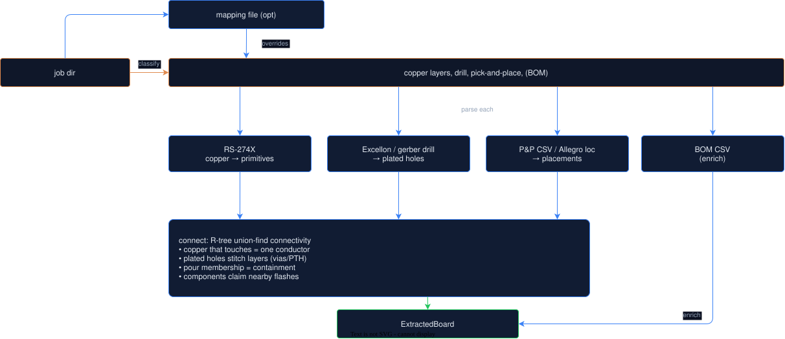

# Gerber + Pick-and-Place Reverse Extraction

Hauksbee normally extracts a board from native CAD, where every pad already
carries its net: a `.kicad_pcb` or `.brd` layout, a `.kicad_sch` hierarchy
([SCHEMATICS.md](SCHEMATICS.md)), or an Altium `.PcbDoc`
([ALTIUM.md](ALTIUM.md)). But a large tier of real
hardware ships only *manufacturing* files: RS-274X copper gerbers, an
Excellon (or gerber) drill, a pick-and-place CSV, sometimes a BOM, and no
CAD at all. The uConsole, Inkplate, and a long tail of famous boards live
here.

This module reconstructs an `ExtractedBoard` (the same nets + components +
pads the rest of the engine consumes) from those fab files alone, so bind,
DRC, lint, stress and simulation work on boards that otherwise could not be
ingested.

Entry point: `ExtractedBoard::from_gerber(path)`, a job directory or a
`.zip`. The richer `gerber::from_gerber_dir` returns reconstruction stats
alongside the board.

## How it works



1. **Classify** every file (recursing sub-dirs) by name into copper / drill /
   outline / ignore. A `layer_map.txt` or `*.map` file overrides the guess.
2. **Parse** copper layers into solid primitives (capsules and polygons in
   board mm), the drill into plated holes, the pick-and-place into
   placements.
3. **Reconstruct** connectivity geometrically: copper that touches is one
   net (R-tree-pruned union-find, with a shape/distance model that mirrors
   `drc.rs`, a parallel copy with matched numerics, since the gerber path
   needs ops the DRC did not expose), plated holes stitch the layers, and
   each placed component claims the flashes nearest it as pads tagged with
   their net.

## Parsing (what we read)

We adapt the battle-tested **`gerber_parser`** crate (RS-274X to the
`gerber-types` model) rather than hand-rolling the grammar. Aperture macros,
coordinate-format scaling, polarity and the deprecated codes are its
problem. The Excellon reader is hand-rolled (no mature Rust crate exists;
the format is a simple tool-table plus coordinates).

| Input | Reader | Notes |
|-------|--------|-------|
| RS-274X copper | `gerber_parser` + `rs274x` plotter | apertures (circle/rect/obround/poly/**macro**), draws (linear + arc), flashes, regions (G36/G37), polarity |
| Aperture macros (AM) | `macros` | circle / center-line / vector-line / outline / polygon primitives, `$n` variable substitution, a small `+ - x /` arithmetic evaluator; the solid area is the convex hull of the union |
| Excellon drill | `excellon` | tool table, metric/inch, leading/trailing-zero suppression, plated vs NPTH from the file's `TF.FileFunction` or the file name |
| Gerber-format drill | `rs274x` | some tools (Allegro) draw holes as flashes on a gerber film; flash centres become hole locations |
| Pick-and-place CSV | `placement::parse_pnp` | tolerant column matching: KiCad `Ref,Val,Package,PosX,PosY,Rot,Side`, JLCPCB `Designator,Mid X,Mid Y,Layer,Rotation`, Altium `Center-X(mm)…`; mm / mil / inch units |
| Allegro location file | `placement::parse_allegro_loc` | `smt_loc.txt`: `!`-delimited, mils, `mirror` flag for bottom side |
| BOM CSV | `placement::parse_bom` | `Designator/Comment/MPN` or `Reference(s)/Value`; one row may list many refs |

### RS-274X dialect normalisation

Real fab gerbers deviate from the textbook form in ways the upstream parser
rejects outright, which would silently drop a whole layer. Before parsing we
normalise two things (well-formed KiCad/JLCPCB gerbers pass through
untouched):

- **Multi-statement extended blocks**: one `%...%` may pack several
  statements, e.g. `%FSAX55Y55*MOIN*%`. We split each into its own `%...*%`.
- **FS without a zero-omission char**: Allegro writes `%FSAX55Y55*`
  (absolute, 5.5) with no leading `L`/`T`. Coordinates in these files are
  zero-padded to full width, so inserting `L` is exact.

## Layer-role inference

Filenames are the only clue to what each gerber is. We recognise the common
conventions and fall back to an explicit mapping file:

- **KiCad long names**: `*-F_Cu.gbr`, `*-B_Cu.gbr`, `*-In1_Cu.gbr`.
- **Protel / Altium extensions**: `.GTL`/`.GBL` (top/bottom), `.G1L`/`.G2L`…
  (inner), `.GTP`/`.GBP` (paste), `.GTO`/`.GBO` (silk), `.GTS`/`.GBS`
  (mask), `.GKO`/`.GM1` (outline), `.TXT`/`.DRL` (drill).
- **Allegro `.art`**: role-named films `top` / `bottom` / `gnd02` / `pwr04`
  / `gnd05` (the digits are the stack position), plus the gerber-format
  drill.
- **Generic words**: a name containing `top`+`copper`, `bottom`+`cu`,
  `inner`, `signal`, and so on.
- **Mapping file** (`layer_map.txt` / `*.map`): `filename = copper:<index>`
  / `copper:bottom` / `drill` / `outline` / `ignore`, one per line.

Inner-layer indices stay provisional until we see the whole set, then
densify into a top-to-bottom `0..n` stack order.

## Connectivity reconstruction

Two pieces of copper that touch are the same conductor. Every primitive on a
layer is indexed in an `rstar` R*-tree (the same prune `drc.rs` uses for its
O(n) short sweep), and any pair whose signed copper gap is `<= eps` gets
unioned (disjoint-set). Connected components become the nets, named
`NET_n`.

- **Vias / through-holes**: each plated drill becomes a disc on every copper
  layer and unions those layers' copper, stitching the stack.
- **Copper pours (the hard part)**: a pour ships as a *single keyholed
  outline* with antipads and thermal reliefs baked in (no clear-polarity
  cut-outs). Edge proximity to that weaving boundary would falsely short
  every net the pour surrounds; pure centre-containment would drop
  thermal-relief pads the pour laps onto. So a primitive joins a pour when a
  **sample point sits inside the filled outline** **or** a pad's copper
  genuinely **penetrates** the boundary. This is the single most important
  correctness rule in the module. It is exact **for the keyholed
  single-region pour** KiCad and Allegro emit (the antipad is part of the
  region winding, so even-odd puts a pocketed pad outside). It does *not*
  hold if a fab emits the pour as a dark region plus a *separate* clear
  (LPC) antipad; we skip clear polarity (see Limitations), so such a pad
  would read as inside the fill and could false-short. KiCad/Allegro do not
  do that; some tools can.
- **GND heuristic**: the largest pour-touching net is labelled `GND`. This
  is a **label only** (connectivity is unaffected), and it is a guess: a
  board with a power plane larger than its ground plane, or a split ground,
  can mislabel. Downstream code should not trust the `GND` *name* as
  ground-truth.

### Component binding

Each placed component sits at a known `(x, y)`. Every flash is assigned to
the *nearest* placed component whose footprint window contains it
(flash-centric, so a flash is never double-claimed and no component starves).
The window size is inferred from the package name: chip codes
(0402/0603/0805…), IC families (SOIC/QFN/QFP/SOT…), and pin-header grids
(`PinHeader_2x18_P2.54mm`). A package name that matches no known token falls
back to a flat 4.0 mm window, so a blank or unrecognised package field
degrades pad assignment for that part. Coincident flashes at one location (a
through-hole pad's F.Cu + B.Cu rings + its drill discs) collapse to one pad.
Synthesised drill discs are tagged `Via` and never counted as component pads.

## Closed-loop validation against native CAD

Before any real-world claim, we validate the reconstruction against ground
truth: take corpus KiCad boards, export their gerbers + drill + P&P with
`kicad-cli pcb export gerbers --no-x2 --no-netlist` (so the gerbers carry
**no net hints**; the reconstruction must rederive connectivity from copper
geometry alone, exactly as on a third-party board), reverse-extract, and
compare to the native KiCad extraction.

The metric is **net-partition equivalence over component pads**: net
*names* differ (we invent `NET_n`), so we match pads by board position (0.1
mm cells) and check that every pair of matched pads groups the same way
(same-net vs different-net) in both extractions. 100% means the recovered
electrical graph, **over the pads we located**, is identical.

**Read the two columns together.** The partition % is computed *only over
pads the reconstruction located* (the "located" column). Native pads the
reconstruction did not place, bottom-side parts the P&P marks, and pads the
footprint window missed are excluded from the percentage, so a low located
count caps how much the % actually proves. The located fraction is
therefore gated alongside the partition %; both are asserted in
`crates/hauksbee-extract/tests/gerber_closedloop.rs`.

Every number below is a **gate floor**, read straight out of that test's board
table. Reproduce them with:

```bash
HAUKSBEE_REQUIRE_CORPUS=1 cargo test -p hauksbee-extract \
    --test gerber_closedloop -- --nocapture
```

| Board | Native nets / comps | Net-partition floor | Located-pad floor | Last measured |
|-------|---------------------|---------------------|-------------------|---------------|
| reform OLED | 13 / 13 | 99.0% | 85% | 100.0% over 38/38 |
| Watchy | 84 / 84 | 99.0% | 80% | 100.0% over 262/276 = 95% |
| LumenPnP ring-light | not recorded | 99.0% | 80% | not recorded |
| reform trackball2 | 64 / 65 | 99.0% | 75% | 99.8% over 202/220 = 92% |
| Corne (crkbd cherry) | not recorded | 99.0% | 70% | 74.4% located (482/648) |
| Lily58 Pro V2 | not recorded | 98.5% | 78% | 81.0% located (687/848) |
| reform motherboard | 681 / 522 | 99.0% | 78% | 99.7% over 1785/2184 = 82% |

RP2040 minimal has its own tighter test (`rp2040_minimal_exact_nets`, floor
99.0% over more than 150 located pads) rather than a row here.

Which rows a given run actually exercises depends on your corpus. Every board
is fetched by `scripts/fetch-corpus.sh`, but a board the fetch has not
delivered, or one the installed `kicad-cli` cannot load to make ground truth,
is skipped with a printed note rather than failing. `HAUKSBEE_REQUIRE_CORPUS=1`
turns "nothing ran at all" into a failure. The "Last measured" column is what a
full run produced against kicad-cli 9.0.3, the release the floors are
calibrated to (`CALIBRATED_KICAD_CLI` in the test); the test prints both the
calibrated and the running version so a floor breach can be attributed to the
side that moved.

A design note earned the hard way: this sweep resolves boards through a shared
corpus resolver that accepts both the hand-built `famous/<id>/…` layout and the
flat `<id>/…` layout the fetch script writes. It used to join `famous/` directly,
so on a fetched corpus every lookup missed while the directory-exists check kept
the skip from firing, and the gate reported green having examined nothing. Both
layouts resolve now, and a gate that cannot find its inputs says so.

Layout tolerance at the corpus root is not enough on its own, because two corpora
can also disagree about the path WITHIN a board. The Corne row is the case: the
hand-built corpus holds `crkbd/pcbs/corne-cherry.kicad_pcb`, flattened by hand,
while upstream nests each switch variant a level deeper at
`crkbd/pcbs/corne-cherry/hotswap/corne-cherry.kicad_pcb`. Only the flat path was
named, so on any fetched corpus this row matched nothing and the sweep counted the
shortfall as a skip. Rows that can differ list every candidate path, and
`corpus.toml` pins the one the fetch lands in the entry's `expect` list so a fetch
that stops landing it fails at the fetch rather than turning into a quiet gap here.

Over the located pads, net-partition agreement runs 99.7% to 100.0% on every
board that has ground truth: the recovered electrical graph is essentially
identical where we placed a pad. The sub-100% rows are a handful of pads on tiny
isolated stubs whose copper the gerber export rounds just out of touch.

The **located fraction varies a lot** and is the honest weak spot. It runs
82% to 100% on the reform and Watchy boards but drops to 74% on Corne and 81%
on Lily58, where many pads sit bottom-side or on footprints the package-name
window under-covers. Those *missing* pads are not scored by the partition %, so
read the two columns together: "99.7% on the reform motherboard" means "99.7%
over the 82% of pads we located", not "99.7% of the board".

**What the closed loop does and does not cover.** The ground-truth gerbers
are exported with `--no-protel-ext`, so they carry KiCad long layer names
(`*-F_Cu.gbr`). The sweep therefore validates the **connectivity engine**
(the union-find, pour rule, via stitching, pad assignment) on the strongest
layer-classification path. It does *not* stress the Protel-extension or
Allegro `.art`-digit layer inference, nor the gerber-format-drill reader:
only the uConsole exercises those paths, and it has no ground truth to
score against. So "near-exact connectivity" is proven for the engine; the
exotic-dialect *ingestion* paths are proven only to parse and bind, not to
a measured partition accuracy. The "comps" column in the table is the
*native* count, not how many the reconstruction recovered (component
recovery runs materially lower than net agreement, see Limitations).

### The boards that ship in this repo

The sweep above needs the corpus, which needs a fetch, so it does not run on a
bare clone. `shipped_boards_survive_gerbers` covers the fourteen boards that
ship here, and it runs wherever `kicad-cli` is installed.

It gates two different things, and reading them as one would mislead you.

**Every board must round-trip.** `kicad-cli` loads it, exports gerbers, and the
reconstruction reads them back without error. This is not a formality: it
caught six demo boards that KiCad itself could not open. They carried
Lisp-style `;` comment lines inside the s-expression, which the KiCad format
does not have, so `kicad-cli` answered "Failed to load board". Our own parser
tolerates them, which is why the gap survived until something outside hauksbee
was asked to read the same file. The prose moved to `<board>.notes.md`
sidecars.

**Only routed boards are judged on accuracy.** Most boards here are
pad-and-netlist fixtures with zero segments, vias and zones: their connectivity
lives in the file rather than in copper. A gerber carries copper and nothing
else, so on an unrouted board there is physically nothing to trace, and the
reconstruction can only infer from pad overlap. Those boards land anywhere from
about 40% to 100% net-partition (the smallest two-net fixtures happen to hit
100%; a five-part unrouted board reads 41.8%), and that number measures the
fixture rather than the extractor. None of them carries a floor, deliberately.

Watchy is the one shipped board with a real layout (685 segments, 114 vias, 6
zones), and it is the one carrying a floor:

| Board | Copper | Net-partition floor | Located-pad floor | Last measured |
|-------|--------|---------------------|-------------------|---------------|
| watchy (bundled) | 685 seg / 114 vias / 6 zones | 99.0% | 90% | 100.0% over 262/276 = 95% |

Measured against kicad-cli 9.0.3, the same release the corpus floors are
calibrated to.

Every closed-loop disagreement was treated as our bug and chased to the
primitive rather than tolerated. Two mattered: a Y-axis sign convention (KiCad
pcb Y-down vs gerber Y-up) and the pour-containment rule above, which moved the
ring-light board from 35% to 100%.

## Real-world demo: the uConsole mainboard

The ClockworkPi uConsole mainboard (CPI 3.14 Mainboard V5) comes from
`clockworkpi/uConsole` (`PCB/CPI_3.14_Mainboard_V5_Gerber.7z`), recorded in
`corpus.toml` as board id `uconsole_gerber`. It has **no native CAD** and ships
in Allegro `.art` format, a different gerber dialect, role-named layers, a
gerber-format drill, and an Allegro `!`-delimited pick-and-place in mils.

**This board is optional, and normally absent.** Its licence is unconfirmed
(GPL-v3 claimed in a forum thread, not asserted in the repository), so
`corpus.toml` marks it `license_confirmed = false` and `scripts/fetch-corpus.sh`
skips it unless you pass `--include-unconfirmed` and decide for yourself. On top
There is a second obstacle even with `--include-unconfirmed`: ClockworkPi publishes
the films only inside a `.7z`, which the fetch cannot open, so the entry's `expect`
path names the archive and unpacking it is a manual step. Treat the figures below
as a recorded run on a maintainer's corpus who did that unpacking, not as something
a clone reproduces. `gerber_uconsole.rs` prints `NOT RUN  uConsole mainboard: not in
the default fetch` and never passes quietly.

Reverse-extracted (`cargo run --example gerber_report -- <dir>`; the test
asserts loose floors, not these exact values, since there is no ground truth to
compare against):

```
copper layers:       5   (top, gnd02, pwr04, gnd05, bottom)
plated holes:        1095
nets reconstructed:  342
components placed:    223
flashes:             6449 total, 3762 assigned to components, 2687 unassigned (vias/test)
GND net detected:    true   (1158 pads; the dominant ground)
components bound:    217/223 (97%) to >= 1 net
extraction time:     ~238 ms
```

A famous board with no CAD becomes a netlist hauksbee can analyse. Note that
there is no native CAD to validate against here, so unlike the closed-loop
boards these numbers show *internal consistency* (it parsed, it bound,
ground is the biggest net), not a measured agreement. The closed-loop boards
prove correctness; the uConsole proves the pipeline runs end-to-end on a
real fab-only board in an unfamiliar dialect.

### What degrades without each input

- **No pick-and-place**: nets and geometry (DRC) still reconstruct from
  copper alone, but components cannot be bound; there is nothing to say
  which pads form which part. `from_gerber_dir` returns the nets with zero
  components. (The Inkplate 6 gerber set is exactly this case; see
  docs/evidence/FAMOUS_SWEEP.md Round 5.)
- **No BOM**: components still bind; their value/part-number is only the
  P&P `Val`/`Package` field rather than an enriched MPN.
- **No drill**: single-layer boards are fine; on multi-layer boards each
  layer's copper fragments into separate nets without via stitching.

## Per-net copper geometry (the trace-current surface)

The reconstruction surfaces, per reconstructed net, the copper geometry a
trace-current check needs: `ReconStats::net_copper` is a
`Vec<GerberNetCopper>` giving each net's narrowest drawn-track width (the
series bottleneck), widest width, track/region counts, and a
`GerberCopperKind` (`Traces` / `Poured` / `None`). A drawn track is a
finite-width capsule (`width = 2*r`), so **copper width is exact from the
manufacturing files** (the one quantity gerbers give more directly than a
netlist). A net carrying any pour region is `Poured` and never given a
discrete width (a plane's true cross-section is not a segment width),
mirroring the native-CAD `trace_current` `Poured` exemption exactly. The
probe is `cargo run -p hauksbee-extract --example gerber_trace_current --
<dir>`.

This makes the IPC-2221 trace-current surface runnable on a gerber-only
board. Its reach stays honest: it needs a *cited current attributed to a
net*, and gerber reconstruction recovers no net names or BOM-bound
identity, so it runs but finds nothing unless a current can be tied to a
specific reconstructed net. And a board whose fab draws traces as G36/G37
filled regions (some Altium exports, e.g. the Inkplate 6) reads every net
as `Poured`, so the check goes inert there, the safe failure direction (a
`Poured` net is never flagged). See docs/evidence/FAMOUS_SWEEP.md Round 5.

## Excellon dialects

The drill reader handles the KiCad/decimal form and the **Altium dialect**
the Inkplate 6 ships: `;FILE_FORMAT=2:5` (integer:decimal), `INCH,LZ`,
`T<idx>F..S..C<dia>` tool defs (feed/speed before the diameter), **modal
single-axis coordinate lines** (`X..` keeps the last Y, `Y..` keeps the last
X), and `;TYPE=PLATED` / `;TYPE=NON_PLATED` sections (NPTH tools dropped
from connectivity). The Altium drill is named `<board>-RoundHoles.TXT` /
`-RectHoles.TXT` / `-SlotHoles.TXT`, recognised by the `holes` token. Before
we handled these, the Inkplate drill parsed to zero holes; tests live in
`gerber::excellon` and `gerber_inkplate.rs`.

## Performance

The connectivity trace is fully spatial-indexed (R-tree per layer for the
touch sweep; R-tree-pruned region lookups). Pour containment over
board-spanning plane layers (tens of thousands of vertices, tested against
every primitive) is accelerated by `PolyGrid`: a scanline-rasterised
inside/outside/boundary grid built once per large pour, making each query
O(1) outside a thin boundary band.

Two-layer boards extract in tens to hundreds of milliseconds. The 6-layer
reform motherboard (about 75k draws and four 35k-vertex plane pours)
extracts in ~15-40 s depending on machine load. The dominant remaining cost
is the all-pairs touch sweep on the densest signal layers.

## Honest limitations

- **The closed-loop % only scores located pads.** As the validation section
  stresses, net-partition agreement is computed over pads the
  reconstruction placed, which ranges from ~74% (dense keyboards) to 100%.
  Pads we fail to locate (bottom-side parts, footprints the package-name
  window under-covers) are not counted against the percentage. The located
  fraction is gated separately so a regression that *loses* pads cannot
  hide behind a high partition %, but the headline number is "agreement
  over what we found", not "of the whole board".
- **Footprint inference is approximate.** The pad-assignment window is
  inferred from the package-name string, with a flat 4.0 mm fallback for
  unrecognised names. This both *inflates* some pad counts (a stitching via
  inside the window is hard to tell from a real pad without the netlist, so
  a crystal may report its GND vias as extra pads, on the correct net, but
  over-counted) and *misses* pads (a part whose pads fall outside an
  under-sized window). Component-name match in the closed loop therefore
  runs well below net agreement (Watchy recovers 60 of 84 component names at
  100.0% net partition; the reform motherboard, 438 of 522); the recovered
  *connectivity* is what the simulator needs, and that stays near-exact
  over located pads.
- **Aperture-macro coverage** is the common primitives (circle,
  center/vector line, outline, polygon) with `$n` substitution and basic
  arithmetic. Moire and thermal primitives (fiducials/reliefs, not pads)
  are skipped; a macro using a variable expression we cannot evaluate falls
  back to a small disc so the flash still anchors a pad. Concave macros are
  over-approximated by their convex hull.
- **Pour fidelity**: a deliberately split pour drawn as one dark fill reads
  as connected within that fill. KiCad emits separate dark regions per
  island, so this is rarely wrong in practice; an exotic single-region
  split-plane could mis-merge.
- **Gerber-format drill diameter is partly guessed.** When a hole on a
  gerber drill film is flashed with a non-circular aperture, its barrel
  diameter falls back to 0.3 mm (a circular flash gives the true size).
  This feeds via stitching on exactly the multi-layer Allegro boards
  (uConsole) that have no ground truth, so it is an unverified assumption
  on that path.
- **Clear polarity (LPC)** is skipped for connectivity: a thermal relief or
  antipad clearing copper inside a pour does not disconnect a net the way
  it changes a rendered image, so treating the board as additive is correct
  for connectivity but means a net split *only* by a clear cut-out would be
  missed.
- **Inner-layer order is inferred from filename digits** (`gnd02` maps to
  stack index 2). An Allegro-style plane named without a stack number
  collapses to a single default inner slot, so on a board that names its
  inner planes ambiguously the layer order, and therefore via stitching
  across the wrong pair, can be wrong. The mapping-file escape hatch
  (`copper:<index>`) overrides this when it matters.
- **GND label is a heuristic** (largest pour-touching net), so the `GND`
  *name* can be wrong on a power-plane-dominant or split-ground board.
  Connectivity is unaffected; only the label is a guess.
- **The bundled `.zip` reader flattens by file name.** Two entries with the
  same basename in different sub-folders of a job zip would overwrite each
  other. Job zips are flat in practice, but a deeply-nested archive is
  better extracted manually and pointed at as a directory.
- **kicad-cli round-trip**: the closed loop needs `kicad-cli` to make ground
  truth, and the floors are calibrated against 9.0.3. A board a newer or older
  CLI cannot load (KiCad-10-format demos such as `pic_programmer` and
  `stickhub` are the ones we hit) is skipped rather than failed, with a printed
  note naming it. The gate prints both the calibrated and the running version on
  every run, so if a floor breaks you can tell whether the extractor regressed
  or the exporter moved the ground truth. The right response to the latter is to
  re-measure and record the new version, never to shave the floor.
